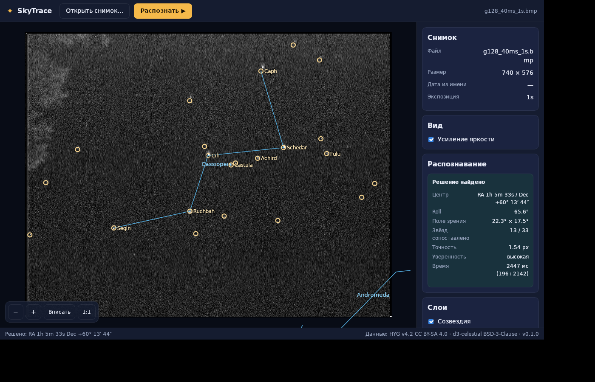

# starglyph

Распознавание снимков звёздного неба: по фотографии определяется участок неба
(blind plate solving — направление, поворот и поле зрения не известны заранее),
поверх кадра рисуются линии созвездий, подписи ярких звёзд и планеты.



## Что внутри

- **Десктоп-приложение** (Rust + Tauri 2): загрузка снимка, распознавание с живым
  прогрессом, оверлей-слои (созвездия, названия звёзд, планеты, детекции, сетка RA/Dec),
  зум/пан, диагностика качества решения — [docs/app.md](docs/app.md).
- **`starglyph-cli`**: headless-решатель (`solve`, `batch-solve`, `detect`, `overlay`) для
  приёмки и отладки.
- **Симулятор синтетического неба** (фазы 1–2 дорожной карты) — генерация датасетов
  с эталонной разметкой.

## Быстрый старт

```bash
# каталог HYG (data/catalogs/hyg_v42.csv.gz) и приёмочные снимки (data/input/)
# уже в репозитории — всё ниже работает на свежем клоне
cd prototype

# headless: решить один кадр и отрисовать оверлей
cargo run -rq -p starglyph-cli -- solve ../data/input/<frame>.bmp \
  --json report.json --overlay-png overlay.png

# пакетная приёмка по каталогу снимков
cargo run -rq -p starglyph-cli -- batch-solve ../data/input --out-dir artifacts/batch

# GUI (нужны libwebkit2gtk-4.1-dev и libgtk-3-dev; см. docs/app.md)
cargo run -p starglyph-desktop                       # пустое окно
cargo run -p starglyph-desktop -- photo.bmp          # сразу открыть снимок
cargo run -p starglyph-desktop -- photo.bmp --auto-solve
```

Первый запуск генерирует базы паттернов из HYG (~1 мин) и кэширует их; дальше
решение кадра занимает секунды.

## Результаты на реальных кадрах

На тестовом наборе `data/input/` (аналоговая видеокамера 740×576, 5–20 звёзд на
кадр, шум, облака) вслепую решаются 10 из 20 кадров (FOV восстанавливается
консистентно: 22.2°±0.4°), отказы диагностируются честно («слишком мало звёзд»,
«нет уверенного сопоставления»). Подробности — [docs/app.md](docs/app.md).

## Документация

Концепция, архитектура, дорожная карта и контракты данных — в [docs/](docs/README.md).
Техническая презентация проекта (алгоритмы, эксперименты, результаты, источники) —
[docs/presentation.html](docs/presentation.html): самодостаточный HTML-файл, открыть в браузере.

## Лицензия

- **Код** (движок, CLI, десктоп) — **Apache-2.0**, см. [LICENSE](LICENSE) и [NOTICE](NOTICE).
- **Данные** лицензируются отдельно и **не** покрываются Apache-2.0: HYG — CC BY-SA 4.0,
  d3-celestial — BSD-3-Clause; подробности в [THIRD_PARTY_LICENSES.md](THIRD_PARTY_LICENSES.md)
  и [ATTRIBUTION.md](ATTRIBUTION.md). Паттерн-базы, генерируемые из HYG, — производные
  BY-SA-данных: при их распространении действует ShareAlike (держим их server-side, чтобы
  не запускать это обязательство).
- Вклад в проект — по [CONTRIBUTING.md](CONTRIBUTING.md) (Apache-2.0 + DCO).
