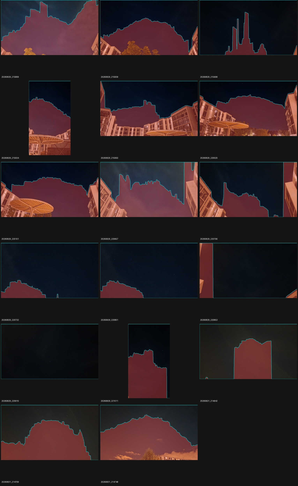

# Автоматическая маска неба: первый RGB-прототип

Дата: 2026-10-02. Продолжение [sky-fill](sky-fill-experiment.md).

## Что проверяется

Ручные маски вместе со статистикой и адаптивным заполнением по небу дали
12/17 решений против 8/17 обычного режима. Этот опыт проверяет, можно ли получить
пользу с автоматически построенной областью. Это исследовательский Python-код
в `prototype/eval/`, использующий существующий `eval --sky-masks`.
Обычные CLI, HTTP и десктопный режим не изменены.

Сравниваются три режима одного release-бинарника на исходных 17 фотографиях:

- `unmasked`: обычный детектор без масок;
- `manual`: прежние шесть ручных полигонов, `--sky-statistics --sky-fill`;
- `automatic`: полигоны из пикселей каждого кадра, те же два флага.

Пороги принятия решения, каталог, геометрия, EXIF и бюджет поиска одинаковы.
Снимки для решателя не обрезаются и не закрашиваются. Генератор не получает
ручные полигоны, каталог, результаты решателя или межкадровые подсказки.

## Алгоритм и его ограничения

`rgb_skyline_v1` — простая эвристика, а не семантическая сегментация:

1. Применить EXIF Orientation, уменьшить копию до длинной стороны 320 пикселей
   фильтром BOX, подавить отдельные яркие точки медианным фильтром 5×5.
2. Оценить медианный RGB и `1.4826 × MAD` по верхней восьмой части изображения;
   нижний предел масштаба — 3 уровня восьмибитного канала.
3. В каждом столбце найти первые три последовательных пикселя, где хотя бы один
   канал отличается от медианы более чем на четыре масштаба.
4. Расширить исключение в соседние столбцы на один рабочий пиксель и отступить
   вверх на два пикселя. Если граница не найдена, сохранить столбец до нижнего края.
5. Построить один полигон в нормированных EXIF-ориентированных координатах.
   Если масштаб верхней выборки превышает 20 уровней или выбранная площадь меньше
   15%, отказаться от маски и использовать обычный путь.

Параметры зафиксированы до первого solve; по результатам этого опыта не менялись.
Предполагается, что небо примыкает к верхней границе, а в каждом столбце имеется
одна граница с передним планом. Нависающие конструкции, неоднородная засветка,
светлые облака и сходный с небом цвет предметов нарушают эти предположения.
Однотонный кадр без неба также может быть ошибочно принят целиком.
Отказ от маски не является распознаванием отсутствия неба.

Используются стандартные операции Pillow
[EXIF-нормализации](https://pillow.readthedocs.io/en/stable/reference/ImageOps.html#PIL.ImageOps.exif_transpose)
и [медианной фильтрации](https://pillow.readthedocs.io/en/stable/reference/ImageFilter.html#PIL.ImageFilter.MedianFilter).
Модели и сторонние веса не скачиваются.

## Разделение данных и метрики

До генерации в `plan.json` записываются шесть ранее размеченных кадров (`annotated`)
и остальные 11 (`validation`). Вторая часть не используется для подбора параметров,
но это та же ранее исследованная серия; независимость по камере, месту или ночи
не заявляется. Для будущего обобщения нужна новая серия с проверенными правами.

Проверяется каждый прежний успешный ID, а не только итоговый счёт. Оба контрольных
режима обязаны пройти существующие baseline. Потери автоматического варианта
записываются в отчёт и не скрываются заменой их новыми успехами.

Для шести размеченных кадров измеряется перекрытие полигонов на сетке с длинной
стороной 320 пикселей, сохранённая доля ручной области и доля автоматической
области вне ручной. Ручные полигоны консервативны, поэтому эти числа **не являются
precision/recall семантической сегментации**. Аналогично детекции вне ручной области
не объявляются автоматически ложными звёздами.

Сохранены диагностические проходы обоих масштабов и default/deep. Для двух кадров
используются прежние точечные пробы и облачные области, радиус 12 исходных пикселей,
однозначное сопоставление и отдельный учёт до/после top-K. Успех решателя не заменяет
независимой проверки привязки и точности по всему полю.

## Результат: не включать по умолчанию

[Полные измерения, параметры и происхождение](experiments/automatic-sky-2026-10-02.json).
Оба контроля прошли существующие проверки. Автоматический режим хуже обычного:

| Выборка | Без маски | Ручная маска | Автоматическая |
|---|---:|---:|---:|
| Все 17 кадров | 8 | 12 | **6** |
| Шесть размеченных | 0 | 4 | 0 |
| Остальные 11 | 8 | 8 | 6 |

Потеряны четыре обычных успеха: `20260829_215809`, `20260829_221011`,
`20260831_214642`, `20260831_214709`. Ни один из четырёх дополнительных успехов
ручной маски не сохранён. Получены два новых принимаемых решения:

| Кадр | Inliers | RMS, px | Log-odds |
|---|---:|---:|---:|
| `20260829_220657` | 22 | 2.16 | 127.00 |
| `20260829_220706` | 11 | 3.00 | 21.87 |

Это внутренняя проверка движка, а не независимая астрометрическая сертификация.
Новые решения требуют отдельной проверки соответствий. Их наличие не компенсирует
регрессии на остальных кадрах.



На превью видно, что модель постоянного цвета от верхней полосы принимает
градиенты/структуру неба за передний план. На шести размеченных кадрах сохраняется
лишь **40.8–76.2% ручной области**; IoU **0.408–0.759**. Доля выбранной области
вне ручной мала, 0–0.55%, но это достигнуто ценой исключения значительной части
неба. Во всех 17 случаях алгоритм выдал маску: пороги отказа эту проблему не обнаружили.

Весь шаг генерации занял **4.11 s** (включая чтение и декодирование 17 JPEG).
Медиана `report.timing_ms.total`: без маски **6.13 s**, ручная **0.96 s**,
автоматическая **10.40 s**; максимум **43.67 / 43.70 / 37.33 s** соответственно.
Полное время трёх отдельных eval-процессов: **193.05 / 163.93 / 245.39 s**,
включая дополнительную диагностику. Это одиночный прогон с готовым кэшем;
в том же окружении выполнялись короткие тесты/превью, поэтому сравнение не является
чистым performance-бенчмарком или обещанием ускорения.

Вывод: постоянный RGB верхней области недостаточен для этой серии. Следующий
отдельный опыт должен учитывать пространственный градиент освещения и отличать
границу предмета от изменения яркости неба. Простое ослабление цветового порога
по уже просмотренной проверочной выборке не будет независимой проверкой качества.
Автоматический вариант оставлен исключительно исследовательским; baseline 8/17
и ручной baseline 12/17 не изменены.

## Проверки реализации

- Все 17 масок и диагностик повторно сгенерированы точно, кроме времени генерации.
- 16 новых Python-тестов: геометрия горизонта/дерева, подавление отдельных звёзд,
  EXIF и хеши, отказ от маски, повторяемость, независимость от ID, границы пикселей,
  отчёт о потерях, повреждение артефактов и изменение конфигурации.
- Проверка обнаружила различие последнего разряда дробных координат после
  Python → Rust → JSON. Сравнение метаданных осталось точным; координатам разрешены
  только два ULP. Хеш файла масок проверяется точно. Исходные маски и solve-report
  не менялись; после исправления сравнения выполнен `--compare-only`, а хеши
  анализирующих скриптов записаны отдельно от скриптов исходного запуска.
- Release CLI собран с `--locked`; все 51 Python-тест прошли в окружении с Astropy.
  В обычном окружении новые 16 тестов прошли с NumPy 2.2.6/Pillow 12.3.0;
  полный набор — с NumPy 1.23.5/Astropy 6.1.7/Pillow 12.3.0.
- `git diff --check` и разбор YAML workflow прошли. Добавлена отдельная CI-задача
  с тестами прототипа; удалённый GitHub Actions в этой сессии не запускался.

## Воспроизведение

Из `prototype/`, в Python-окружении с NumPy и Pillow:

```bash
python3 -m pip install -r eval/requirements-automatic-sky.txt
make test-automatic-sky
cargo build --release -p starglyph-cli --locked
python3 eval/automatic_sky_experiment.py --out-dir artifacts/automatic-sky/reproduction
```

Выходной каталог должен отсутствовать. В нём сохраняются `plan.json`, маски,
диагностика генерации, все solve-report, логи и происхождение: версии Python,
NumPy/Pillow, SHA-256 бинарника, скриптов, входов и выходных JSON, параметры,
кэш и команды. Повторная проверка без генерации и solve:

```bash
python3 eval/automatic_sky_experiment.py \
  --out-dir artifacts/automatic-sky/reproduction --compare-only
python3 eval/preview_sky_masks.py \
  --manifest ../data/input/smartphone/manifest.json \
  --masks artifacts/automatic-sky/reproduction/automatic-masks.json \
  --out-dir artifacts/automatic-sky/reproduction/previews
```

`--compare-only` требует сохранности исходных путей и хешей, включая бинарник;
повторная сборка с другим хешем требует нового прогона. Код возврата 0 означает
целостный эксперимент, а не успешную приёмку автоматического алгоритма.
Время генерации включает чтение/EXIF/декодирование; оно отдельно от solve.
Дополнительная диагностика детектора не входит в `report.timing_ms`.

Фото и производные маски/превью: Igor Lazarev, **CC BY 4.0**; автоматическая
разметка — Starglyph RGB skyline v1. См. [атрибуцию](../ATTRIBUTION.md).

Продолжение: [локальная модель изменения RGB](gradient-sky-experiment.md).
Приведённые выше результаты v1 сохранены; последующие опыты описываются отдельно.
