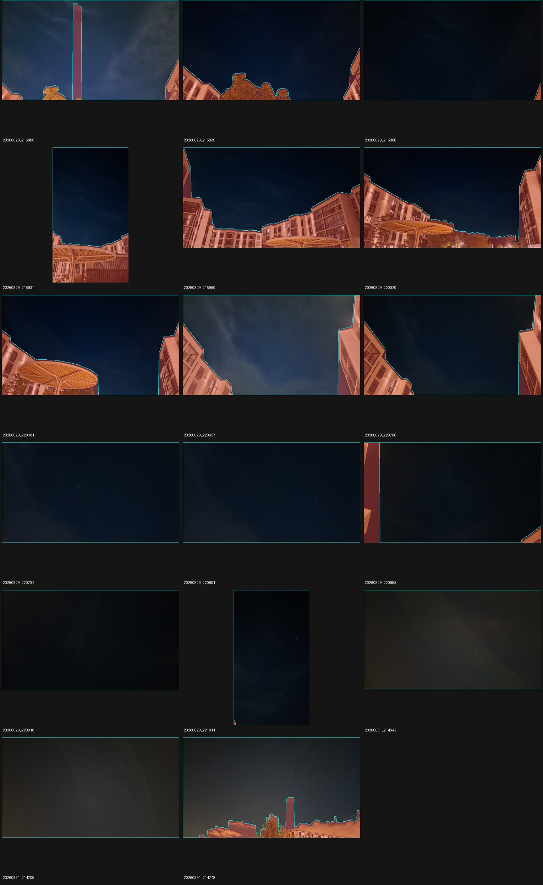

# Автоматическая маска: локальный градиент RGB

Дата: 2026-10-02. Продолжение [первого RGB-прототипа](automatic-sky-experiment.md),
который решал 6/17 кадров против обычных 8/17 и ручных 12/17.

## Гипотеза и границы опыта

Первая версия сравнивала весь кадр с постоянным цветом верхней полосы и отсекала
плавно меняющееся небо. `rgb_gradient_v2` вместо этого прогнозирует следующий ряд
по локальному линейному тренду ранее принятых пикселей. Проверяется именно это
изменение модели, а не ослабление критериев принятия решения солвером.

Длинная сторона рабочего изображения 320, медианный фильтр 5×5, минимум масштаба
шума 3 уровня RGB, порог 4 масштаба, три последовательных отказа, расширение на
соседний столбец и отступ на два пикселя сохранены. Добавлены история из 12 строк
и три итерации оценки начальной плоскости. Параметры зафиксированы до solve
и не менялись по результатам прогона.

Новый алгоритм находится в `prototype/eval/gradient_sky_mask.py`.
`rgb_skyline_v1` сохранён и остаётся вариантом по умолчанию **исследовательского
скрипта**. Обычные CLI, HTTP, десктоп и пороги независимой каталожной проверки
не менялись. Облака относятся к небу; метод не является классификатором облачности
или семантической сегментацией.

Все 17 кадров уже просмотрены в предыдущих опытах. Разделение на шесть размеченных
и остальные 11 сохранено для сравнимости, но **обе группы теперь исследовательские**.
Имя `validation` в JSON — историческая метка группы, а не независимый holdout.
Для оценки обобщения нужны новые снимки с подтверждёнными правами.

## Алгоритм

1. После EXIF и уменьшения строится RGB-плоскость `a + b*x + c*y` внутри верхней
   восьмой части кадра, минимум 12 строк. Три итерации least squares с отбрасыванием
   крупных остатков подавляют часть посторонних объектов в этой области.
   Плоскость используется только для начальной области и не экстраполируется
   до горизонта. Используется [`numpy.linalg.lstsq`](https://numpy.org/doc/stable/reference/generated/numpy.linalg.lstsq.html)
   с явно заданным `rcond=None`.
2. Три последовательных отклонения внутри начальной полосы сразу ограничивают
   столбец. Отдельные выбросы при инициализации истории заменяются значениями
   плоскости, чтобы не обучать локальный тренд на яркой помехе.
3. Для каждого активного столбца по последним 12 принятым строкам оцениваются
   линейные тренды трёх каналов и MAD их остатков. Цвет следующей строки
   прогнозируется с ограничением диапазоном 0–255.
4. Совместимая строка обновляет историю. Отвергнутая — **не обновляет**, поэтому
   модель не должна адаптироваться к резкой границе здания. После трёх отказов
   столбец останавливается у первой отвергнутой строки.
5. Из границ получается тот же нормированный полигон, с прежним отступом.
   При слишком неоднородной начальной области либо площади меньше 15% — отказ
   от маски и обычный путь. Генератор не получает ручные маски, ID кадра,
   каталог, позу или обратную связь решателя.

Остаётся предположение об области неба, примыкающей к верхней стороне, с одной
границей в каждом столбце. Постепенно меняющийся цвет предмета может быть принят
за небо, а резкая граница облака — за предмет. Нависающие объекты, несколько
раздельных областей и кадры без неба этим прототипом не распознаются надёжно.
На превью видны узкие вырезанные полосы от структуры облаков; это ограничение
одномерного прохода по столбцам, а не исправленная семантическая сегментация.

## Результат

[Полные измерения и происхождение](experiments/gradient-sky-2026-10-02.json).
Оба свежих контроля прошли прежние per-ID baseline и совпали с контрольными
отчётами опыта v1, кроме времени и порядка равноярких детекций.

| Группа | Без маски | Ручная маска | RGB v1 | Градиент v2 |
|---|---:|---:|---:|---:|
| Все 17 | 8 | 12 | 6 | **14** |
| Шесть размеченных | 0 | 4 | 0 | 4 |
| Остальные 11 | 8 | 8 | 6 | 10 |

**Все восемь успехов обычного режима сохранены.** По сравнению с v1 добавились
восемь решений, ни одно из его шести не потеряно. Шесть новых относительно
обычного режима решений повторены отдельным процессом: камеры и отчёты совпали
точно после исключения времени и порядка равноярких детекций.

| Новое относительно обычного режима решение | Inliers | RMS, px | Log-odds |
|---|---:|---:|---:|
| `20260829_215839` | 10 | 2.36 | 12.99 |
| `20260829_215934` | 16 | 3.07 | 66.29 |
| `20260829_220101` | 18 | 1.63 | 84.06 |
| `20260829_220657` | 25 | 2.33 | 121.72 |
| `20260829_220706` | 30 | 2.58 | 165.02 |
| `20260831_214748` | 18 | 3.14 | 84.06 |

Это внутренние метрики принятого решения. Повторяемость не является независимой
астрометрической проверкой; точность привязки новых результатов по всему кадру
здесь не подтверждалась. `confidence` также не трактуется как калиброванная вероятность.

**По сравнению с ручной маской есть регрессия:** `20260829_220020` не решён.
Вместо него решены `220657`, `220706` и `214748`. Одинаковые 4/6 в размеченной
группе поэтому означают разные успешные ID. Остальные отказы v2: `215950`, `220732`.



На шести размеченных кадрах сохранено **90.6–100%** ручной области против
40.8–76.2% у v1. IoU: **0.901–0.994** против 0.408–0.759; доля выбранной области
вне ручной — **0.23–1.13%**. Это сравнение с консервативной разметкой, а не
precision/recall относительно точной семантической истины. Все 17 кадров получили
маску; механизм отказа от маски не сработал ни разу.

Генерация заняла **4.96 s** на все 17 JPEG, включая чтение/EXIF/декодирование.
Медиана solve total: **4.87 / 1.14 / 0.96 s** для обычного / ручного / v2;
максимум **37.86 / 44.49 / 40.29 s**. Полное время eval-процессов с диагностикой:
**175.78 / 157.47 / 136.83 s**. Кэш готов, прогон одиночный, рядом выполнялись
короткие проверки и генерация превью. Это диагностическое время, не SLA и не
статистически доказанное ускорение.

### Почему одного счёта решений недостаточно: `220020`

Сравнены координаты 16 детекций, помеченных inlier успешным **ручным** решением,
с диагностическими списками обоих режимов. Однозначное сопоставление — в радиусе
12 исходных пикселей, с прежней полупиксельной поправкой масштаба.
Это восстановление источников опорного решения, а не независимые звёздные метки.

В уменьшенном deep у обоих режимов находятся **16/16** таких соответствий до
и после top-K. Однако ранги меняются: в первых 30 кандидатах manual имеет 13
соответствий, automatic — 11. Итоговых кандидатов deep 50 и 49; число удвоений
порога одинаково — одно, сам порог меняется с 0.0120170 на 0.0121085.

Поэтому данный отказ нельзя объяснить только отсутствием всех нужных детекций
или их отсечением итоговым top-K. Следующий предметный разбор — влияние рангов,
смещения центроидов и перебора гипотез на этом фиксированном кадре. Наблюдение
не доказывает конкретную причину и не оправдывает ослабление проверки решения.
Метрики сохранены в `manual_inlier_recovery` сравнения.

## Проверки и статус

- Все маски v1 совпали с сохранёнными, несмотря на добавление выбора алгоритма.
- Все маски и диагностики v2 повторно воспроизвелись, кроме времени генерации.
- Шесть новых решений повторены отдельным процессом без диагностических проходов;
  хеши и команда находятся в `repeat_verification` снимка эксперимента.
- **61 Python-тест прошёл** в подготовленном окружении с NumPy 1.23.5,
  Astropy 6.1.7 и Pillow 12.3.0. Новые тесты масок также прошли с NumPy 2.2.6,
  использованным для основного прогона. `git diff --check` и компиляция Python прошли.
- CI-задача `automatic-sky-unit` через `make test-automatic-sky` теперь запускает
  оба набора тестов масок. Удалённый CI в этой сессии не запускался.

Результат поддерживает локальную модель градиента на этой серии, но v2 остаётся
экспериментальным. Обычный baseline и ручной baseline не изменены. Следующие
проверки — отказ `220020`, независимые соответствия для новых решений и новая
серия фото; увеличение общего счёта не заменяет эти проверки.

## Протокол и воспроизведение

Три свежих режима: без маски, ручной sky-fill, автоматический v2. Режим v1 берётся
из отдельного закреплённого прогона. Проверяются его входы и артефакты, совпадение
бинарника, каталога, исходных кадров и аннотаций. Контрольные отчёты двух прогонов
должны совпасть после исключения времени и порядка равноярких детекций.
Нельзя подставить прошлый агрегированный счёт без этой проверки.

Из `prototype/`, с NumPy/Pillow из `eval/requirements-automatic-sky.txt`:

```bash
cargo build --release -p starglyph-cli --locked
make test-automatic-sky
python3 eval/automatic_sky_experiment.py --algorithm rgb_skyline_v1 \
  --out-dir artifacts/automatic-sky/reference-v1
python3 eval/automatic_sky_experiment.py --algorithm rgb_gradient_v2 \
  --reference-run artifacts/automatic-sky/reference-v1 \
  --out-dir artifacts/automatic-sky/gradient-v2
python3 eval/automatic_sky_experiment.py --compare-only \
  --out-dir artifacts/automatic-sky/gradient-v2
```

Оба каталога при первом запуске должны отсутствовать. Если прежний прогон v1
с тем же бинарником уже существует, первый eval можно пропустить. `--compare-only`
читает алгоритм и reference-run из сохранённого плана, не генерирует маски и
не запускает solve. Подмена параметров генерации, файлов или одного успешного ID
не скрывается агрегированным числом решений.

В план записаны параметры и SHA-256 входов; в происхождение — хеши скриптов,
выходных артефактов, версии зависимостей, окружение и команды. Все статусы,
inliers/RMS/log-odds, тайминги, перекрытия ручных областей, точечные пробы и облачные
счётчики сохраняются. Код возврата 0 означает корректность измерения, а не готовность
алгоритма к включению по умолчанию.

Новые тесты проверяют градиент по двум осям, плавное облако, резкую крышу и дерево,
запрет обновления истории отвергнутым передним планом, одиночные звёзды,
портретную ориентацию, детерминизм, выбор алгоритма и целостность сравнения с v1.
Это искусственные контрольные сцены, а не расширение реальной проверочной выборки.

Фото и производные маски/превью: Igor Lazarev, **CC BY 4.0**; автоматическая разметка
Starglyph RGB gradient v2. См. [атрибуцию](../ATTRIBUTION.md).

## Контролируемый replay `220020`

Дополнительный опыт 2026-10-02: [измерения и SHA-256](experiments/centroid-replay-2026-10-02.json).
Тестовый модуль `solve/replay.rs` запускает штатный `run_matching` на сохранённых
полноточных списках уменьшенного deep. Использованы исходные EXIF FOV и эпоха,
каталог и кэш; поза ручного решения в поиск не передаётся. Это проверка выбора
кандидата **до уточнения**, а не повтор полного решения изображения.

По геометрии найдены 29 общих источников (жадное однозначное сопоставление в
радиусе 4.8 рабочих пикселя), без использования меток inlier. Остальные элементы
списков не объявляются ложными звёздами. tetra3 повторно сортирует по `mass`,
поэтому при вмешательстве в порядок переносится и яркость соответствующего слота.

| Вход | Кандидат принят |
|---|---|
| Исходный manual / automatic | да / нет |
| Manual с координатами общих источников из automatic | да |
| Automatic с координатами общих источников из manual | нет |
| Manual с порядком общих источников из automatic | нет |
| Automatic с порядком общих источников из manual | нет |
| Только 29 общих: обе системы координат × оба порядка | да, все 4 |

При перестановке общих источников сохраняются полный состав, координаты,
позиции остальных элементов и яркости слотов. Поэтому потеря кандидата manual
демонстрирует влияние порядка при фиксированных координатах и составе.
Обратная перестановка не спасает automatic: одним относительным порядком общих
источников причина не исчерпывается. Удаление необщих элементов одновременно
меняет состав префиксов поиска и статистику проверки; успех общего набора
**не доказывает**, что эти элементы ошибочны или их можно определить на новом кадре.

Замена координат проверена только на сопоставленных источниках. Результаты
согласуются с проблемой состава и перебора кандидатов и не дают оснований
считать смещение этих центроидов достаточным объяснением отказа. Общий набор
использует сразу две маски, поэтому это диагностическое вмешательство, а не
готовый автоматический алгоритм.

Все десять случаев повторены отдельным процессом с точным совпадением результатов.
Исходный manual принят по существующей ветке `hard` с 12 hits и log-odds 9.12;
штатная ветка `hard` не требует log-odds ≥18. Порог 18 применяется к мягким
кандидатам. Критерии не менялись. Малые численные отличия позы replay от старого
CLI не трактуются как побитовая эквивалентность исходному запуску.

Воспроизведение из `prototype/` после генерации paired-артефактов v2:

```sh
python3 eval/centroid_replay.py artifacts/automatic-sky/gradient-v2-run-1 /tmp/starglyph-replay.json
STARGLYPH_REPLAY_INPUT=/tmp/starglyph-replay.json \
STARGLYPH_REPLAY_OUTPUT=/tmp/starglyph-replay-results.json \
  cargo test -p starglyph-core --release --offline solve::replay::saved_detections -- --ignored --nocapture
```

Replay исключён из обычных тестов и production-сборки. Следующий эксперимент —
ограниченное расширение/диверсификация префиксов с контролем всех 17 кадров,
ложных принятий и времени. Итог v2 остаётся **14/17**; исправление `220020`
в рабочем алгоритме пока не внесено.

Последующий [опыт с дополнительными deep-префиксами](extended-dense-search-experiment.md)
поднял результат той же маски до 15/17 за счёт изменения решателя; `220020`
по-прежнему не решается автоматически. Числа 14/17 выше относятся к исходному движку.
