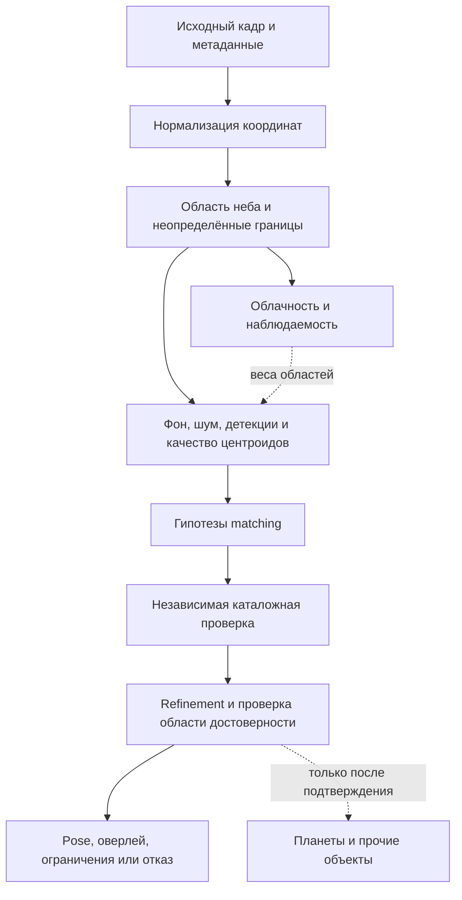

# Устойчивое распознавание звёздного неба: проблемы и существующие решения

**Исследование от 2026-10-02.** Срез Starglyph: `6365f3a`.

## 1. Цель, метод и основные выводы

Цель — описать, что мешает распознаванию настоящих фотографий, какие методы уже
существуют и как проверить их применимость к Starglyph. Документ — техническое
исследование, а не обещание реализовать каждый перечисленный метод.

Основной сценарий: одна фотография со смартфона или камеры, неизвестные направление,
поворот и поле зрения; EXIF может отсутствовать. Серии кадров, RAW и калибровочные
снимки рассматриваются как дополнительные возможности, а не обязательный вход.

Метод: целевой обзор первичных публикаций, документации авторов и открытых
реализаций; сопоставление с кодом и [локальными измерениями](smartphone-quality.md).
Это не систематический метаанализ: не проводились исчерпывающий поиск всех работ,
обучение внешних моделей или сравнительный benchmark сторонних солверов.
Ссылки проверены на дату исследования. Числа из чужих экспериментов не считаются
ожидаемым качеством на наших смартфонных JPEG.

Основные выводы исследования:

1. **Нужны разные механизмы для разных ошибок.** Лишняя точка, исчезнувшая звезда
   и смещённый центроид не являются одной задачей фильтрации.
2. **Маска неба и маска облаков — разные слои.** Облако находится в области неба;
   его прозрачность влияет на наблюдаемость звёзд, а не на принадлежность к небу.
3. **Не обязательно узнавать каждый лишний объект до solve.** Планета или самолёт
   могут остаться неидентифицированным выбросом, если решение надёжно подтверждено
   другими звёздами. Классификация полезна, когда помеха заполняет список кандидатов.
4. **Сначала геометрия и независимая проверка.** Малый RMS по точкам подгонки
   не подтверждает правильность всего оверлея, особенно на краях.
5. **Для текущего набора наиболее обоснован эксперимент с передним планом.**
   Следующие направления — EXIF/масштаб, локальный фон и контроль геометрии.
   Спутниковые следы и другие классы требуют собственных проверочных примеров.

Пункты с рекомендациями ниже — выводы для Starglyph. Описания опубликованных
методов снабжены источниками; они не означают, что метод уже внедрён.

## 2. Что уже известно о Starglyph

На опубликованных 17 смартфонных кадрах воспроизводятся восемь решений;
обязательные успешные ID защищены отдельным regression gate. Девять отказов имеют
код `no_confident_match`. Визуально подтверждены многочисленные детекции на
деревьях, зданиях и освещённых конструкциях. В одном отказе 50 детекций занимают
лишь 31% ширины и 19% высоты кадра. Причинный эффект удаления переднего плана ещё
не измерен. [Локальный отчёт](smartphone-quality.md)

Три независимых WCS-кандидата пока имеют статус `pending`: распределение опорных
звёзд недостаточно для подтверждения углов, а модели заметно расходятся у краёв.
Это свидетельство неопределённости геометрии, **не доказательство**, что ошибается
только модель Starglyph. [Проверка WCS](local-wcs.md)

| Уже реализовано | Что это покрывает | Что остаётся проверить |
|---|---|---|
| [Детектор](../prototype/crates/starglyph-core/src/detect.rs): mesh-фон, MAD-шум, matched filter, связные компоненты, фильтры площади/вытянутости/концентрации, обработка ярких ядер | Часть шума, одиночные дефекты, диффузные и вытянутые источники | Нет семантической маски неба; фотометрическая форма не отличает звезду от фонаря гарантированно |
| [Загрузка](../prototype/crates/starglyph-core/src/image_input.rs): EXIF-ориентация, FOV-приор, сохранение диапазона поддерживаемых сенсорных TIFF | Некоторые ошибки формата и масштаба | Приор может быть неверным после кропа/цифрового зума; это не поддержка всех camera RAW |
| [Solve](../prototype/crates/starglyph-core/src/solve.rs): несколько масштабов/попыток, tetra3, независимая каталожная проверка, LM refinement | Неизвестный FOV, часть выбросов и малых геометрических ошибок | Нет доказанной устойчивости ко всем классам помех из этого обзора |
| [Геометрия](../prototype/crates/starglyph-core/src/geom.rs): радиальный `k1`, защита от заворота радиуса | Ограниченный класс дисторсии | Не полноценная модель произвольного fisheye, панорамы или нелинейно склеенного изображения |
| [Каталог](../prototype/crates/starglyph-core/src/catalog.rs): собственные движения; [эфемериды](../prototype/crates/starglyph-core/src/ephem.rs) для планет | Эпоха звёзд и планетный оверлей | Планетный оверлей сам по себе не является предфильтром планет среди детекций |

Предыдущие меры нельзя считать отсутствующими и «внедрять заново». Новый метод
нужно сравнивать с действующим pipeline, включая его fallback-попытки.

## 3. Каталог проблем

Обозначения доказательности:

- **Н** — явление наблюдалось в текущих данных/отчётах; причинность отказа может
  оставаться гипотезой.
- **К** — риск уже учитывается кодом или тестами; устойчивость на реальных кадрах
  этого класса отдельно не установлена.
- **Л** — риск из литературы/модели изображения; отдельной локальной проверки нет.

Номера R01–R24 — постоянные идентификаторы классов для разметки и экспериментов.
Один снимок может иметь несколько меток одновременно.

| ID | Проблема | Как ломает распознавание | Основание | Основной подход |
|---|---|---|---|---|
| R01 | Здания, деревья, горы, провода, окна, фонари | Занимают top-K детекций; дают случайные паттерны | Н | Маска неба, оценка границ и пространственный отбор (§4.1) |
| R02 | Тонкое облако, дымка, частичное перекрытие звезды | Ослабляет поток, меняет ранги яркости и иногда центроид | Н — облака видны, влияние не изолировано | Карта прозрачности/наблюдаемости, локальный SNR (§4.2) |
| R03 | Плотные облака и окклюзии ветками | Удаляют реальные опорные звёзды | Л | Matching с пропусками; отказ при недостатке информации (§4.2) |
| R04 | Городская засветка, Луна, сумерки, сияние, градиенты | Неоднородные фон и шум; ложные структуры | К/Л | Пространственные фон и RMS, маски засвеченных областей (§4.3) |
| R05 | Планеты и другие внекаталожные точечные источники | Яркий объект принимается за опорную звезду | К/Л | Устойчивость к выбросам; эфемериды после pose (§4.4) |
| R06 | Самолёты, спутники, метеоры, мигающие огни | Следы, цепочки точек, временные источники | Л | Форма, линии, временная согласованность (§4.5) |
| R07 | Hot pixels, дефектные столбцы, импульсные события | Псевдозвёзды на сенсоре | К | Bad-pixel mask, форма PSF, анализ серии (§4.6) |
| R08 | Насыщение, ореолы, blooming ярких звёзд | Неустойчивый центроид либо потеря важной опоры | К | Работа с ненасыщенными крыльями, флаг качества (§4.6) |
| R09 | Lens flare, внутренние отражения, стекло, грязь/роса | Дубли, размытые пятна и пространственно меняющаяся потеря контраста | Л | Маскирование/понижение веса, диагностика оптического пути (§4.6) |
| R10 | Низкий SNR, недоэкспозиция, сильный шум | Пропуски слабых звёзд и случайные пики | К | Matched filter, локальная неопределённость, серия при наличии (§4.3) |
| R11 | Мало пригодных звёзд или плохое покрытие поля | Не хватает геометрических ограничений; нестабильный fit | Н/К | Контроль числа и распределения независимых опор (§4.9) |
| R12 | Дефокус, кома, астигматизм, хроматизм | PSF меняется по полю; форма и центроид искажены | Л | Локальные PSF-модели, веса, калибровка (§4.7) |
| R13 | Шевелёнка, вращение Земли, star trails | Звёзды вытянуты; круглый фильтр отвергает настоящие источники | Л | Оценка согласованного смаза, trail-PSF, короткие экспозиции (§4.5) |
| R14 | Радиальная/тангенциальная дисторсия, смещённый центр | Простая камера подходит в центре, но не на краях | К; Н — расхождение моделей | Калибровка, расширение модели только по контрольным данным (§4.8) |
| R15 | Fisheye, сшитая панорама, локальный warp | Один pinhole/TAN pose может быть неприменим | Л | Явный тип проекции, отдельный scene-сценарий (§4.8) |
| R16 | Неверный EXIF, zoom/crop, поворот/отражение | Ошибка FOV-приора или координат изображения | Н/К | Нормализация координат, мягкие приоры, blind fallback (§4.10) |
| R17 | JPEG, ресайз, sharpening, denoise, tone mapping | Стирают слабые звёзды, создают ringing, меняют поток | К/Л | Геометрически корректный multiscale, оценка на исходных пикселях (§4.10) |
| R18 | Ночной стекинг/HDR, ghosting, rolling shutter | Дубли или неодинаковая геометрия разных частей кадра | Л | Сравнение режимов съёмки/серий; выявление несовместимой геометрии (§4.10) |
| R19 | Двойные/слившиеся звёзды, скопления, туманности | Один blob соответствует нескольким звёздам или не звезде | К/Л | Deblending, PSF-fit, модель разрешения каталога (§4.7) |
| R20 | Глубина каталога, эпоха, спектральный диапазон, переменность | Неверные ожидания видимости, координат и яркости | К/Л | Модель отбора каталога; яркость как мягкий признак (§4.11) |
| R21 | Атмосферная рефракция, особенно у горизонта | Пространственно зависимые смещения звёзд | Л | Модель apparent-place при достаточных метаданных (§4.11) |
| R22 | Случайный match, переобученный fit, некалиброванная уверенность | Неправильный оверлей выглядит убедительно | К; Н — нехватка независимой GT | Проверка всех детекций, контрольные звёзды, negative set (§4.9) |
| R23 | Неточная дата, часовой пояс, место наблюдения | Неверная идентификация планет и атмосферные поправки | К/Л | Явная неопределённость метаданных; отдельная точность оверлеев (§4.4, §4.11) |
| R24 | Разрастание поиска, холодный кэш, таймауты | Качество зависит от бюджета времени; долгий отказ | Н | Ограниченный поиск, телеметрия, отдельные cold/warm метрики (§4.12) |

## 4. Методы решения и границы применимости

### 4.1. Передний план: R01

**Что известно.** В работе *Sky Optimization* показана семантическая сегментация
неба на уменьшенном изображении с восстановлением границ маски через weighted
guided upsampling. Это существенно ближе к нашим ночным пейзажам, чем маска
неизменного горизонта стационарной камеры. Цель работы — обработка фотографии,
а не точность plate solving. [S01]

**Варианты для сравнения:** ручные полигоны как диагностический ориентир;
семантический сегментатор; простая геометрическая маска для фиксированной установки.
Правило «верх изображения — небо» непригодно как общий контракт: камера может быть
повёрнута, между ветками есть просветы, а горы занимают верх кадра.

**Предлагаемое применение.** Маску передавать как допустимую область измерения,
а не закрашивать землю чёрным перед оценкой фона: искусственная граница меняет
статистику и может породить источники. Сначала A/B: без маски и с ручной маской,
при одинаковой камере и настройках. Отдельно проверить исключение областей при
оценке фона и фильтрацию уже найденных точек — это разные вмешательства.

**Риск.** Ошибка маски удаляет реальные звёзды у горизонта/веток. Нужны
`sky / non-sky / uncertain`, пограничная полоса и измерение сохранности звёзд,
а не только IoU всей маски. Эта схема разметки — предложение для Starglyph.

### 4.2. Облака, дымка и исчезнувшие звёзды: R02–R03

**Разные случаи.** Полностью закрытую звезду нельзя достоверно восстановить из
одного снимка; её можно лишь предсказать после определения поля по другим звёздам.
При частичном перекрытии остаются слабый сигнал, изменённая форма и неравномерная
потеря потока. Предсказанный объект не должен становиться «обнаруженной звездой».

**Существующие методы.** Mommert сравнивает ResNet с классификатором LightGBM на
локальных признаках для all-sky камеры; опубликован код `cloudynight`. Работа
ориентирована главным образом на непрозрачную облачность. Авторы отдельно отмечают,
что облако может быть и светлее, и темнее ясного неба, поэтому одного порога яркости
недостаточно. [S02] В работе 2025 года используются разностные изображения,
пороговая обработка и морфология для обнаружения и отслеживания движущихся облаков;
этому методу нужны последовательные кадры, а не одна фотография. [S03]

**Предлагаемое применение.** Хранить отдельную карту облачности/наблюдаемости
внутри маски неба. После предварительно подтверждённого pose сравнивать наличие
ожидаемых звёзд по областям с учётом предельной величины и локального шума.
До solve нельзя называть область облачной только потому, что там мало точек:
это может быть бедное поле, засветка, дефокус или иной участок неба.

**Ограничение переноса.** Модель стационарной камеры использует повторяемые
геометрию, экспозиции и условия; смартфон меняет всё это между кадрами. Нет
оснований обещать опубликованную accuracy на наших JPEG. Полностью закрытые
облаками кадры нужны в negative set: правильным исходом может быть отказ.

### 4.3. Фон, засветка и низкий SNR: R04, R10

**Готовые строительные блоки.** SEP разделяет оценку пространственного фона и
извлечение источников, принимает маску и оценку шума. Photutils `Background2D`
даёт двумерные фон и RMS с исключением источников/плохих областей. Размер ячейки
важен: слишком мелкая сетка поглощает источники, слишком крупная не описывает
градиент. [S04][S05]

Для точечных источников Photutils предоставляет DAOStarFinder/IRAFStarFinder
и фильтрацию по форме; StarFinder допускает собственное ядро. Это полезные
контрольные алгоритмы для диагностики нашего детектора. [S06]

**Предлагаемое применение.** Сравнить действующий mesh-фон и глобальную оценку
шума с локальной картой RMS на тех же снимках. Проверить несколько масштабов PSF,
раздельно считать найденные звёзды и ложные источники от облаков, Млечного Пути,
сияния, фонарей и лунного ореола. Маску яркого диска и его ореола оценивать отдельно
от вычитания гладкого фона.

**Риск.** Простое понижение порога повышает одновременно recall и число ложных
детекций; top-K может стать хуже. Контрастирование для красивого просмотра
не равно улучшению измерений. Для JPEG величина «SNR» зависит от обработки камеры,
поэтому её нельзя без проверки трактовать как физический сенсорный SNR.

### 4.4. Планеты, Луна и метаданные: R05, R23

**Почему это отдельный случай.** Планета — полезный объект оверлея, но не звезда
неподвижного каталога. На широком поле она может выглядеть как обычная яркая PSF.
Нельзя надёжно отличать её от звезды только по размеру или цвету.

**Существующее решение.** Геометрический солвер допускает лишние источники и
проверяет гипотезу по совокупности звёзд. Astrometry.net отделяет поиск кандидата
по астеризму от статистического принятия решения. [S07] Для идентификации объектов
Солнечной системы JPL Horizons предоставляет геоцентрические и топоцентрические
эфемериды, с явными системой координат, временем и наблюдателем. [S08]

**Предлагаемое применение.** Сначала решить кадр по звёздам, затем проецировать
эфемериды и проверить близость оставшихся ярких источников. Если достоверны время
и место, можно тестировать дополнительные маски/веса, но нельзя удалять все яркие
источники до первого solve. Для Луны и близких объектов особенно важны точка
наблюдения и параллакс; текущий планетный оверлей не считать универсальной моделью.

**Граница.** При неизвестной дате сохранить объект как неклассифицированный
выброс. EXIF DateTimeOriginal без часового пояса не считать гарантированным UTC.
Точность planet-overlay и точность звёздного pose оценивать раздельно.

### 4.5. Самолёты, спутники, метеоры и смаз: R06, R13

**Наблюдаемые формы.** На длинной экспозиции помеха может быть линией, на короткой —
точкой; мигающий источник — цепочкой. Поэтому удаление только вытянутых blobs
не закрывает весь класс. Вращение неба или камеры, напротив, вытягивает настоящие
звёзды, и слишком строгий фильтр вытянутости удаляет полезный сигнал.

**Существующие методы.** ASTA сочетает U-Net с probabilistic Hough transform
для спутниковых следов; опубликованы код и размеченные данные MeerLICHT. Это
телескопический домен, не проверенная модель самолётов на телефоне. [S09]
Для серий Astroalign находит преобразование между звёздными полями по треугольным
астеризмам без WCS; это инструмент регистрации, а не абсолютный plate solver. [S10]

**Предлагаемое применение.** На одиночном кадре сравнить геометрическое выделение
линий/цепочек с простым фильтром формы. Для серии сначала зарегистрировать звёздное
поле, затем искать несогласованное движение. При наличии общего смаза оценивать
его направление/длину и использовать соответствующую PSF-модель вместо запрета
всех вытянутых источников.

**Риск.** Линии созвездий случайно складываются в почти прямые цепочки; след
самолёта бывает прерывистым. По одной PSF без метаданных нельзя уверенно присвоить
тип «самолёт» или «спутник». Цель первой версии — не использовать помеху как опору,
а не обязательно определить её физический класс.

### 4.6. Сенсор, насыщение и блики: R07–R09

**Существующие методы.** L.A.Cosmic использует лапласиановую резкость для выделения
cosmic-ray событий; Astro-SCRAPPY предоставляет реализацию с масками, параметрами
шума, усиления и насыщения. Она предназначена для соответствующих измерительных
данных, а не автоматически для нелинейного телефонного JPEG. [S11][S12]
`ccdproc` предоставляет операции калибровки bias/dark/flat и bad-pixel masks;
это вариант при наличии согласованных RAW/FITS и калибровочных кадров. [S13]

**Предлагаемое применение.** Разделить постоянный дефект сенсора, случайный импульс
и оптический блик. У дефекта полезна повторяемость в координатах сенсора; у звезды —
согласованность с небесным преобразованием. По одному изображению эти признаки
могут быть недоступны. Проверять, что фильтр hot pixels не удаляет недосэмплированные
звёзды размером в несколько пикселей.

Для насыщенных звёзд сравнить устойчивость центроида по ненасыщенным крыльям
и действующему выделению ядра; сохранять флаг насыщения и понижать вес сомнительных
измерений. Насыщенный фонарь не становится звездой только из-за круглой формы.

**Блики и роса.** Надёжность классификации по одному кадру ограничена. Практический
baseline — исключение подтверждённо повреждённых областей и устойчивый matching;
в серии можно исследовать связь артефакта с ярким источником и положением камеры.
Dark/flat не устраняют произвольное отражение в стекле и не восстанавливают
информацию под сильной засветкой. Это инженерные гипотезы для проверки, не готовое
универсальное решение R09.

### 4.7. PSF, двойные звёзды и протяжённые источники: R12, R19

Нужно различать **искажение формы изображения звезды** и **искажение геометрического
отображения её направления**. Кома может сместить измеряемый центроид; радиальная
дисторсия меняет положение источника даже при симметричной PSF. Один коэффициент
`k1` не исправляет произвольную форму звёзд.

**Готовые методы.** Photutils поддерживает разделение перекрывающихся сегментов
через `deblend_sources` и групповую/итеративную PSF-фотометрию. PSF-fitting позволяет
оценивать несколько близких источников и их положения, если данные содержат
достаточно информации. [S14][S15]

**Предлагаемое применение.** Сравнить текущий центроид с Gaussian/Moffat или
эмпирической PSF; измерять ошибку отдельно по радиусу поля, яркости и насыщению.
Для широкого поля рассмотреть локальную PSF и неопределённость каждого центроида.
На синтетике варьировать расстояние пары звёзд и отношение потоков.

**Риск.** Deblending может раздробить одну шумную звезду на несколько фиктивных.
Неразрешённая двойная звезда в каталоге и на снимке должна иметь согласованную
модель наблюдения: нельзя требовать две детекции там, где оптика даёт один blob.
Туманности и плотные звёздные облака полезны как отрицательные примеры детектора,
но не должны механически удалять все звёзды внутри таких областей.

### 4.8. Дисторсия, fisheye и неоднородная проекция: R14–R15

**Существующие модели.** OpenCV предоставляет pinhole-калибровку с радиальными
и тангенциальными параметрами; для fisheye существует отдельная модель. Это
разные семейства проекций, а не один универсальный набор коэффициентов. В
документации также отмечена необходимость корректного, взаимно однозначного
отображения дисторсии. [S16][S17] TAN/SIP описывает астрометрическую проекцию
с полиномиальными искажениями; Astropy предупреждает о согласованности SIP и
WCS-метаданных, особенно после обработки изображения. [S18]

**Предлагаемое применение.** Сначала получить пространственно распределённые
независимые соответствия и карту векторов ошибок. Затем сравнить действующий
`k1` с более богатой моделью; увеличивать число параметров лишь при улучшении
ошибки на отложенных контрольных звёздах. Проверять центр, края, углы и несколько
кадров одного режима камеры. Профиль для одного zoom/режима не переносить без
проверки на другой модуль смартфона.

**Риск.** На звёздах только в центре фокусное расстояние и дисторсия плохо
разделяются. Более гибкая модель может снизить training RMS и ухудшить края.
Необходимо сохранять защиту от заворота/складывания проекции.

**Граница сценария.** Большой FOV сам по себе не делает кадр непригодным.
Fisheye может иметь единую калибруемую камеру. Сшитая панорама или локальный warp
могут не описываться одной текущей pinhole-моделью; их следует отдельно размечать
как `scene` либо исследовать явное преобразование проекции. Присутствие домов или
облаков само по себе не является основанием переносить кадр из `solver` в `scene`.

### 4.9. Недостаток опор, ложное решение и уверенность: R11, R22

**Существующие решения.** Astrometry.net генерирует гипотезы по геометрическим
астеризмам и принимает их статистической проверкой; опубликованная высокая
доля успеха относится к конкретным астрономическим данным. [S07] tetra3 имеет
параметры числа проверяемых звёзд, радиуса match, порога и бюджета поиска. Это
средства настройки компромисса, а не гарантия корректности на другом домене. [S19]

**Предлагаемая защита.** Считать независимо сопоставленные звёзды, их распределение
и остатки; проверять one-to-one соответствия, а не число любых близких пар.
Не принимать решение по совпавшему начальному кваду без остальных детекций.
Не снижать порог принятия для «спасения» трудного кадра без оценки ложных решений.

Звёзды в маленькой центральной области могут подтверждать направление и
не подтверждать края. Нужно раздельно описывать:

- достоверность идентификации участка неба;
- точность камеры в области опор;
- неопределённость вне области опор;
- уверенность классификации отдельных объектов.

**Текущий риск интерпретации.** В `solve.rs` поле `confidence` вычисляется
ограниченным линейным преобразованием log-odds. Без калибровки на размеченных
положительных и отрицательных примерах его нельзя читать как эмпирически
подтверждённую вероятность «решение верно на 99%».

Пустое небо, плотная облачность, городские огни без звёзд и искусственные случайные
точки должны допускать честный отказ. Отсутствие ложных решений на маленьком
наборе не доказывает нулевую вероятность ошибки.

### 4.10. EXIF, цифровая обработка и серия: R16–R18

**Координаты.** Поворот EXIF, отражение, crop и resize должны составлять явное
преобразование между пикселями обработки и исходным ориентированным изображением.
Маски и оверлей проходят то же преобразование. Для измерительного сравнения
фиксируются соглашение о центрах пикселей, размеры и SHA-256 исходника.
Это локальное требование, уже частично закреплённое в [WCS-процессе](local-wcs.md).

**Смартфонная обработка.** Google описывает Night Sight как совмещение нескольких
экспозиций, подавление шума и отдельную обработку неба. Поэтому финальный JPEG
не следует считать линейным одиночным измерением сенсора, а EXIF одного файла —
полным описанием всей вычислительной цепочки. [S20]

**Предлагаемый эксперимент.** На одной сцене сопоставить обычный JPEG, ночной
режим и доступный RAW/линейный экспорт. Отдельно варьировать resize/JPEG quality,
ориентацию и доверие к FOV-приору. Слабые источники искать на нескольких масштабах,
но геометрию принятого решения проверять в исходных координатах.

**Движение и rolling shutter.** При построчном считывании строки относятся к
разным моментам; при движении камеры единый pose может стать недостаточным.
Работы по motion blur/rolling shutter используют дополнительные наблюдения или
сильные priors; это не готовая обратимая коррекция одного нашего JPEG. [S21]
При обнаружении несовместимых локальных преобразований сначала диагностировать
режим съёмки, а не добавлять произвольные коэффициенты дисторсии.

**Риск.** Нейросетевое восстановление/генеративное увеличение резкости может
создать правдоподобные, но не измеренные точки. Такой результат нельзя использовать
как независимый эталон. Для серии нужны регистрация по звёздам, отбраковка выбросов
и раздельное обращение с движением неба и земли; обычное усреднение без регистрации
может стереть полезные звёзды. Astroalign — один из исследовательских ориентиров. [S10]

### 4.11. Каталог, эпоха, спектр и атмосфера: R20–R21, R23

**Каталог.** Более глубокий индекс полезен только при наличии дополнительных
пригодных звёзд в изображении. Он не возвращает звёзды, закрытые домом, и увеличивает
число возможных совпадений. Спектральный диапазон камеры, баланс белого,
переменность, насыщение и обработка влияют на порядок яркости. Для Starglyph
целесообразно сохранять геометрию главным признаком, а фотометрию — мягким.

**Известные средства.** Astropy `apply_space_motion` переносит координаты по
заданным собственным движениям и временам. Это полезный контроль нашего учёта
эпохи, но неполные входные данные не превращаются в полную модель движения. [S22]
Научные координатные поправки нужно применять в согласованной системе, избегая
смешения каталожных и apparent/topocentric координат. [S08][S23]

**Атмосфера.** В Astropy AltAz рефракция зависит, в частности, от давления;
документация предупреждает о неточности используемой модели ниже примерно 5°
высоты. Нельзя обещать, что включение стандартной формулы исправит любой кадр
у горизонта. [S23]

**Предлагаемое применение.** Разделить broad-field overlay и точную астрометрию.
Сначала измерить величину систематики относительно погрешности центроидов.
Дата/время нужны для эпохи и эфемерид; место, условия атмосферы и соглашения о
времени — для соответствующих поправок. Если данных нет, явно ограничить точность,
а не приписывать координаты наблюдателя. Параметры каталога и эпохи включать
в провенанс эксперимента.

### 4.12. Стоимость поиска и диагностируемый отказ: R24

На локальной машине полный повтор смартфонного набора с готовыми базами занимал
около 140–146 s; отдельные отказы — до 48 s, тогда как успешные решения второго
повтора — 0.31–1.30 s. Это измерение текущего набора, не универсальный SLA.
[Отчёт качества](smartphone-quality.md)

**Существующие рычаги.** В tetra3 доступны ограничения числа паттерн-звёзд и
времени поиска. ASTAP использует quad-паттерны и настраиваемые параметры
звёздного списка, масштаба и поиска. Это полезные варианты для внешнего
сравнения, а не основание предполагать одинаковое время на нашем наборе. [S19][S24]

**Предлагаемое применение.** Записывать, где потрачен бюджет: загрузка/построение
индекса, детекция, попытки matching, проверка и refinement. Сравнивать качество
при фиксированном бюджете, отдельно cold/warm. Ранний отказ обосновывать числом
и качеством пригодных опор, а не только наличием большого числа blobs.
Таймаут попытки и подтверждённая невозможность решения — разные диагнозы.

## 5. Что можно использовать как существующее решение

Назначение таблицы — выбрать контрольные реализации для экспериментов. Наличие
проекта или статьи не означает готовую совместимость с нашим Rust pipeline,
лицензию на все веса/данные или необходимость замены движка.

| Решение | Что реально даёт | Роль в исследовании Starglyph | Ограничение |
|---|---|---|---|
| Astrometry.net [S07][S25] | Blind calibration, индексы, WCS и соответствия | Независимый solve и проверка кандидатов | Успешный внешний solve ещё требует проверки пикселей, соответствий и границ |
| tetra3 (ESA) [S19] | Lost-in-space matching, настройка извлечения центроидов/дисторсии | Сравнение принципов, параметров и входных списков | Python tetra3 и закреплённый Rust crate не считать одной версией API |
| ASTAP [S24] | Quad-based solver и регистрация/стекинг | Второй внешний baseline на одинаковых данных | Собственные каталоги и настройки; результаты здесь не измерены |
| SEP [S04] | Фон, extraction, маски, deblending | Контроль качества списка источников | Не семантический классификатор «звезда/фонарь» и не полный solver |
| Photutils [S05][S06][S14][S15] | Background/RMS, star finding, PSF, deblending | Прототипирование и контроль центроидов | Требует настройки под PSF/шум; Python-инструмент не обязан стать runtime-зависимостью |
| StellarSolver [S26] | C++-интеграция SEP и Astrometry.net, без обязательного Python-процесса | Пример разделения extraction и solve; внешний comparator | Не независимый от Astrometry.net алгоритм принятия решения |
| Sky Optimization [S01] | Метод ночной сегментации и уточнения границ | Основа гипотезы об автоматической маске неба | Не подтверждено наличие подходящих готовых весов для нашего набора |
| cloudynight [S02][S27] | Открытый код исследования облаков на all-sky данных | Базовый feature-based cloud classifier | Нужны перенос и проверка на мобильных камерах |
| ASTA [S09][S28] | Сегментация спутниковых следов + Hough | Контрольный метод R06 | Данные MeerLICHT; самолёты/смартфоны — другой домен |
| Astro-SCRAPPY / ccdproc [S12][S13] | Импульсные дефекты и калибровка измерительных данных | RAW/FITS-ветка экспериментов | Физические параметры и калибровки нельзя угадывать из JPEG |
| OpenCV / Astropy WCS [S16][S17][S18] | Модели камеры и координатные преобразования | Диагностика геометрии и независимые расчёты | Дополнительные параметры без контроля могут переобучить модель |
| Astroalign [S10] | Относительное совмещение звёздных изображений | Исследование коротких серий | Не выдаёт абсолютную идентификацию участка неба сам по себе |

При сравнении extraction и matching следует менять только один компонент за раз:
например, собственный и SEP-список на одном matcher; затем один и тот же список
на разных matchers. Иначе нельзя понять, какой этап дал выигрыш.

## 6. Предлагаемая схема исследования

Схема показывает роли компонентов, а не утверждает новый обязательный API.
Симулятор и распознаватель остаются отдельными подсистемами.

### 6.1. Разметка данных

Минимальные исследовательские слои:

| Слой | Что размечать | Чего не утверждать по одному фото |
|---|---|---|
| Семантика сцены | Небо / передний план / неопределённая граница | Облако не является земным передним планом |
| Облачность | Ясно / тонкая облачность / непрозрачная область / неизвестно | Неточная визуальная разметка не равна измеренной оптической толщине |
| Кандидаты источников | Звезда с подтверждённой идентификацией, вероятная звезда, незвёздный источник, неопределённо | Нельзя присваивать каталог скрытой или неразрешённой звезде только по ожиданию |
| Качество измерения | Насыщение, blend, trail, повреждённая область, оценка ошибки центроида | Видимость blob не подтверждает точность его центра |
| Геометрия | Проекция/режим съёмки, ориентация, crop/resize, контрольные звёзды | Подгонка на тех же точках не независимая ground truth |
| Условия | Метки R01–R24, устройство/сеанс, доступные EXIF, достоверность времени | Неизвестные параметры остаются неизвестными |

Каждая маска привязана к SHA-256, размерам и EXIF-ориентации исходника; исходные
пиксели сохраняются. При сборе новых фотографий использовать существующий
[процесс происхождения данных](data-sources.md). В этом исследовании новые
сторонние изображения, веса и датасеты в репозиторий не добавлялись.

### 6.2. Синтетика и контрольные вмешательства

Сначала изолировать один фактор, затем сочетать факторы. Предлагаемые оси тестов:

- R01/R06/R07: доля ложных источников среди top-K, их яркость и расположение;
  линии/цепочки, постоянные дефекты, реалистичный передний план.
- R02/R03/R10: пространственно неоднородное ослабление, удаление источников,
  добавленный фон и шум; облако моделировать не только как удаление точек.
- R08/R12/R13/R19: насыщение, пространственно меняющаяся PSF, смаз, пары звёзд.
- R14/R16/R17: известная камера, дисторсия, crop/rotation/resize и сжатие;
  хранить точное преобразование координат после каждого шага.
- R20/R21: эпоха, модель наблюдаемости каталога и атмосферное смещение при
  заданных параметрах. Не выдавать простую синтетику за полный реализм атмосферы.

Truth симулятора хранится отдельно от гипотез распознавателя. Параметры,
которые алгоритм должен восстанавливать вслепую, не передаются ему скрыто.
Улучшение только на синтетике требует проверки на реальных кадрах.

### 6.3. Что измерять

| Уровень | Метрики | Зачем |
|---|---|---|
| Маска | IoU, сохранность видимых звёзд, доля пропущенного переднего плана, ошибки границ | Большой IoU может скрыть потерю нескольких критичных звёзд |
| Детекции | Precision/recall по проверенным звёздам, доля помех в top-K, ошибка центроида | Отделить количество blobs от качества измерений |
| Matching | Подтверждённые решения по ID, ложные решения на negative set, число независимых опор | Не позволить дополнительным успехам скрыть новые ошибки |
| Геометрия | Внешняя ошибка звёзд, median/p95/max, центр/края/углы, покрытие опорами | Отличить точность в центре от достоверности всего оверлея |
| Надёжность | Доля отказов по условиям, соответствие confidence наблюдаемой частоте ошибок | Разделить «не знаю» и уверенное неправильное решение |
| Ресурсы | Время/память по этапам, cold/warm, число попыток и таймаутов | Не обменять небольшой выигрыш на неприемлемый поиск |

Recall по реально видимым звёздам и полнота относительно ожидаемого каталога —
**разные показатели**: второй дополнительно зависит от облаков, чувствительности
и полноты каталога. На кадрах без принятого эталона не публиковать абсолютную
астрометрическую точность как установленный факт.

Разделять данные по сеансам и устройствам, а не случайным соседним кадрам одной
серии. Существующие 17 снимков полезны для регрессий, но недостаточны для оценки
обобщения на разные телефоны и частоты редких ложных решений. Для каждой метрики
публиковать знаменатель и состав выборки; неопределённость оценивать с учётом
зависимости кадров внутри сеанса.

### 6.4. Очерёдность экспериментов

Это технический приоритет по текущим свидетельствам, а не внешний backlog.
Размер: S — небольшой диагностический эксперимент; M — новая разметка/прототип;
L — исследование с расширением данных или модели. Это сравнительная сложность,
не оценка сроков реализации.

| Приоритет | Эксперимент | Основание и ожидаемый ответ | Размер / риск |
|---|---|---|---|
| P0 | Сохранять per-ID baseline и собрать проверяемый negative set | Защита от ложного «улучшения»; для новых классов пока нет локальной оценки false solves | M / высокий риск неверной GT |
| P1 | A/B ручной маски неба на шести проблемных кадрах + контроль на всех 17 | R01 непосредственно наблюдается; проверяет, объясняет ли передний план отказы | S–M / маска может удалить звёзды |
| P1 | FOV/EXIF ablation для `20260829_220732`, затем на всей серии | Есть расхождение приора и слабых кандидатов; причина пока не подтверждена | S / риск подгонки одного кадра |
| P1 | Локальный RMS и контрольный SEP/Photutils extraction | Отделяет плохие кандидаты от ограничений matcher | M / снижение порогов усиливает помехи |
| P2 | Контрольные звёзды на краях трёх WCS-кандидатов | Независимая геометрия нужна до усложнения дисторсии | M–L / переобучение калибровки |
| P2 | Отдельная разметка облачности и эксперименты прозрачности | Нужен ответ, сколько информации теряется и где допустим отказ | M / неоднозначность слабых звёзд и облаков |
| P3 | Набор планет, следов, дефектов, смаза и blends; сравнение профильных фильтров | Классы важны, но ещё не подтверждены как главная причина наших отказов | M–L / удаление настоящих звёзд |
| После локального эффекта | Обучение маски неба/облаков и перенос между устройствами | Имеет смысл после измерения пользы хорошей ручной маски | L / domain shift и утечка между train/test |

Для принятия следующего инженерного изменения нужны: сформулированная гипотеза,
контрольный вариант, зафиксированные данные/бюджет и критерий неуспеха эксперимента.
Ни один новый solve на текущих кадрах без независимой проверки не должен
автоматически становиться эталоном для следующего обучения.

## 7. Что пока неизвестно

- Даст ли хорошая маска неба дополнительные подтверждённые решения или после её
  применения окажется, что видимых звёзд всё равно недостаточно.
- Какая доля краевой ошибки относится к модели Starglyph, WCS-кандидату,
  центроидам и вычислительной обработке телефона.
- Какой детектор и модель фона лучше при одинаковом matcher и бюджете времени.
- Насколько пригодны опубликованные веса масок/следов без дообучения; в этой
  работе они не запускались.
- Как часто встречаются самолёты, планеты, блики и rolling-shutter-деформации
  в целевом потоке снимков. Текущий набор не даёт надёжной оценки частот.
- Какой уровень ошибки оверлея приемлем пользователю и какая область кадра должна
  иметь подтверждённую точность. Пороги из [phase0.md](phase0.md) остаются исторической
  отправной точкой, а не основанием автоматически принять текущие WCS.

## 8. Источники

Первичные публикации и документация разработчиков. Дата обращения: **2026-10-02**.
Для работ S01–S03 и S09 просмотрены полнотекстовые HTML-публикации; для S07,
S10, S11 и S21 — описание/аннотация авторов, дополненные документацией реализации
там, где она указана. Обзор не воспроизводит эксперименты авторов.

| ID | Источник | Что он поддерживает в исследовании |
|---|---|---|
| S01 | Liba et al., *Sky Optimization: Semantically aware image processing of skies in low-light photography*, 2020. [Публикация][S01] | Ночная семантическая маска и уточнение границ |
| S02 | Mommert, *Cloud Identification from All-sky Camera Data with Machine Learning*, 2020. [Публикация][S02] | Облака, локальные признаки, ResNet/LightGBM, ограничения домена |
| S03 | *Nighttime Cloud Detection, Tracking and Prediction with All-Sky Cameras*, 2025. [Публикация][S03] | Временные разности для облачности |
| S04 | SEP, [Tutorial][S04] | Фон, шум, маски и extraction |
| S05 | Photutils, [Background Estimation][S05] | Пространственный фон и RMS |
| S06 | Photutils, [Point-like Source Detection][S06] | PSF-подобные источники и фильтры формы |
| S07 | Lang et al., *Astrometry.net: Blind astrometric calibration of arbitrary astronomical images*, 2010; препринт 2009. [Публикация][S07] | Геометрические гипотезы и статистическая проверка |
| S08 | NASA/JPL, [Horizons System Manual][S08] | Эфемериды, наблюдатель, системы координат и время |
| S09 | Stoppa et al., *Automated Detection of Satellite Trails in Ground-Based Observations Using U-Net and Hough Transform*, 2024. [Публикация][S09] | ASTA, следы, телескопические данные |
| S10 | Beroiz et al., *Astroalign: A Python module for astronomical image registration*, препринт 2019. [Публикация][S10] | Регистрация по треугольным астеризмам |
| S11 | van Dokkum, *Cosmic-Ray Rejection by Laplacian Edge Detection*, 2001. [Публикация][S11] | Принцип L.A.Cosmic |
| S12 | Astro-SCRAPPY, [detect_cosmics][S12] | Маски, шум и параметры очистки |
| S13 | ccdproc, [Reduction toolbox][S13] | Bias/dark/flat и bad-pixel masks |
| S14 | Photutils, [deblend_sources][S14] | Разделение перекрывающихся сегментов |
| S15 | Photutils, [PSF Photometry][S15] | Групповая и итеративная PSF-фотометрия |
| S16 | OpenCV, [Camera Calibration and 3D Reconstruction][S16] | Pinhole, дисторсия, ограничения модели |
| S17 | OpenCV, [Fisheye camera model][S17] | Отдельная широкоугольная проекция |
| S18 | Astropy, [Note about SIP and WCS][S18] | Согласованность SIP с геометрией данных |
| S19 | ESA tetra3, [API reference][S19] | Extraction, matching, параметры дисторсии и поиска |
| S20 | Kainz, Murthy / Google Research, [Astrophotography with Night Sight on Pixel Phones][S20], 2019 | Многокадровая обработка смартфонных фотографий |
| S21 | Ji et al., *Motion Blur Decomposition with Cross-shutter Guidance*, CVPR 2024. [Публикация][S21] | Неоднозначность смаза и построчное время экспозиции; общий CV, не benchmark звёзд |
| S22 | Astropy, [Accounting for Space Motion][S22] | Перенос координат между эпохами |
| S23 | Astropy, [AltAz][S23] | Параметры и ограничения рефракции |
| S24 | Han Kleijn, [ASTAP documentation][S24] | Quad-based solving и параметры поиска |
| S25 | Astrometry.net, [code README][S25] | Практический запуск и артефакты решения |
| S26 | [StellarSolver — официальный репозиторий][S26] | Интеграция SEP/Astrometry.net |
| S27 | [cloudynight — код автора исследования][S27] | Реализация исследования S02 |
| S28 | [ASTA — официальный репозиторий][S28] | Реализация и опубликованный model-файл для S09 |

[S01]: https://arxiv.org/html/2006.10172v1
[S02]: https://arxiv.org/html/2003.11109v1
[S03]: https://arxiv.org/html/2507.21711v1
[S04]: https://sep.readthedocs.io/en/stable/tutorial.html
[S05]: https://photutils.readthedocs.io/en/stable/user_guide/background.html
[S06]: https://photutils.readthedocs.io/en/stable/user_guide/detection.html
[S07]: https://arxiv.org/abs/0910.2233
[S08]: https://ssd.jpl.nasa.gov/horizons/manual.html
[S09]: https://arxiv.org/html/2407.19461v1
[S10]: https://arxiv.org/abs/1909.02946
[S11]: https://arxiv.org/abs/astro-ph/0108003
[S12]: https://astroscrappy.readthedocs.io/en/latest/api/astroscrappy.detect_cosmics.html
[S13]: https://ccdproc.readthedocs.io/en/latest/reduction_toolbox.html
[S14]: https://photutils.readthedocs.io/en/stable/api/photutils.segmentation.deblend_sources.html
[S15]: https://photutils.readthedocs.io/en/stable/user_guide/psf.html
[S16]: https://docs.opencv.org/4.13.0/d9/d0c/group__calib3d.html
[S17]: https://docs.opencv.org/4.10.0/db/d58/group__calib3d__fisheye.html
[S18]: https://docs.astropy.org/en/stable/wcs/note_sip.html
[S19]: https://tetra3.readthedocs.io/en/latest/api_docs.html
[S20]: https://research.google/blog/astrophotography-with-night-sight-on-pixel-phones/
[S21]: https://arxiv.org/abs/2404.01120
[S22]: https://docs.astropy.org/en/stable/coordinates/apply_space_motion.html
[S23]: https://docs.astropy.org/en/stable/api/astropy.coordinates.AltAz.html
[S24]: https://www.hnsky.org/astap.htm
[S25]: https://astrometry.net/doc/readme.html
[S26]: https://github.com/rlancaste/stellarsolver
[S27]: https://github.com/mommermi/cloudynight
[S28]: https://github.com/FiorenSt/ASTA
