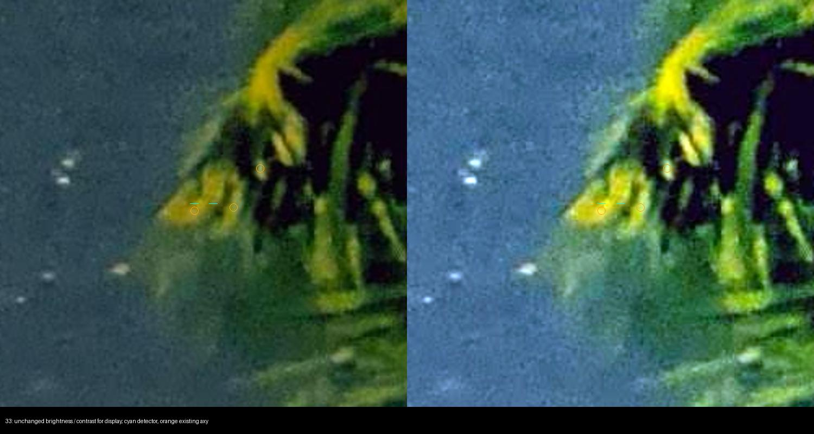

# Итерация устойчивости 10: визуальная проверка широкого rematch

2026-10-03, продолжение [итераций 8](robustness-iteration-8.md) и
[9](robustness-iteration-9.md). Только development `wm_r_143159342`.

**В широком rematch найдена вторая ложная опора на пальмовом листе.**
Её постоянное исключение немного меняет широкий fit, но оба варианта сходятся
к тем же 28 парам на следующем радиусе и практически одинаковой финальной
камере. Ошибка Albireo остаётся 18.69 px, RMS 40 проверочных опор — 11.31 px.
Удаление второй опоры не исправляет итоговую геометрию; автоматического
улучшения и изменений production нет.

## Проверены все 34 пары

Исходный набор — `rematch_10_before` случая `drop_detection_all_stages`
итерации 8: первый подтверждённый лист уже удалён из детекций, остаются
39 источников и десять начальных fit-пар. Радиус этого rematch — 10 рабочих,
или 25 исходных пикселей. Выборка фиксируется целиком, без отбора по остатку
или результату последующего fit.

Десять пар уже рассматривались в итерации 7, одиннадцать физических источников
встречались среди опор итерации 5. Три источника входят в обе группы;
**16 пар ранее не просматривались**. Сохранены общий вид и три листа кропов
150×150 исходных пикселей, увеличенных ×2. Для сомнительного источника у
границы предмета и новой ложной опоры дополнительно просмотрен контекст
250×250 px, в исходной яркости и с усилением контраста только для просмотра.

Для каждой пары записаны неизменные каталожный ID и вектор, координаты,
ближайшие три прежних внешних извлечения `.axy`, центроиды по исходным пикселям
в апертурах 8/12 px, пересечения с прежними опорами и каталожные соседи
до 7 mag в пределах 0.2°. Каталог, `.axy`, фото и прежние разметки не менялись.
Новая разметка допускает изменение только метки, выбранного внешнего центроида
и пояснения.

| Метка | Число | Что установлено |
|---|---:|---|
| `visible_source` | 25 | Различимо звёздное ядро; идентичность условна на относительном рисунке поля |
| `blend` | 7 | Смешанный/неразрешённый источник либо сомнение в индивидуальном компоненте |
| `ambiguous` | 1 | Природа источника у границы предмета не подтверждена |
| `not_visible` | 1 | Подтверждён протяжённый пальмовый лист вместо звёздного ядра |

Наличие звёздного ядра не удостоверяет индивидуальный HYG ID. Начальные
идентичности предложены проверяемой камерой; согласие рисунка поля и второго
извлечения не делает их независимым абсолютным ground truth. Внешний WCS
кадра остаётся unresolved, новые WCS не запускались.

### Источники с неопределённой идентичностью

| Индекс пары | HYG | Наблюдение |
|---:|---:|---|
| 7 | 119198 | Неразрешённая близость более яркого HYG 88327: 0.00216°, 6.00/4.03 mag; компонент не установлен |
| 8 | 89193 | Несколько звёздных ядер на структурном фоне; ближайший `.axy` смещён на 4.88 px |
| 10 | 83221 | Прежний возможный blend с HYG 83247, расстояние 0.08485° |
| 22 | 95473, Anser | Частично разделённая двойная структура; HYG 95487 на расстоянии 0.11787° |
| 24 | 82921 | Два близких ядра, HYG 82941 на расстоянии 0.11234°; индивидуальный центр не подтверждён |
| 30 | 95648, Albireo | Прежний физический источник; HYG 95652 находится в 0.00959°, отдельный компонент не разрешён |
| 31 | 87511 | Несколько частично смешанных ядер на ярком фоне Млечного Пути |
| 32 | 96324 | У границы предмета нет уверенно изолированного ядра; ближайший `.axy` в 24.52 px |

Для Albireo явно добавлена неопределённость компонента, прежняя разметка
физической опоры не переписывалась. Каталожная близость сама по себе не
доказывает ложную пару. Пара 32 оставлена сомнительной: недостаточная видимость
не равна доказательству ложного источника. Все эти детекции сохраняются
в эксперименте.

## Вторая подтверждённая ложная опора

Пара 33 сопоставляет HYG 81442 с детекцией в `(2819.54, 1445.65)` исходного
кадра. В центре видна непрерывная освещённая структура пальмового листа,
без отдельного звёздного ядра. Это другой физический источник, чем лист
в `(2941.24, 1193.01)`, исключённый в итерации 8.



Голубые отметки указывают центр детекции; оранжевые окружности — ближайшие
прежние `.axy`-извлечения. Фото Aruncmohan1987, CC BY 4.0; кроп, увеличение,
контраст правой половины и оверлеи — диагностические производные.

Ближайший `.axy` находится в 6.99 px и также лежит на листе: второе извлечение
не подтверждает звёздную идентичность. В начальных десяти парах эта детекция
отсутствует. Широкий rematch включает её при расстоянии до HYG 81442
**23.68 px**, внутри допуска 25 px. После fit остаток составляет 23.41 px,
поэтому следующий радиус 12.5 px её уже исключает.

Это конкретное подтверждение повторного включения переднего плана при
расширенном поиске соответствий, но не достаточное объяснение финальной ошибки.

## Один ограниченный replay

Визуальная разметка завершена и сохранена до нового fit. Сравниваются:

1. Контроль итерации 8: 39 детекций без первого листа, десять исходных пар.
2. Тот же вход без второй подтверждённой детекции: 38 детекций, **те же десять
   исходных пар**. Смешанные источники и сомнительная пара 32 не удаляются.

Начальная камера, остальные координаты, ранги, яркости, оптимизатор,
последовательность радиусов и код принятия решения неизменны. Переиспользована
та же проверенная Rust-сборка replay итерации 8 с `float_roundtrip`; перед
запуском проверены её исходники, manifest и lock. Это тот же workspace и
набор Cargo features, не подмена варианта через общий build-cache.
Поиск tetra3, повторная детекция и проверка принятия решения не выполнялись.

Все **12 контрольных этапов совпали точно** с трассой итерации 8, включая
камеры, порядок пар, координаты, векторы, ID и проекции.

| Этап и случай | Пары | RMS 40 опор | RMS 14 вне входов | Albireo | Shaula |
|---|---:|---:|---:|---:|---:|
| Широкий fit, контроль | 34 | 9.22 | 11.85 | 15.11 | 25.13 |
| Широкий fit, без второго листа | 33 | 9.12 | 11.45 | 15.21 | 23.38 |
| Следующий fit, контроль | 28 | 9.77 | 12.80 | 16.64 | 27.89 |
| Следующий fit, без второго листа | 28 | 9.77 | 12.80 | 16.64 | 27.89 |
| Финал, контроль | 18 | 11.31 | 15.10 | 18.69 | 32.94 |
| Финал, без второго листа | 18 | 11.31 | 15.10 | 18.69 | 32.94 |

Все ошибки — в исходных пикселях, на неизменных опорах итерации 5. После
широкого fit Albireo остаётся за следующим радиусом в обоих случаях.
Оба варианта выбирают те же 28 пар на 12.5 px: совпадают ID, векторы и
координаты, но порядок пар различается после сортировки по расстоянию.
Финальные различия focal
не превышают 1.2e-10 px, rotation — 6.5e-14, k1 — 1.9e-13.

В этих 28 парах остаются 24 визуально звёздных источника и четыре blend;
сомнительная пара 32 и второй лист исключены действующим радиусом.
Финальные 18 пар — 17 визуально звёздных источников и один blend.
Непросмотренных физических детекций в этих наборах нет; это не подтверждает
безошибочность всех каталожных назначений.

У 25 визуально одиночных источников широкий пространственный охват:
x = 59.54–2845.67, y = 125.72–3864.49 в кадре 3000×4000. По четвертям
верхняя левая/верхняя правая/нижняя левая/нижняя правая — 10/7/3/5.
Один bounding box не измеряет устойчивость геометрии: плотность опор неравномерна,
а источники около границ могут иметь систематические смещения или неверный ID.

## Проверки, ограничения и следующий шаг

Две трассы заняли 12.16/11.60 ms, включая диагностические снимки состояния;
команда с готовой сборкой — 1.17 s. Ошибок и таймаутов нет. Это не время
полного решателя и не performance-бенчмарк.

Прошли **127 Python-тестов** и существующий Rust replay. Новые пять тестов
защищают точность исключения, неизменность начальных пар, сохранение сомнительных
источников, запрет редактировать координаты/ID и запрет holdout. Rust-модуль
не менялся: его прежние проверки rustfmt/Clippy остаются применимы; повторный
контроль подтверждает эквивалентность всех этапов.

Производственный код, Cargo-зависимости, фото, manifest, split/track,
опубликованный baseline и WCS-review не менялись. Holdout не использован.
Negative и прежние успехи всей коллекции повторно не прогонялись: здесь нет
автоматического варианта pipeline. Ручное удаление ложной детекции не является
автоматическим улучшением, а отсутствие эффекта на одном кадре не означает
бесполезность обработки переднего плана вообще.

Круг причин сужен: второй подтверждённый лист влияет только на промежуточный
fit и не объясняет итоговую потерю Albireo. Остаются смешанные источники,
неполностью подтверждённые индивидуальные идентичности, систематические
смещения центроидов и ограничения модели камеры. Следующий ограниченный
опыт — фиксированный fit по 25 визуально одиночным широким опорам с контролем
всех прежних 40 проверочных точек; его нужно трактовать как диагностику
состава опор, без подбора радиусов или объявления новой камеры эталоном.

## Артефакты и воспроизведение

- [Разметка всех 34 пар](experiments/robustness-iteration-10-review.json) и
  [протокол просмотра](experiments/robustness-iteration-10-review-protocol.json).
- [Все этапы двух случаев](experiments/robustness-iteration-10-geometry.json),
  [протокол replay](experiments/robustness-iteration-10-protocol.json) и
  [проверки](experiments/robustness-iteration-10-checks.json).
- [Подготовка просмотра](../prototype/eval/robustness_wide_pairs.py) и
  [исполнитель](../prototype/eval/robustness_wide_replay.py).

Из корня, с NumPy, Astropy, Pillow и сохранёнными артефактами итерации 8:

```bash
python3 prototype/eval/robustness_wide_pairs.py prepare prototype/artifacts/wide-review-new
cp docs/experiments/robustness-iteration-10-review.json prototype/artifacts/wide-review-new/review.json
python3 prototype/eval/robustness_wide_pairs.py check prototype/artifacts/wide-review-new
python3 prototype/eval/robustness_wide_replay.py prepare prototype/artifacts/wide-fit-new --review prototype/artifacts/wide-review-new
python3 prototype/eval/robustness_wide_replay.py run prototype/artifacts/wide-fit-new
python3 prototype/eval/robustness_wide_replay.py report prototype/artifacts/wide-fit-new
python3 -m unittest discover -s prototype/eval -p 'test_*.py'
```

Использовать новые выходные каталоги. Cargo запускается offline/locked из
`prototype/`. Разметка и производные фото наследуют CC BY 4.0,
Aruncmohan1987; [атрибуция](../ATTRIBUTION.md).
