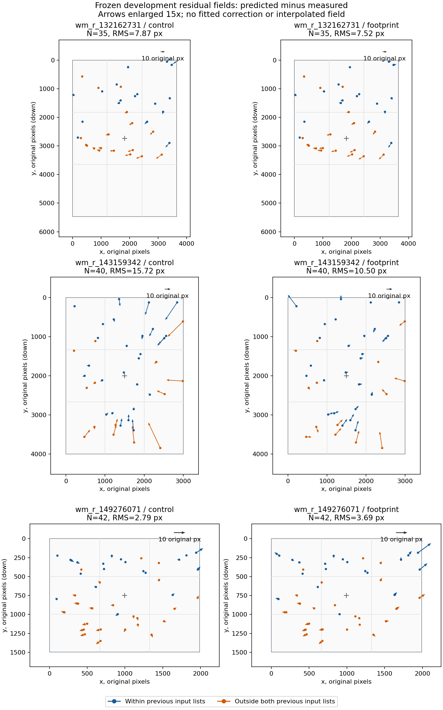

# Итерация устойчивости 12: пространственный рисунок остатков на трёх кадрах

2026-10-03, продолжение [итерации 11](robustness-iteration-11.md).

**Единого направления краевой ошибки на трёх development-кадрах нет.**
На `wm_r_143159342` исходные остатки почти полностью радиальные и направлены
преимущественно внутрь; на `wm_r_149276071` преобладает радиальная ошибка
наружу; на `wm_r_132162731` касательная составляющая не меньше радиальной.
Рисунок сохраняется при прежних альтернативных измерениях центроидов.
Это уточняет область следующего эксперимента, но не подтверждает новую
модель камеры или автоматическое улучшение. Новых fit в этой итерации нет.

## Что зафиксировано и как измерено

Использованы **117 прежних физических опор** итерации 5: 35/40/42 на
`wm_r_132162731` / `wm_r_143159342` / `wm_r_149276071`. Камеры — сохранённые
финальные `control` и `footprint` итерации 4. Это не промежуточные fit
итерации 11. SHA-256 разметки, измерений и всех шести исходных отчётов проверены.
Все 234 повторно вычисленные проекции **точно совпали** с итерацией 5.

До расчёта зафиксированы группы: все опоры, вне обоих прежних входных списков,
краевые полосы 10%, сетка 3×3 и радиальные интервалы `[0,0.35)`, `[0.35,0.70)`,
`[0.70,1]`. Радиус нормирован на полудиагональ кадра. Пустые и малочисленные
группы сохраняются; новых опор или исключений нет. Holdout не используется.

Остаток `e = projected − measured`, x направлен вправо, y вниз. Радиальная
единичная ось идёт от неизменного principal point `(width/2, height/2)` к
измеренному источнику. Положительный радиальный остаток направлен наружу.
Касательная ось повёрнута от радиальной по часовой стрелке в координатах
изображения. Разложение ортогонально: `|e|² = e_radial² + e_tangential²`.
В самом центре направление не определено и исключается только из этого
разложения; таких опор среди 117 нет.

Доля радиальной энергии — `sum(e_radial²) / sum(|e|²)`. Это описательная
статистика, не доля ошибок, причинно объяснённых объективом. Среднее смещение
не вычитается, translation, pose и distortion не подгоняются. Чисто радиальное
направление само по себе не отличает ошибку focal/k1 от других ограничений
подгонки или изображения.

## Векторные карты



Начало каждой стрелки — прежний измеренный источник, направление — к его
каталожной проекции; длины увеличены **в 15 раз**. Оранжевые опоры находятся
не ближе 12 исходных px к детекциям обоих прежних входов; синие — ближе хотя
бы к одному. Крест — прежний principal point. Показаны все опоры, без
интерполяции пустых областей. Масштаб исходных пикселей и aspect ratio
сохраняются внутри каждой панели; одинаковая видимая длина на разных кадрах
не является одинаковой угловой ошибкой.

Векторные форматы для экспорта:
[SVG](images/robustness-iteration-12-vectors.svg),
[PDF](images/robustness-iteration-12-vectors.pdf).

## Общие и вне-входные опоры

| Кадр / камера | N | RMS, px | RMS радиальный | RMS касательный | Радиальная энергия | Средний радиальный остаток |
|---|---:|---:|---:|---:|---:|---:|
| `132162731` control | 35 | 7.87 | 5.30 | 5.82 | 45.3% | −0.54 |
| `132162731` footprint | 35 | 7.52 | 4.50 | 6.03 | 35.7% | +0.70 |
| `143159342` control | 40 | 15.72 | 15.67 | 1.25 | **99.4%** | −9.04 |
| `143159342` footprint | 40 | 10.50 | 9.45 | 4.57 | 81.1% | −3.67 |
| `149276071` control | 42 | 2.79 | 2.53 | 1.19 | 81.9% | +1.49 |
| `149276071` footprint | 42 | 3.69 | 3.43 | 1.37 | 86.3% | +1.95 |

В таблицах сокращён только префикс `wm_r_`, полные ID сохранены в JSON.
Размеры кадров различны. Нормированный общий RMS в тысячных полудиагонали:
2.39→2.29, 6.29→4.20, 2.24→2.96 соответственно. Это удобное относительное
масштабирование, а не угловая калибровка и не основание объединять кадры
в одну оценку качества.

| Кадр | Опор вне входов | RMS control→footprint, px | Радиальная энергия control→footprint |
|---|---:|---:|---:|
| `132162731` | 18 | 8.62→9.14 | 32.0%→35.6% |
| `143159342` | 14 | 21.10→13.38 | **99.6%→82.6%** |
| `149276071` | 23 | 2.99→2.87 | 77.9%→74.4% |

На первом кадре общий RMS немного улучшается, а вне-входный ухудшается.
На третьем — наоборот. Это повторно показывает, почему одного агрегата
недостаточно. Каталожные идентичности этих опор условны на прежней визуальной
проверке; «вне входов» не превращает их в абсолютный независимый ground truth.

## Что различается между кадрами

**`wm_r_132162731`, Canon EOS R6.** В наблюдаемой нижней части звёздного поля
есть согласованный сдвиг преимущественно влево. Средний остаток на опорах
вне входов равен `(−6.22,+1.42)` / `(−7.05,+2.27)` px. Касательный RMS
там 7.10/7.33 px против радиального 4.87/5.45 px. Простая интерпретация
всей ошибки как радиальной недостаточна. Опоры покрывают лишь около 60%
высоты кадра; в нижних 10% и нижнем ряду сетки 3×3 опор нет. Точность там
не измерена.

**`wm_r_143159342`, vivo I2012.** У control средний радиальный остаток
по трём интервалам радиуса равен `+1.40 / −8.03 / −24.57` px, при
8/25/7 опорах. Это сильный радиальный компонент, наблюдаемый и вне входных
списков. Footprint уменьшает большую часть этого остатка, но вносит заметную
касательную составляющую и ухудшает верхний левый угол.

Радиальное направление не означает зависимости только от радиуса. Например,
у footprint Albireo при нормированном радиусе 0.876 имеет радиальный остаток
**+24.37 px**, Shaula при 0.825 — **−27.03 px**, Cujam при 0.816 —
**−12.13 px**. У control эти значения −0.97/−48.06/−36.76 px.
Это разные направления поля при сопоставимых, но не одинаковых радиусах;
наблюдение требует учитывать азимут, pose и распределение опор, а не выбирать
поправку по одному знаку среднего.

**`wm_r_149276071`, камера не указана.** Преимущественное направление наружу
сохраняется у обоих вариантов. У footprint во внешнем радиальном интервале
RMS 7.92 px против 3.58 px control; средний радиальный остаток +6.63 против
+2.23 px, всего шесть опор. Правый край ухудшается 4.28→9.23 px.
В верхних 10% кадра опор нет; в нижних — одна. Отсутствие ошибки в ненаблюдаемой
области не заявляется.

## Устойчивость наблюдения и ограничения

На одном и том же кадре направления control/footprint в основном согласованы:
косинус между полными полями векторов — 0.925 / 0.697 / 0.840; на опорах вне
входов — 0.961 / 0.884 / 0.904. Дополнительно сохранена медиана покомпонентных
косинусов для пар остатков не короче 1 px. Эти значения измеряют сходство
ошибок двух камер, **не правильность одной из них**; оба варианта используют
общий pipeline и общую проверочную разметку.

Повторное разложение по прежним центроидам r=8/r=12 сохраняет основные
различия. Доля радиальной энергии для первого кадра остаётся 44.5–45.2%
у control и 35.3–35.8% у footprint; для второго — около 99.5% и 81.5–81.6%;
для третьего — 81.4–82.4% и 85.6–86.1%. Членство в пространственных группах
при этом остаётся исходным. Это проверка чувствительности к измерению центра,
не независимая сертификация звёздных ID или модели изображения.

Кадры сняты разными/неустановленными камерами, имеют разное поле зрения,
масштаб и покрытие опорами. Разные знаки остатков **не опровергают** общую
модель с индивидуальными параметрами на кадр, но не обосновывают одну
фиксированную поправку для всех снимков. Ни по корреляции полей, ни по
радиальной энергии нельзя выбрать источник дефекта однозначно.

## Проверки и следующий эксперимент

137 Python-тестов прошли, включая пять новых проверок знаков, сохранения
квадрата нормы, поведения в центре, пустых групп, разбиения поля и запрета
holdout. Повторный запуск дал точно те же результаты, кроме времени.
Повторная проекция совпала с прежними координатами и ошибками на всех 234
случаях. Rust, маски, решатель и зависимости проекта не менялись;
Matplotlib установлен только во временное окружение для графиков.

Manifest, исходные пиксели, split/track, baseline и WCS-review сохранены.
Новых детекций, fit, WCS, solver-прогонов, ground truth и фотографий нет.
Holdout и negatives не прогонялись, solve rate не измерялся.

Следующий ограниченный опыт обоснован прежде всего радиальным остатком
`wm_r_143159342`: сравнить текущую модель с **одним дополнительным радиальным
членом** при фиксированных соответствиях, без повторного сопоставления.
Параметры и бюджет нужно закрепить до fit, оценивать прежние вне-входные
опоры и все края, а два других development-кадра использовать как проверки
регрессий. Азимутальные различия остаются ограничением гипотезы; положительный
результат одного кадра не разрешает включение модели по умолчанию.

## Артефакты и воспроизведение

- [Все остатки и группы](experiments/robustness-iteration-12-results.json),
  [протокол](experiments/robustness-iteration-12-protocol.json) и
  [проверки](experiments/robustness-iteration-12-checks.json).
- [Расчёт](../prototype/eval/robustness_residual_fields.py) и
  [экспорт графиков](../prototype/eval/robustness_residual_plot.py).

Нужны сохранённые отчёты итерации 4 и JSON итерации 5. Фото не перечитываются.
Из корня в окружении с NumPy/Astropy, для графиков также Matplotlib 3.8.4:

```bash
python3 prototype/eval/robustness_residual_fields.py prepare prototype/artifacts/residual-fields-new
python3 prototype/eval/robustness_residual_fields.py measure prototype/artifacts/residual-fields-new
python3 prototype/eval/robustness_residual_plot.py prototype/artifacts/residual-fields-new
python3 -m unittest discover -s prototype/eval -p 'test_*.py'
```

Использовать новый выходной каталог. Производные координаты и графики
наследуют атрибуцию исходных фото: oliwok, Aruncmohan1987, Harukkaaario,
CC BY 4.0; [атрибуция](../ATTRIBUTION.md).
