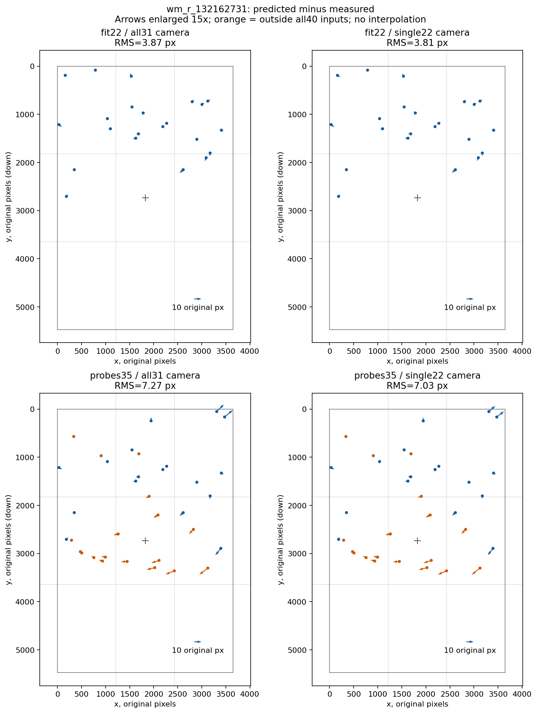

# Итерация устойчивости 29: остаточные векторы после fit по 22 одиночным звёздам

2026-10-05, продолжение [итерации 28](robustness-iteration-28.md).

**Исключение спорных опор почти не меняет пространственный рисунок ошибки.**
На `wm_r_132162731` после single22 fit сохраняется касательный остаток на
проверочных звёздах вне исходных детекций. Его направление устойчиво к прежним
альтернативным центроидам. Обнаруженный пробел в пространственном охвате fit
помогает выбрать следующий диагностический опыт, но ещё не устанавливает
причину ошибки модели. Автоматического улучшения в этой итерации нет.

## Вопрос и фиксированные входы

Итерация 28 показала: исключение девяти смесей/неоднозначных источников
уменьшает остаток на тех же 22 звёздах лишь на 1.48%. Здесь проверяется,
сохраняется ли направленный рисунок остатка после этой подгонки, включая
опоры вне fit, и может ли смена способа измерения центра существенно его изменить.

Использованы только сохранённые development-данные:

- Камеры `all31` и `single22` из итерации 28, без новой оптимизации.
- Те же 22 одиночных источника и их центроиды из итерации 27.
- Те же 35 проверочных источников из итерации 13 и альтернативные центроиды
  r8/r12 из итерации 5.
- Прежние группы 21 вне объединения fit и 18 вне всех исходных 40 детекций.
  Расстояние исключения остаётся 12 px. Это внутриполевые проверочные группы,
  **не коллекционный holdout**.

До расчёта зафиксированы хеши, оба варианта камеры, полный состав источников,
края 10%, сетка 3×3 и радиальные интервалы 0/.35/.70/1 полудиагонали.
Членство в группах определяется исходными центроидами и не меняется при r8/r12.
Пустые группы сохранены. Новых изображений, измерений центроидов, solve, WCS
и fit нет. Все данные для расчёта доступны в Git; локальные Rust-бинарники
и фотографии этому инструменту не нужны.

Повторно использованы `decompose`, `vector_metrics`, `groups` и `agreement`
из [итерации 12](../prototype/eval/robustness_residual_fields.py).
Остаток — `predicted − measured`, x вправо, y вниз. Радиальная ось идёт от
`(width/2,height/2)` наружу, касательная — по часовой стрелке. Направление
сравнивается отдельно для остатков длиной не меньше 1 px. Никакой translation,
affine или distortion к остаткам не подгоняется.

## Результат

| Группа | N | RMS all31→single22, px | Радиальный RMS single22 | Касательный RMS single22 | Радиальная энергия single22 |
|---|---:|---:|---:|---:|---:|
| Те же звёзды fit, detector | 22 | 3.869→3.811 | 2.992 | 2.361 | 61.6% |
| Все проверочные опоры | 35 | 7.270→7.031 | 4.607 | 5.311 | 42.9% |
| Вне всех исходных детекций | 18 | 7.729→7.773 | 4.253 | 6.506 | **29.9%** |
| Средняя центральная ячейка | 6 | 10.138→10.165 | 4.989 | 8.856 | 24.1% |

В последней строке все шесть опор входят в группу 18. В этой же ячейке
`x∈[1216,2432), y∈[1824,3648)` **нет ни одной из 22 звёзд fit**.
Средний вектор на шести опорах равен `(−9.400,+2.877) px`: преимущественно
влево и немного вниз. На всех 18 опорах — `(−5.572,+1.226) px`.
Это пространственно неоднородный остаток, а не одинаковый сдвиг всего поля.

Косинус между полями all31 и single22 равен **0.9852** на 22 звёздах,
**0.9958** на всех 35 и **0.9982** на 18 вне-входных опорах. Поэтому небольшое
изменение общего RMS не означает исчезновения прежнего рисунка ошибки.

## Чувствительность к центроидам

Камера single22 остаётся фиксированной; альтернативные центроиды используются
только для измерения ошибки, без повторной подгонки.

| Группа / центроид | RMS, px | Радиальная энергия | Косинус поля относительно основного центроида |
|---|---:|---:|---:|
| 22 / detector | 3.811 | 61.6% | 1 |
| 22 / external | 3.838 | 60.8% | 0.9931 |
| 22 / r8 | 3.772 | 60.3% | 0.9987 |
| 22 / r12 | 3.805 | 58.7% | 0.9934 |
| 18 вне входов / external | 7.773 | 29.9% | 1 |
| 18 вне входов / r8 | 7.835 | 30.3% | 0.9997 |
| 18 вне входов / r12 | 7.888 | 30.1% | 0.9994 |

RMS разности центроидов на 22 звёздах — 0.195 px для r8, 0.437 px для r12
и 0.449 px для external относительно detector. На 18 проверочных опорах —
0.191/0.293 px для r8/r12 относительно external. Эти изменения существенно
меньше сохраняющегося остатка. Согласие методов **не исключает общую
систематическую ошибку** изображения или условных каталожных идентичностей.
В JSON поле `camera_disagreement_rms_px` переиспользованного `agreement`
в секции `centroid_agreement` означает именно RMS разности центроидов:
проекция камеры в этом сравнении одна и та же.

## Векторная карта и ограничения



Стрелки увеличены в 15 раз, начало — измеренный центр, конец — направление
каталожной проекции. Оранжевые источники вне всех исходных 40 детекций.
Верхний ряд: одни и те же 22 звезды на двух камерах; нижний: одни и те же
35 проверочных опор. Сетка совпадает во всех панелях, интерполяции нет.
[SVG](images/robustness-iteration-29-vectors.svg),
[PDF](images/robustness-iteration-29-vectors.pdf).

Звёзды fit покрывают y≈84…2707 px, проверочные — y≈52…3360 px при высоте
5472 px. Нижний ряд сетки и нижний край не проверены. Отсутствие опор в
центральной ячейке fit не доказывает, что добавление там звёзд исправит модель.
По этой карте нельзя однозначно выбрать децентрирование, aspect ratio,
дисторсию, обработку изображения или иной механизм.

Привязка этого кадра по-прежнему не имеет принятого независимого WCS.
Все оценки геометрии условны на прежних идентичностях. Согласие векторов
между камерами и методами измерения не превращает их в ground truth.

## Проверки, воспроизведение и следующий шаг

**218 Python-тестов прошли**, включая четыре новых проверки неизменности
групп/идентичностей, интерпретации согласия и запрета holdout. Все 70 проекций
проверочных источников точно воспроизведены; RMS на 22 звёздах совпадает
с итерацией 28 в пределах 1e−8 px. Повторный расчёт дал побайтово одинаковый
JSON. Проверены хеши исходных артефактов, manifest, baseline и WCS-review.
Rust и production pipeline не менялись, поэтому Rust/CLI/collection gates
не повторялись. Solve rate, таймауты решателя и false acceptance не измерялись.

Из `prototype/`, в новый выходной каталог, с NumPy/Astropy/Pillow:

```bash
PYTHONPATH=artifacts/robustness-wcs-python:eval python3 eval/robustness_single22_residuals.py prepare --out-dir artifacts/robustness-iteration-29
PYTHONPATH=artifacts/robustness-wcs-python:eval python3 eval/robustness_single22_residuals.py measure --out-dir artifacts/robustness-iteration-29
```

Для графиков нужен Matplotlib 3.8.4. В этой сессии он установлен только в
`/tmp/starglyph-iteration-29-plot`; зависимости проекта не менялись:

```bash
MPLCONFIGDIR=/tmp/starglyph-iteration-29-mpl PYTHONPATH=/tmp/starglyph-iteration-29-plot:artifacts/robustness-wcs-python:eval python3 eval/robustness_single22_plot.py --out-dir artifacts/robustness-iteration-29
```

[Протокол](experiments/robustness-iteration-29-protocol.json),
[векторы и все группы](experiments/robustness-iteration-29-results.json),
[проверки](experiments/robustness-iteration-29-checks.json).
Производные координаты и графики сохраняют атрибуцию исходного фото: oliwok,
CC BY 4.0;
см. [ATTRIBUTION.md](../ATTRIBUTION.md).

Следующий ограниченный опыт — проверить влияние **пространственного охвата**
при прежней пяти-параметрической модели: заранее выбрать по координатам,
без отбора по ошибке, одинаковое число проверенных опор для двух распределений.
Для оценки оставить общий набор вне объединения обоих fit; звёзды, включённые
в подгонку, больше не считать проверочными. Это будет ручная диагностика
охвата, а не автоматический отбор источников. Новую модель камеры или повторную
настройку k2 текущие наблюдения сами по себе не обосновывают.
