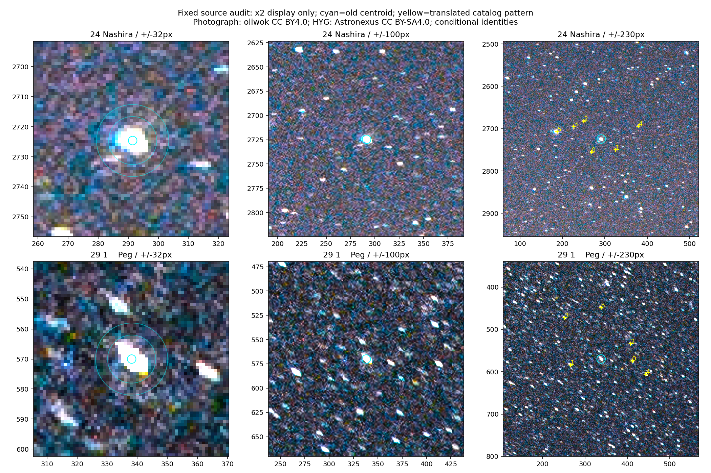

# Итерация устойчивости 33: идентичность и форма двух звёзд левого края

2026-10-05, продолжение [итерации 32](robustness-iteration-32.md), база `18247b4`.
Только development `wm_r_132162731`.

**Оснований заменить или исключить Nashira и 1 Peg не найдено.** Обе прежние
идентичности поддерживаются рисунком окружающих звёзд. У источников есть
асимметрия, цветовые различия и отсечение яркости, но измеренный разброс
центров значительно меньше остатка после fit19. Ошибка каталожной
идентификации или смешение с очевидным соседним ядром не подтверждены
как объяснение регрессии. Абсолютная точность этих опор остаётся неизвестной.

## Вопрос и границы проверки

В итерациях 31–32 эти две точки определяли ухудшение левого края при
подгонке по 19 звёздам. Проверяем ограниченную гипотезу: прежняя разметка
выбрала другой физический источник либо его центр сильно смещён смесью.
Выбор двух точек сделан **по уже известному результату**; это целевая
диагностика, не случайная выборка для оценки частоты ошибок.

Идентификаторы, координаты и исходные метки сохраняются:

| source ID | HYG | Имя | Строка `.axy` | Центр X/Y, px |
|---:|---:|---|---:|---|
| 24 | 106642 | Nashira | 77 | 291.47592 / 2724.58984 |
| 29 | 105162 | 1 Peg | 15 | 338.13684 / 570.02008 |

До новых измерений закреплены код и хеши входов. Повторно используются
`native_centroid`, `project`, выбор development, прежний HYG v4.2 и `.axy`.
Новых фото, WCS, детекций, LM-fit или rematch нет. Результат не меняет
производственный алгоритм, пороги принятия или старую разметку.

## Каталог и относительный рисунок

Для каждой цели сохранены шесть ближайших записей **полного локального
HYG без ограничения звёздной величины**. Отдельно для просмотра окружения
выбраны шесть ближайших звёзд до 8 mag в радиусе 3°. Выбор не зависит
от наличия детекции и величины её ошибки.

Ближайшие записи полного каталога:

| Цель | Сосед HYG | mag | Угловое расстояние | Расстояние проекций, px |
|---|---:|---:|---:|---:|
| Nashira | 106515 | 8.33 | 0.41822° | 24.29 |
| 1 Peg | 105176 | 8.70 | 0.21571° | 18.66 |

Проекции вычислены сохранённой камерой `original22_external` итерации 30.
Для локального рисунка применяется **только общий перенос**: проекция
целевой звезды совмещается с её прежним измеренным центром. Масштаб,
вращение и дисторсия не подгоняются. В пределах 20 px от каждой проекции
показываются до трёх ближайших старых извлечений; они являются кандидатами,
а не автоматически принятыми соответствиями.

Визуально проверены все 12 соседей. Рисунок поддерживает прежние
идентичности: видимые источники расположены у всех шести предсказанных
позиций каждой цели. Выбранные строки `.axy` по порядку сохранённого списка:

- Nashira: `3414, 3687, 5423, 3855, 3399, 29`; расстояния до перенесённого
  рисунка 0.28–1.50 px. Последняя звезда — Deneb Algedi.
- 1 Peg: `910, 314, 1184, 1118, 673, 1333`; расстояния 0.17–1.48 px.

Это дополнительное локальное свидетельство, **не независимая WCS**.
Общий перенос намеренно убирает абсолютную ошибку цели; малые остатки
соседей не доказывают правильность абсолютного центра, камеры или каталога.
Отсутствие близкой записи HYG также не исключает слабого или неразрешённого
компонента, отсутствующего в этом каталоге.

## Просмотр и измерение центров

Просмотрены участки ±32, ±100 и ±230 px. Для отображения яркость умножается
на два; численные измерения используют исходные пиксели нормализованного
JPEG. Бирюзовый круг показывает прежний центр, жёлтые кресты — относительный
каталожный рисунок. Апертуры на увеличении имеют радиусы 8 и 12 px.



У Nashira одно доминирующее компактное ядро, асимметричный цветной ореол
и слабый выступ снизу слева. У 1 Peg одно доминирующее ядро, вытянутое
сверху слева вниз направо; отдельные источники сверху и справа лежат
за пределами апертуры 12 px. Сходная вытянутость видна у соседних звёзд.
Внутри апертур не различаются два сопоставимых ярких ядра. Ни одна точка
не попадает на землю или растительность.

Для Rec.709 luma и каждого канала RGB повторно применён прежний алгоритм:
положительный поток сверх медианы кольца 16–22 px, круг радиуса 8 либо 12 px
вокруг **неизменного внешнего центра**, без повторного центрирования.
Прежние четыре luma-центроида воспроизводятся до 1e−8 px.

| Метрика | Nashira | 1 Peg |
|---|---:|---:|
| Смещение luma r8 относительно `.axy`, px | 0.1480 | 0.2740 |
| Смещение luma r12, px | 0.2295 | 0.3526 |
| Максимальное смещение среди RGB/luma × r8/r12, px | 1.1281 | 0.3654 |
| Пиксели с каналом =255 в круге r12 | 7 / 453 | 12 / 447 |
| Остаток камеры fit19 `original22_external`, px | **4.7573** | **13.0009** |
| Остаток той же камеры при восьми альтернативных центрах, px | 4.4303–5.8709 | 12.6369–13.0594 |

Последняя строка — переоценка **одной фиксированной камеры**, не восемь
новых подгонок. Векторы её исходного остатка `predicted−measured`:
Nashira `[+4.69765, −0.75076]`, 1 Peg `[+6.10717, +11.47718]` px.
Канал B у Nashira сдвигает центр влево и увеличивает этот остаток;
измеренная цветовая неоднородность не устраняет ошибку.

Отсечение до 255 установлено в обработанном JPEG, а не в неизвестном raw
сенсора. Оно и вытянутая форма ограничивают точность оценки истинного центра.
Слабые соседи могут влиять на кольцо фона. Согласие проверенных центроидов
не исключает общего систематического смещения, а `single_core` означает
только одно видимое доминирующее ядро, не физическую одиночность звезды.

## Вывод и следующий шаг

Простая замена ближайшего источника либо выбор другого проверенного
центроида не получили обоснования. Оба ID остаются в оценке, включая
их большие остатки. Подозрение на несоответствие общей геометрической
модели усиливается, но пока не доказано: непроверенные систематические
ошибки изображения и каталога сохраняются. Автоматического улучшения нет.

Следующий ограниченный опыт — проверить, объясняет ли **нерадиальная
компонента дисторсии** согласованный остаток на этом поле. До реализации
новой камеры достаточно диагностического сравнения фиксированного базиса
тангенциальной дисторсии с нынешними пятью параметрами: оценка на прежних
22 опорах, перенос на те же 19 и все непустые краевые группы, три метода
центроидов, заранее заданные критерии регрессии. Опоры не исключать;
агрегатный выигрыш без переноса на края не принимать. Этот опыт ещё не
выполнен и не разрешает включение модели по умолчанию. Радиальный k2 уже
проверялся в итерации 13; его повторного подбора здесь нет.

## Проверки и воспроизведение

**235 Python-тестов прошли**, включая четыре новых: сохранение слабого
ближайшего каталожного компонента, неизменность относительных векторов
при переносе рисунка, измерение цветовых смещений/отсечения на синтетическом
источнике, запрет holdout до чтения данных. Повторные измерения дают
побайтово одинаковый JSON. Проверены хеши фото, входов, manifest, baseline
и WCS-review. Измерение двух точек заняло 2.02 s, без ошибок и таймаутов.
Production и Rust не менялись; solver, negative и holdout
прогоны не повторялись, solve rate и частота ложных принятий не измерены.

Из `prototype/`, в окружении NumPy/Astropy/Pillow/Matplotlib:

```bash
PYTHONPATH=artifacts/robustness-wcs-python:eval python3 eval/robustness_left_source_audit.py prepare --out-dir artifacts/left-source-reproduction
# Для точного повторения: скопировать опубликованный 33-review.json в review.json этого каталога.
PYTHONPATH=artifacts/robustness-wcs-python:eval python3 eval/robustness_left_source_audit.py measure --out-dir artifacts/left-source-reproduction
PYTHONPATH=artifacts/robustness-wcs-python:eval python3 eval/robustness_left_source_audit.py validate --out-dir artifacts/left-source-reproduction
```

В текущем окружении Matplotlib 3.8.4 находится отдельно; для `prepare`/`render`
использовались также `PYTHONPATH=/tmp/starglyph-iteration-29-plot:artifacts/robustness-wcs-python:eval`
и `MPLCONFIGDIR=/tmp/starglyph-iteration-33-mpl`. Первый вызов подготовки
остановился на импорте Matplotlib после сохранения входов; `render` повторён
с этим окружением. Входы и параметры при этом не менялись.

[Протокол](experiments/robustness-iteration-33-protocol.json),
[входы и все каталожные соседи](experiments/robustness-iteration-33-input.json),
[визуальная проверка](experiments/robustness-iteration-33-review.json),
[измерения](experiments/robustness-iteration-33-results.json),
[проверки](experiments/robustness-iteration-33-checks.json),
[скрипт](../prototype/eval/robustness_left_source_audit.py).
Фото: oliwok, CC BY 4.0; HYG: Astronexus, CC BY-SA 4.0.
Производные каталожные таблицы и аннотированная иллюстрация — CC BY-SA 4.0;
[атрибуция и оригинальные ссылки](../ATTRIBUTION.md).
