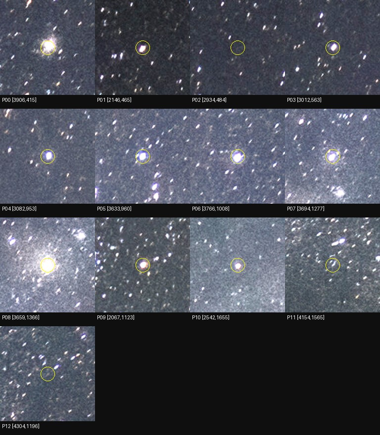

# Итерация 37: потеря центральных источников при ранжировании

На development-кадре `wm_r_134291495` пять визуально компактных центральных
источников проходят фильтры во всех четырёх проходах детектора, но имеют
ранги **77–410** и не попадают в top-40/50. Ручное восстановление этих опор
убирает все **26 `TooFew`**, обнаруженные в [итерации 36](robustness-iteration-36.md),
однако все **192 попытки варианта** завершаются `NoMatch`. Потеря опор
подтверждена; её устранения недостаточно для получения привязки. Новая
автоматическая эвристика не вводится, улучшение распознавания не подтверждено.

## Визуальные пробы и трассировка

По исходной фотографии выбраны 13 точек до запуска трассировки. P00 — яркий
источник, уже присутствующий в коротком списке; P01/P03–P07/P09/P10 — восемь
визуально компактных центральных источников; P08 — яркая сложная область;
P02/P11/P12 заранее помечены как слабые/неоднозначные. Все точки сохранены,
включая неоднозначные; они не объявляются независимыми каталоговыми звёздами.

Для воспроизводимости около каждого визуального seed выбран самый яркий
пиксель 8-bit luma в фиксированном окне ±10 px; при равенстве — первый по
порядку строк. Это координата пробы, а не новый центроид для решателя.
Радиус связи с пороговой компонентой — прежние 12 исходных пикселей.



Фото NOIRLab/AURA/NSF, **CC BY 4.0**, `wm_r_134291495` из существующей
коллекции. Изменения для диагностической иллюстрации: crops 128×128 px,
равномерное увеличение до 192×192, яркость ×1.5, номера и окружности.
Пиксели входного снимка не менялись. Координаты на рисунке относятся
к нормализованному исходнику 6016×3760, top-left zero-based.

Использован существующий `solve::replay::source_traces` и
`detect::trace::detect_stars_with_trace`. Этот тест исполняет четыре
scale/tier-прохода в трёх уже существующих режимах: control, quantile,
blob_concentration. Для каждого из 12 проходов он сравнивает весь результат
с обычным детектором через точный `assert_eq!`. Альтернативные режимы
использованы для диагностики уже известных механизмов, не для подбора
новой комбинации параметров.

Переиспользован сохранённый тестовый бинарник итерации 35: проверены его хеш,
build protocol и все актуальные исходники core относительно этого протокола.
Тестовые LM-варианты бинарника не вызываются. Четыре control-списка дополнительно
точно совпали с сохранёнными входами итерации 1, использованными в итерации 36.
Исследовательские Python-инструменты новые; Rust и production не изменены.

## Где теряются источники

Исходы всех 13 проб в control:

| Проход | Selected | Top-K | Нет компоненты в радиусе | Concentration | Area | Elongation |
|---|---:|---:|---:|---:|---:|---:|
| 1600 default | 1 | 7 | 4 | 1 | 0 | 0 |
| 1600 deep | 3 | 6 | 3 | 1 | 0 | 0 |
| 6016 default | 1 | 6 | 1 | 3 | 1 | 1 |
| 6016 deep | 1 | 6 | 2 | 4 | 0 | 0 |

Пять компактных источников, проходящих фильтры во всех четырёх случаях:

| Проба | 1600 default rank | 1600 deep rank | 6016 default rank | 6016 deep rank |
|---|---:|---:|---:|---:|
| P01 | 276 | 341 | 183 | 139 |
| P03 | 246 | 410 | 233 | 188 |
| P04 | 230 | 217 | 165 | 132 |
| P05 | 118 | 105 | 119 | 77 |
| P09 | 244 | 301 | 132 | 119 |

Ранги нулевые. Их измеренные центроиды находятся в **1.02–1.70 исходных px**
от зафиксированных проб. В уменьшенном default их flux равен 4.44–6.23;
в native default — 41.32–57.02. Значения в разных разрешениях напрямую
не сравниваются. Детектор сортирует по измеренному flux, затем отсекает
список; в этих случаях потери происходят именно на этом последнем шаге.
Это не доказательство ошибки фотометрии или пригодности источников для базы.

P06/P07 проходят в reduced deep, но отклоняются концентрацией в native;
P10 не имеет пороговой компоненты в reduced default и отклоняется
концентрацией в native. P08 отклоняется концентрацией либо площадью,
что само по себе не является ошибкой для сложного объекта. У слабой P12
native default ассоциирует компоненту, центроид которой отстоит на 14.76 px:
радиус проверяется по ближайшему **пикселю компоненты**, а не её центру.
Эта ассоциация не подтверждает идентичность источника. Она сохранена в
результатах, но не используется в опыте восстановления.

Существующий `blob_concentration` не восстанавливает ни одну из пяти опор:
они остаются за top-K во всех проходах. В quantile происходит то же самое.
Это согласуется с ранее опубликованным полным прогоном
[итерации 2](experiments/robustness-iteration-2-development.json):
на данном ID control и blob дали отказ. Новый полный прогон этого варианта
не нужен; его реализация не повторялась.

## Один ограниченный ручной эксперимент

После диагностики, **до matcher replay**, отдельно зафиксированы пять
ID, код, списки, бинарник, базы, параметры и критерии опыта:

- На каждом из четырёх списков пять опор берутся по подтверждённым рангу
  и центроиду из полного сохранённого detector-списка.
- Вход варианта: P01/P03/P04/P05/P09, затем первые 35 или 45 прежних
  детекций. Последние пять прежних слотов заменены; размер 40/50 сохранён.
- Координаты, flux, peak, shape и SNR всех источников неизменны; обновлено
  только поле rank согласно новому порядку. Flux не подделывается для
  приоритета. Tetra3 сам сортирует по flux внутри каждого переданного префикса.
- Префиксы `8,10,12,16,20,30`, восемь диапазонов FOV, базы, пороги принятия
  и timeout 2500 ms совпадают с control. По 48 вызовов на список и режим,
  **384 вызова**, wall limit 180 s.

Это ручное вмешательство в состав и порядок источников, **не автоматический
вариант**. Оно проверяет достаточность восстановления конкретных пяти опор,
а не оптимальность всех возможных списков. Маски и пиксели не редактировались.
Использован тот же сохранённый tetra3 trace-бинарник, что в итерации 36.

Критерии: все 192 control-исхода совпадают с итерацией 36; все попытки имеют
свои trace-события; учитываются кандидаты, таймауты, время и число источников
после прореживания. Даже появление сырого tetra3-кандидата не считалось бы
принятым решением без последующей независимой проверки Starglyph и геометрии.

## Результат опыта

| Проход | Control: NoMatch / TooFew | Восстановление: NoMatch / TooFew | После thinning при k=8, до→после | После thinning при k=30, до→после | Matcher s, до→после |
|---|---:|---:|---:|---:|---:|
| 1600 default | 48 / 0 | 48 / 0 | 5→5 | 10–11→11–12 | 2.427→3.722 |
| 1600 deep | 48 / 0 | 48 / 0 | 5–6→5 | 9–10→10–11 | 1.480→3.595 |
| 6016 default | 35 / 13 | 48 / 0 | 3→5 | 6–7→8–9 | 0.191→0.814 |
| 6016 deep | 35 / 13 | 48 / 0 | 3→5 | 6–8→7–8 | 0.323→1.156 |

Все 192 control-исхода воспроизведены. Вариант имеет ≥4 источников во всех
6240 проверках FOV вместо 5394 у control, но **кандидатов по-прежнему нет**.
Итоговые inliers и независимая геометрия не определены. Таймаутов нет ни
в одном из 384 вызовов. Полный replay занял 16.037 s; tracer детектора —
48.893 s, включая 12 дополнительных запусков без trace для точного сравнения.

При одинаковом лимите и числе вызовов фактическая работа выросла: сумма
matcher-времени 4.421→9.288 s. Разнесённые опоры оставляют больше четвёрок
для перебора. Поэтому это сопоставимый ограниченный бюджет попыток,
а не равная вычислительная работа; timing с инструментированием не является
production benchmark.

Неудачный опыт не исключает пользы другого состава источников. Он исключает
более узкое объяснение: **полный отказ не устраняется одним восстановлением
этих пяти потерянных центральных опор при прежнем поиске**. Не обоснованы
ни отключение cluster-buster, ни увеличение top-K, ни новая пространственная
эвристика по одному лишь улучшению счётчика пригодных четвёрок.

## Проверки, ограничения и следующий шаг

- Пройдены **253 Python-теста**, включая неизменность измерений при
  перестановке, валидацию состава, half-pixel mapping и split/freeze guards.
- Existing Rust trace-test прошёл 12 точных сравнений с обычным детектором;
  четыре списка совпали с прежним baseline. Новая Rust-сборка не потребовалась.
- Production, manifest, baseline, split/track и WCS-review не менялись.
  Holdout не использован. Отрицательные и остальные успешные кадры не
  переизмерялись: автоматического изменения нет.
- Внешняя WCS этого кадра остаётся unresolved. Каталоговые идентичности проб,
  полнота каталога и единая проекция поля не подтверждены. Новый WCS-прогон
  не запускался. Новых снимков нет.

Следующий вопрос — почему достаточно разнесённые четвёрки не дают решения.
Нужно разделить отсутствие подходящих каталожных паттернов и отбраковку
при внутренней проверке tetra3, используя сохранённые исходные и ручные
списки. До новой эвристики полезна независимая идентификация нескольких
групп звёзд для проверки масштаба и применимости одной камеры ко всему полю.
Сам по себе `NoMatch` этих причин не различает.

## Артефакты и запуск

[Трассировка и визуализация](../prototype/eval/robustness_central_sources.py),
[ручной replay](../prototype/eval/robustness_central_replay.py),
[тесты](../prototype/eval/test_robustness_central_sources.py).

Публикуются отдельно от baseline:
[trace protocol](experiments/robustness-iteration-37-protocol.json),
[пробы](experiments/robustness-iteration-37-input.json),
[каждый исход пробы](experiments/robustness-iteration-37-results.json),
[replay protocol](experiments/robustness-iteration-37-replay-protocol.json),
[списки replay](experiments/robustness-iteration-37-replay-input.json),
[каждая попытка](experiments/robustness-iteration-37-replay-results.json),
[проверки и хеши](experiments/robustness-iteration-37-checks.json).

Из `prototype/`, с сохранёнными артефактами итераций 1, 35 и 36:

```sh
export PYTHONPATH=artifacts/robustness-wcs-python:eval
export ITERATION_OUT=artifacts/robustness-iteration-37-repeat
python3 eval/robustness_central_sources.py prepare --out-dir "$ITERATION_OUT"
python3 eval/robustness_central_sources.py run --out-dir "$ITERATION_OUT"
python3 eval/robustness_central_sources.py summarize --out-dir "$ITERATION_OUT"
python3 eval/robustness_central_sources.py figure --out-dir "$ITERATION_OUT"
python3 eval/robustness_central_replay.py prepare --out-dir "$ITERATION_OUT"
python3 eval/robustness_central_replay.py run --out-dir "$ITERATION_OUT"
python3 eval/robustness_central_replay.py summarize --out-dir "$ITERATION_OUT"
python3 -m unittest discover -s eval -p 'test_*.py'
```

Локально `prototype/artifacts/robustness-iteration-37/` сохранены полноточные
trace/result JSON, stderr и параметры запуска. Публикуемые protocol/input
сохраняются побайтово; results компактны без округления чисел. Инструменты
намеренно проверяют прежние бинарники и исходники: при их изменении нужен
новый протокол, а не обход freeze. Пересборка описана в отчётах 35/36.
