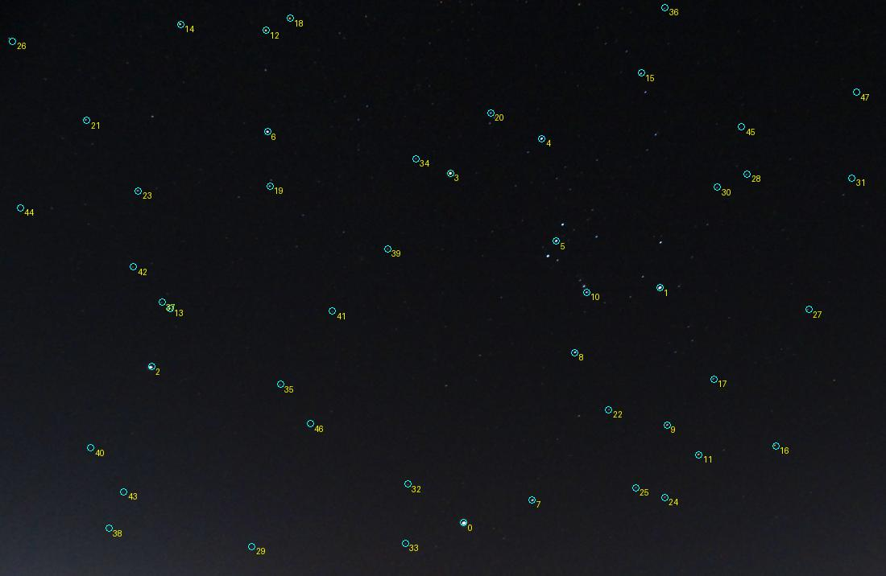

# Итерация 40: успешный статус при большой ошибке поля

На development-кадре **`wm_r_154807046`** подтверждено крупное расхождение
сохранённых решений Starglyph с видимыми звёздами вне небольшой области
inliers. На 47 просмотренных источниках RMS составляет **94.39 px у control
и 92.78 px у blob**, хотя внутренние RMS равны **3.66 и 2.58 px**.
Существующая внешняя WCS на тех же источниках даёт **5.97 px**.
Идентичности поддержаны рисунком поля, но остаются условными; WCS не повышена
до ground truth. Автоматическое улучшение не подтверждено.

## Выбор следующей задачи

После отрицательной [итерации 39](robustness-iteration-39.md) не продолжался
слепой перебор областей `wm_r_134291495`. Повторно просмотрены существующие
development-обзоры `16053617`, `176481855`, `170711707`; уверенных новых
каталожных идентичностей из них не получено. Среди исходных десяти отказов
сохранённый WCS-кандидат есть только у уже разобранного `161606532`.

Поэтому выбран прежний **успешный** development-пример с открытым вопросом
о геометрии. В [итерации 2](robustness-iteration-2.md) для `154807046`
уменьшение внутреннего RMS сопровождалось ростом расхождения с внешними
соответствиями примерно 70→73 px. Предположение о плохой внешней привязке
тогда не было проверено на распределённых видимых источниках.

Ограниченная проверка: сравнить сохранённые control/blob-камеры и внешнюю WCS
на одинаковых физически измеренных источниках. Новых solve, WCS-поисков,
подгонок камер и изменений алгоритма нет. Это диагностика качества уже
принятого решения, не продолжение подбора blob-эвристики.

## Протокол и визуальная проверка

Вход — неизменённый PNG **4485×2920**, фото Davydushta, CC BY 4.0,
«Orion, Sirius, Lepus.jpg». Использованы control/blob-отчёты
`robustness-iteration-2/development-final`, исходные `.axy`, `.corr`, `.wcs`
и локальный HYG v4.2. Проверяются development split, SHA-256 изображения,
внешних артефактов и сохранённых входов. Масштабы и координаты FITS приведены
к исходному изображению; из X/Y вычтена единица.

До измерения ошибок закреплены код, модели и **48 кандидатов**:
HYG mag≤5.5, три ярчайших в каждой ячейке 4×4 по проекции внешней WCS.
Отбор не зависит от наличия близкой детекции или размера остатка.
Для каждого показаны ближайшие три извлечения в радиусе 45 px и ярчайшее
в той же области. Повторно использованы `preview`, `validate_review`,
`native_centroid` и `project`; новые механизмы решателя не добавлялись.

Просмотрены обзор и все 48 кропов исходных пикселей с яркостью ×2 только
для отображения. **47 локализованных источников** приняты для измерения.
Кандидат №29, α Mon, оставлен `not_visible`: в фиксированной области нет
уверенного изолированного ядра и подходящего извлечения. Это не доказательство
ошибки каталога. Остальные точки не исключались после просмотра остатков.
Перед вычислением геометрии отдельно закреплён SHA-256 завершённой разметки.

Рисунок Ориона с Betelgeuse, Bellatrix, поясом, Rigel и Saiph, положение
Sirius, Procyon и группы Lepus поддерживают соответствия. Виден сходный
наклон вытянутых ядер, у ярких звёзд насыщение и цветные ореолы. Слабые
краевые точки сопоставлены условно по общему рисунку. Их имена предложены
проверяемой WCS: визуальное совпадение не является независимой абсолютной
калибровкой. Все 108 строк внешней `.corr` заново не сертифицировались.



Кружки — исходные WCS-проекции всех 48 кандидатов, включая исключённый №29;
это обзор выбора, не карта измеренных ошибок или ground truth.

## Одинаковые источники, разные модели

Ошибка — расстояние от каталожной проекции до выбранного измеренного центра
в исходных пикселях. Полные координаты, остатки и группы каждого ID сохранены
в JSON. «Вне входов» означает не ближе 12 px к любой точке соответствующего
сохранённого списка, а не только к финальным inliers. Для внешней WCS
исключены **все 108 строк `.corr`**, включая одну с весом ниже 0.95.

| Группа | N | Control RMS, px | Blob RMS, px | Внешняя WCS RMS, px |
|---|---:|---:|---:|---:|
| Все просмотренные источники | 47 | 94.385 | 92.784 | 5.967 |
| Вне обоих входов Starglyph | 18 | 101.222 | 99.289 | 6.256 |
| Вне всех строк внешней `.corr` | 14 | 68.128 | 69.488 | 4.025 |
| Вне обоих Starglyph-входов и внешней `.corr` | 2 | 8.855 | 14.921 | 5.390 |
| Левые 10% ширины | 3 | 250.046 | 228.941 | 14.325 |
| Правые 10% ширины | 3 | 20.046 | 44.690 | 12.001 |
| Верхние 10% высоты | 5 | 163.103 | 149.997 | 10.344 |
| Нижние 10% высоты | 3 | 116.039 | 108.663 | 5.240 |

Группы могут пересекаться. Две точки вне всех входов — μ Eri и 45 Eri;
этого мало для независимой оценки всего поля. Выбор по WCS и общая внешняя
экстракция ограничивают независимость даже 14 точек вне `.corr`.

У blob улучшаются **15/47**, ухудшаются **32/47** источников. Общий RMS
немного ниже за счёт самых крупных ошибок, но правый край существенно хуже.
Сохранённый blob-режим не становится приемлемым по этим результатам.

| Физическая опора | Control, px | Blob, px | Внешняя WCS, px |
|---|---:|---:|---:|
| Rigel | 3.39 | 3.12 | 1.46 |
| Alnilam | 2.22 | 1.36 | 1.15 |
| Betelgeuse | 8.90 | 17.37 | 1.24 |
| Sirius | 32.44 | 35.21 | 2.78 |
| Procyon | 122.33 | 129.56 | 6.03 |
| Wasat | 190.52 | 184.55 | 6.89 |
| ι Gem | 308.06 | 271.01 | 21.96 |

Таким образом, большое расхождение не сводится к нескольким неподтверждённым
слабым строкам внешней таблицы: оно видно и на ярких узнаваемых источниках.
При этом внешняя модель тоже неточна на краях — максимум **21.96 px**.
Внутренний RMS WCS 6.01 px сам по себе не служит её подтверждением.

## Почему внутренний RMS не отражает всё поле

После основных измерений отдельно зафиксировано описательное сравнение
покрытия финальных inliers. Оно не меняет критерии и не добавляет fit.

| Сохранённый вариант | Детекций / inliers | X inliers, px | Размах X / ширина кадра |
|---|---:|---|---:|
| control | 40 / 17 | 2741.23…3921.45 | 26.31% |
| blob | 40 / 16 | 2773.38…3416.54 | 14.34% |

В обоих вариантах все финальные inliers находятся правее 61% ширины кадра.
При этом сами списки детекций охватывают X=48.00…4301.51. Малая внутренняя
ошибка вычисляется по узкой правой области и не контролирует левую часть.
Это подтверждённая ограниченность покрытия финальной проверки; ещё не
доказано, на каком шаге потеряны остальные правильные пары и достаточно ли
действующей модели камеры для всего изображения.

Близость просмотренной звезды к отмеченной inlier-детекции не удостоверяет
назначенный ей каталоговый ID. Для причинной диагностики нужны сохранение
пар и поэтапный replay; в этой итерации такого запуска не было.

## Чувствительность, проверки и ограничения

Центры повторно измерены по исходным пикселям: Rec.709 luma, положительный
поток в радиусах 8/12 px, медианный фон в кольце 16–22 px, без подгонки
к камере. RMS сдвига относительно `.axy` — **0.199/0.192 px**.
Общий RMS control остаётся **94.34/94.37 px**, blob — **92.74/92.77 px**,
WCS — **5.93/5.94 px**. Направление изменений всех 47 опор сохраняется.
Разница центроидов не объясняет обнаруженные десятки и сотни пикселей.

- **269 Python-тестов**: прежние eval gates и пять новых проверок отбора,
  исключения всех входных строк, split guard, фиксации камер и покрытия.
- Оба протокола и разметка проверены по хешам после измерений.
- Manifest, baseline, WCS-review, split, track и фотографии не изменены.
- Rust и production не менялись; новые сборки, negative и holdout запуски
  не требовались. Приписывать этому опыту новый solve rate нельзя.
- Измерение заняло **1.542 s**; это время анализа сохранённых артефактов,
  не время решателя и не benchmark. Новых отказов/таймаутов solve нет,
  поскольку solve не запускался.

Следующий ограниченный шаг — поэтапный replay **control** для этого кадра:
сопоставить проверенные яркие звёзды с выбранным кандидатом, исходными парами,
первым fit и последующими rematch. Критерий — точное воспроизведение прежней
камеры, а затем локализация потери охвата. Прежде чем менять модель или
правила выбора опор, нужно отличить ошибочную начальную позу от потери пар
при refinement. Пороги принятия не ослаблять.

## Артефакты и воспроизведение

[Исполнитель аудита](../prototype/eval/robustness_reference_audit.py),
[покрытие inliers](../prototype/eval/robustness_reference_coverage.py),
[тесты](../prototype/eval/test_robustness_reference_audit.py),
[protocol](experiments/robustness-iteration-40-protocol.json),
[candidates](experiments/robustness-iteration-40-candidates.json),
[review](experiments/robustness-iteration-40-review.json),
[review protocol](experiments/robustness-iteration-40-review-protocol.json),
[results](experiments/robustness-iteration-40-results.json),
[coverage protocol](experiments/robustness-iteration-40-coverage-protocol.json),
[coverage](experiments/robustness-iteration-40-coverage.json),
[checks](experiments/robustness-iteration-40-checks.json).

Из `prototype/`, при наличии сохранённых артефактов итерации 2 и baseline:

```sh
export PYTHONPATH=artifacts/robustness-wcs-python:eval
export ITERATION_OUT=artifacts/robustness-iteration-40-repeat
python3 eval/robustness_reference_audit.py prepare --out-dir "$ITERATION_OUT"
cp ../docs/experiments/robustness-iteration-40-review.json "$ITERATION_OUT/review.json"
python3 eval/robustness_reference_audit.py measure --out-dir "$ITERATION_OUT"
python3 eval/robustness_reference_coverage.py prepare --out-dir "$ITERATION_OUT"
python3 eval/robustness_reference_coverage.py run --out-dir "$ITERATION_OUT"
python3 eval/robustness_reference_audit.py validate --out-dir "$ITERATION_OUT"
python3 -m unittest discover -s eval -p 'test_*.py'
```

Локальные кропы, полные результаты и лог тестов сохранены в
`prototype/artifacts/robustness-iteration-40/`. Новая разметка не изменяет
исходный манифест или collection WCS-review. JSON результатов публикуется
компактно без округления; исходные протоколы и разметка — побайтово.
