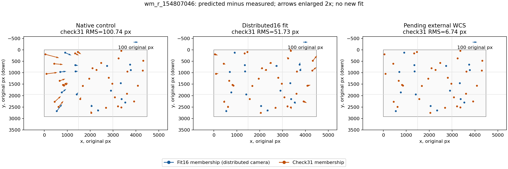

# Итерация 44: асимметричное поле остатков на Orion

На development **`wm_r_154807046`** остатки после распределённого fit
имеют устойчивую пространственную структуру. На 31 контрольной звезде
радиальный RMS равен **43.78 px**, тангенциальный — **27.56 px**. Слева
радиальные ошибки направлены внутрь, справа — наружу; тангенциальная
ошибка правого края достигает 48.49 px RMS. Этот рисунок почти не
меняется при трёх способах измерения центров.

Это основание для следующей ограниченной проверки асимметричной модели,
но не установленная физическая причина. Новых fit, solve и WCS-прогонов
здесь нет; автоматическое улучшение не подтверждено.

## Вопрос и неизменные входы

[Итерация 43](robustness-iteration-43.md) исключила недостаточную локальную
сходимость как практическое объяснение больших остатков в проверенном
опыте. Теперь исследуется их направление и зависимость от положения.
Использованы все прежние 47 источников, разделение **fit16/check31**,
три центроида, native-control из итерации 40, три replay-камеры fit43
и сохранённые проекции pending external WCS. Нового отбора опор нет.

До расчёта закреплены входы, код и членство в группах: старые группы,
сетка 3×3, радиальные интервалы 0/.35/.70/1 полудиагонали, пересечения
с fit16 и check31. Членство определяется external-координатами и не
меняется для r8/r12. Пустые группы сохраняются. Сетка 3×3 используется
для описания, она не заменяет сетку 4×4 выбора опор итерации 42.

Повторно использованы `decompose`, `groups`, `vector_metrics`, `agreement`
и `describe` из прежних инструментов. Остаток — **predicted − measured**,
x вправо, y вниз. Радиальная ось направлена от номинального центра
`(width/2,height/2)` наружу, тангенциальная — по часовой стрелке.
Это разложение в плоскости исходного изображения, не оценка параметров
объектива. Не подгонялись translation, affine, новый центр или дисторсия.

## Измерения

Все ошибки — исходные пиксели; таблица использует external-центры.
Доля радиальной энергии — сумма квадратов радиальных компонент,
делённая на полную сумму квадратов в группе.

| Камера / группа | N | Полный RMS | Радиальный RMS | Тангенциальный RMS | Радиальная энергия |
|---|---:|---:|---:|---:|---:|
| Native control / fit16 | 16 | 80.65 | 74.82 | 30.12 | 86.1% |
| Native control / check31 | 31 | 100.74 | 94.98 | 33.60 | 88.9% |
| Distributed / fit16 | 16 | 31.32 | 21.60 | 22.68 | 47.5% |
| Distributed / check31 | 31 | 51.73 | 43.78 | 27.56 | 71.6% |
| Pending external / fit16 | 16 | 4.08 | 3.94 | 1.08 | 93.0% |
| Pending external / check31 | 31 | 6.74 | 6.61 | 1.28 | 96.4% |

`fit16` обозначает членство только в распределённой подгонке. В строках
native-control/external это те же физические источники, а не утверждение
об участии в соответствующих старых fit. External остаётся pending;
малая ошибка не делает эту WCS независимым эталоном.

Краевые контрольные группы распределённой камеры:

| Группа | N | Средняя радиальная ошибка | Радиальный RMS | Средняя тангенциальная ошибка | Тангенциальный RMS |
|---|---:|---:|---:|---:|---:|
| Левый край | 3 | −54.69 | 55.57 | +13.55 | 14.79 |
| Правый край | 3 | +103.38 | 106.50 | −45.30 | 48.49 |

Правые звёзды Sceptrum, Beid и 35 Eri имеют векторы соответственно
`(+70.96, −18.13)`, `(+91.93, −76.04)`, `(+91.80, −114.27)` px.
Ошибка растёт к верхней части правого края, а не выглядит единичным
изолированным промахом. Правильность их каталожных идентичностей по-прежнему
условна на прежнем просмотре.

Средние векторы check31 по фиксированной сетке 3×3, `(dx, dy)` px;
в скобках после вектора — число источников:

| Ряд | Левый столбец | Средний столбец | Правый столбец |
|---|---|---|---|
| Верхний | (+21.73, +22.84), N=4 | (−35.22, +12.97), N=3 | (+26.76, −61.96), N=5 |
| Средний | (+29.01, −9.17), N=4 | (−25.97, +5.70), N=4 | (+45.58, −4.53), N=2 |
| Нижний | (+5.24, −34.63), N=2 | (−23.26, +8.32), N=3 | (+18.90, +29.18), N=4 |

Во всех трёх средних ячейках dx отрицателен, в крайних столбцах check31 —
положителен; dy по углам меняет знак. Это **описательная асимметрия**,
не доказательство конкретного закона дисторсии. На fit16 рисунок не
полностью совпадает: например, средняя правая ячейка содержит одну опору
с отрицательным dx. Все такие группы сохранены в JSON.

На check31 радиальные интервалы дают RMS **32.40 / 40.16 / 82.97 px**
при N=7/17/7. Остаток есть и в центральной области, а не только на самых
краях. Из одной доли радиальной энергии 71.6% нельзя заключать, что нужен
лишь следующий радиальный коэффициент: тангенциальный остаток и различие
левой/правой сторон требуют отдельной проверки.

## Чувствительность к центроидам и карта

Сравнение **соответствующих fit и центроидов** external против r8/r12
на check31 даёт RMS разности векторных полей **0.267 / 0.259 px**,
косинус полного поля **0.9999867 / 0.9999875**. Здесь меняются и fit,
и измеренные центры. В отдельных секциях `centroid_agreement` камера
фиксирована, поэтому поле `camera_disagreement_rms_px` переиспользованного
инструмента означает только разность центроидов. Эти два сравнения
не смешиваются.



Начало стрелки — измеренный источник; стрелки увеличены вдвое. Цвет
обозначает неизменное членство fit16/check31 распределённого опыта во всех
трёх панелях. Интерполяции и новой коррекции нет.
[PDF для экспорта](images/robustness-iteration-44-vectors.pdf).

## Следующий ограниченный опыт и ограничения

Наблюдаемая асимметрия обосновывает проверку **уже реализованных p1/p2**
из [итераций 34](robustness-iteration-34.md)–[35](robustness-iteration-35.md)
на этом кадре. Следующий шаг — сначала линейный прогноз по сохранённым
Jacobian: добавить только эти два столбца к нынешним пяти, используя
**только fit16**, прежний ненулевой prior k1 и отдельную оценку check31.
Сохранить все старые краевые группы и три способа центроидирования;
не выбирать параметры по check31. Лишь перенос без краевой регрессии
будет основанием для отдельного нелинейного опыта.

Это не повторная реализация и не предложение включить модель по умолчанию:
на `wm_r_132162731` вариант p1/p2 уже не прошёл общий критерий из-за
левого края. Результат другого кадра остаётся отрицательным. Здесь
проверяется новая гипотеза для `wm_r_154807046`, где структура ошибки
измерена отдельно. Физическое децентрирование, обработка изображения,
ошибка каталога/идентичности и иные причины этим описанием не разделены.

Согласие центроидов не исключает их общую систематическую ошибку.
Контрольные 31 источник ранее просматривались и не являются blind holdout.
Пороги принятия, negative, holdout и частота ложных принятий в этом
описательном опыте не исследовались. Нового production-варианта нет.

## Проверки и воспроизведение

**291 Python-тест** прошёл. Пять новых тестов защищают разделение 16/31,
покрытие сеткой и радиальными интервалами, фиксированное членство краёв,
независимость групп от остатков и смысл сравнения центроидов. Проверены
сохранённые проекции/нормы, равенство полной энергии сумме радиальной и
тангенциальной, хеши baseline, manifest, WCS-review и фотографии.
Анализ занял **0.369 s**. Rust и решатели не запускались.

Из `prototype/`, в свежий каталог:

```sh
export PYTHONPATH=artifacts/robustness-wcs-python:eval
python3 eval/robustness_orion_residuals.py prepare --out-dir artifacts/robustness-iteration-44
python3 eval/robustness_orion_residuals.py measure --out-dir artifacts/robustness-iteration-44
python3 eval/robustness_orion_residuals.py validate --out-dir artifacts/robustness-iteration-44
```

Для графика нужен Matplotlib. При первом вызове он отсутствовал в основном
Python-пути; использована сохранённая временная установка итерации 29,
без новых зависимостей проекта:

```sh
MPLCONFIGDIR=/tmp/starglyph-iteration-44-mpl PYTHONPATH=/tmp/starglyph-iteration-29-plot:artifacts/robustness-wcs-python:eval python3 eval/robustness_orion_residuals.py plot --out-dir artifacts/robustness-iteration-44
```

[Протокол](experiments/robustness-iteration-44-protocol.json),
[фиксированные группы](experiments/robustness-iteration-44-input.json),
[векторы и метрики всех источников](experiments/robustness-iteration-44-results.json),
[проверки](experiments/robustness-iteration-44-checks.json).
