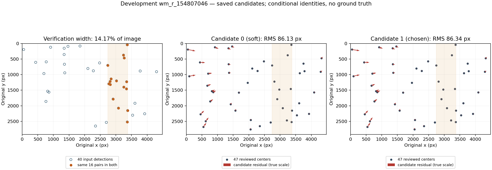

# Итерация 47: два кандидата содержат один набор локальных соответствий

На development **`wm_r_154807046`** сравниваются оба сохранённых кандидата
из итерации 41. Их проверочные наборы **точно совпадают по 16 парам**:
индекс детекции, каталожный вектор и координаты одинаковы, различается порядок.
Объединение не добавляет ни одной пары. Оба набора занимают **14.17% ширины**
справа, хотя доступные детекции распределены существенно шире.

Перевыбор между этими двумя кандидатами не даёт готовой глобальной привязки:
RMS по прежним 47 просмотренным звёздам — **86.13 и 86.34 px**.
Это отрицательный результат проверки доступности альтернативы, а не новый
вариант solver. После [итерации 46](robustness-iteration-46.md) оснований
включать p1/p2 или менять ранжирование этих кандидатов не появилось.

## Область и протокол

Использованы неизменённые публичные trace/results41, источники40 и группы46.
Локальные исходник observer25 и лог41 проверены по ранее опубликованным хешам.
Пороги сохранённого observer совпадают с текущим `solve.rs`. До измерения
зафиксированы протокол, код, входы, все три метода центроидов и проверки replay.
Новых распознаваний, fit, WCS, изображений или визуальных идентичностей нет.

Переиспользованы `project`/`pair_metrics` из существующего анализа кандидатов,
`lift`, `extent` и групповые метрики. Python-проекция проверена по сохранённой
Rust-проекции каждого tetra3-соответствия обоих кандидатов. Проекции выбранного
кандидата также воспроизводят прежние координаты всех 47 источников.

Каталожные ID проверочных пар восстановлены через **точное** совпадение
с уже привязанными к HYG парами41. В refinement input нет индекса детекции:
он восстанавливается по единственному точному совпадению координат во входном
списке. Затем сравниваются и индекс, и вектор, и координаты. Близость точек
сама по себе не считается идентичностью. Неизвестные пары не подставляются.

## Почему выбран второй кандидат

В логе 48 попыток: **46 NoMatch**, затем два результата dense 48–88°
при префиксах k=20 и k=30. Оба используют одну исходную последовательность
40 детекций; префикс ограничивает вход tetra3, а последующая проверка
Starglyph использует весь список.

| Метрика | Кандидат 0, k=20 | Кандидат 1, k=30, выбран |
|---|---:|---:|
| Соответствия tetra3 | 9 | 11 |
| Вероятность tetra3 | 1.42806e−4 | 1.53699e−9 |
| Focal, рабочие px | 1276.872924 | 1276.872924 |
| Проверочные пары Starglyph | 16 | 16 |
| Предсказанные звёзды | 1043 | 1044 |
| Log-odds | 68.618259 | 68.618259 |
| Внутренний RMS проверки, рабочие px | **1.642051** | 1.731055 |
| Жёсткий путь принятия | Нет | Да |

Текущий жёсткий путь требует tetra3 matches≥6, prob<1e−5 и проверочных
hits≥6. Первый кандидат остаётся soft; второй проходит этот путь и получает
приоритет. Оба проходят soft-критерий hits≥6 и log-odds≥18.
Внутренний RMS в данном выборе не используется. Одинаковые log-odds
следуют из одинаковых hits, числа детекций и размера кадра: текущая формула
не использует ни пространственный охват, ни число предсказанных звёзд.
Это описание кода, не предложение ослабить принятие.

Выбор произошёл на **последней запланированной попытке**: последняя blind
dense-полоса и последний стандартный префикс 30. Поэтому простое снятие
раннего выхода здесь не добавило бы попыток той же лестницы. Наблюдатель
сохраняет возвращённые решения; внутренние отвергнутые гипотезы tetra3
не входят в эти два кандидата и не объявляются исследованными.

## Где теряется пространственный охват

| Набор | N | Размах X / ширина | Размах Y / высота |
|---|---:|---:|---:|
| Вход tetra3 top-20 | 20 | 69.17% | 87.62% |
| Вход tetra3 top-30 | 30 | 86.36% | 87.98% |
| Все детекции проверки | 40 | 94.84% | 89.34% |
| Tetra3-пары кандидата 0 | 9 | 14.17% | 60.99% |
| Tetra3-пары кандидата 1 | 11 | 14.17% | 60.99% |
| Проверочные пары каждого кандидата | 16 | 14.17% | 84.84% |

У tetra3-наборов восемь общих пар, объединение содержит 12. Все они входят
в те же проверочные 16; объединение tetra3-наборов тоже не расширяет границы.
Таким образом, узкий охват присутствует **у возвращённых tetra3-соответствий**,
ещё до дополнительной проверки Starglyph и LM. Он не объясняется только
географией входного top-K. Размах — лишь описательная метрика: он не
сертифицирует распределённость или правильность каждой входной детекции.

Из проверочных 16 пар восемь совпадают по HYG с близкими просмотренными
источниками; семь не покрыты прежней близкой визуальной разметкой.
Один случай — близкий компонент γ Lep с разными ID — остаётся неоднозначным,
как в итерациях 41 и 46. Его нельзя считать ни новым подтверждённым ложным
источником, ни независимой от входов контрольной звездой.



Стрелки показаны в истинном масштабе, от измеренного центра к проекции.
Полоса — горизонтальные границы проверочных пар. Фотографические пиксели
не изменялись и на график не включены. Доступна [PDF-версия](images/robustness-iteration-47-candidates.pdf).

## Геометрия обоих кандидатов

External-центры, исходные пиксели; все старые группы сохранены:

| Группа | N | Кандидат 0 RMS | Кандидат 1 RMS |
|---|---:|---:|---:|
| Все просмотренные | 47 | 86.125 | 86.341 |
| Вне автоматических пар | 38 | 95.740 | 95.975 |
| Левый край | 3 | 210.115 | 209.748 |
| Правый край | 3 | 59.149 | 56.059 |
| Верхний край | 5 | 136.799 | 136.105 |
| Нижний край | 3 | 98.913 | 101.560 |

При native r8 общий RMS составляет 86.087/86.304 px, при native r12 —
86.109/86.326 px. Вывод одинаков для всех трёх центроидов. У первого
кандидата чуть меньше общий RMS, но хуже правый край. Малое преимущество
внутреннего RMS не означает восстановления геометрии поля.

Группа вне автоматических пар — прежние 38 из итерации 46: исключение
по совпадению HYG **или** близости любого из трёх центроидов к входной паре.
Все 47 идентичностей остаются условными на прежней проверке. Pending WCS
не превращена в ground truth, новые внешние соответствия не сертифицировались.

## Проверки и ограничения

- **311 Python-тестов** прошли. Пять новых защищают сравнение полных пар
  независимо от порядка, запрет подмены вектора/координаты и дубликатов,
  replay проекций и отказ от holdout до чтения входов.
- Расхождение с Rust adapter-проекциями обоих кандидатов не превышает
  **1.14e−13 рабочего px**; проверочные RMS и выбранные 47 проекций
  воспроизведены с допуском 1e−8 соответствующего px.
- Анализ занял 0.116 s, это не время распознавания. Solve/WCS/fit-вызовов —
  **0/0/0**. При первичной проверке исполнителя выявлено отсутствие индекса
  детекции в refinement input; исправлен доступ к данным, старый протокол
  оставлен локально как `robustness-iteration-47-preflight`. Исправленный код
  закреплён до вычисления геометрии. Порогов или состава источников не меняли.
- Manifest, baseline, WCS-review и фото проверены по хешам. Production и Rust
  не изменены; solver regression gates, negatives и holdout повторно не
  запускались. False-accept rate и solve rate здесь не измеряются.

Точное совпадение наборов не означает побитово одинаковый будущий LM:
камеры и порядок пар различаются. Альтернативный кандидат не пропускался
через полный refinement. Вывод ограничен его сохранённой геометрией и тем,
что объединение этих пар не добавляет пространственной информации.

## Следующий шаг

Нужна проверка **формирования новых автоматических соответствий**, а не
переранжирование этих двух локальных решений или ещё один fit по тем же парам.
Ограниченная следующая гипотеза: пространственный порядок выбора входных
звёзд/паттернов может дать иной набор, поскольку исходные детекции за пределами
правой полосы уже есть. До изменения следует проверить существующее
пространственное прореживание и порядок перебора tetra3, чтобы не повторить
имеющийся механизм. Проверять один вариант на тех же детекциях и базах,
с тем же числом попыток и лимитом на попытку; критерии закрепить до запуска.
Новые пары оценивать по идентичности и вне-входной геометрии, а не только
по росту ширины или внутреннему RMS. Это пока гипотеза, не доказанная причина.

## Воспроизведение

Из `prototype/`, с сохранёнными observer25 и логом41:

```sh
export PYTHONPATH=artifacts/robustness-wcs-python:eval
export ITERATION_OUT=artifacts/robustness-iteration-47-repeat
python3 eval/robustness_orion_candidates.py prepare --out-dir "$ITERATION_OUT"
python3 eval/robustness_orion_candidates.py run --out-dir "$ITERATION_OUT"
python3 eval/robustness_orion_candidates.py validate --out-dir "$ITERATION_OUT"
python3 -m unittest discover -s eval -p 'test_*.py'
# Дополнительно требуется Matplotlib для PNG/PDF:
python3 eval/robustness_orion_candidates_plot.py "$ITERATION_OUT/results.json" \
  --output ../docs/images/robustness-iteration-47-candidates
```

[Протокол](experiments/robustness-iteration-47-protocol.json),
[оба кандидата, пары, источники и метрики](experiments/robustness-iteration-47-results.json),
[проверки и хеши](experiments/robustness-iteration-47-checks.json).
JSON опубликованы без округления отдельно от baseline; новые бинарники не нужны.
