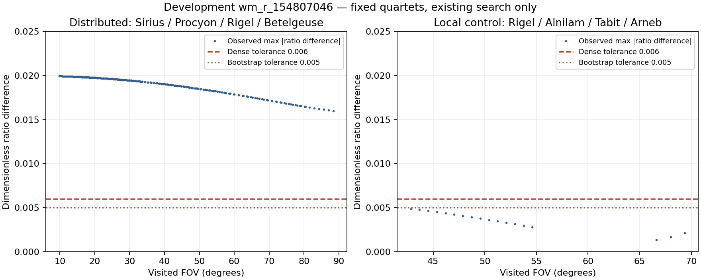

# Итерация 49: распределённая четвёрка отсекается по отношениям рёбер

Для development **`wm_r_154807046`** найден конкретный этап потери заранее
выбранной распределённой четвёрки **Sirius — Procyon — Rigel — Betelgeuse**.
Она присутствует в широкой базе, сохраняется после прореживания и перебирается,
но геометрия её измеренных координат **не проходит проверку отношений рёбер**.
На 66 посещённых шагах поиск доходит до нужной записи и явно отклоняет её
на этой проверке. До SVD и вероятностной проверки она не доходит.

Минимальное наблюдаемое максимальное расхождение пяти отношений — **0.016001**,
при dense-допуске **0.006**. Локальная контрольная четвёрка проходит с
расхождением **0.001365** и возвращает два прежних кандидата. Установлен
механизм отсева этой распределённой гипотезы; причина геометрического
расхождения и автоматическое улучшение пока не подтверждены.

## Выбор без подгонки по остаткам

После отрицательной [итерации 48](robustness-iteration-48.md) использованы
тот же упорядоченный список 40 детекций, четыре базы и исходный порядок
перебора tetra3. Паттерны выбраны **до сканирования баз и нового запуска**:

| Роль | Индексы детекций | Звёзды | Размах X / ширина |
|---|---|---|---:|
| Распределённый | 0, 1, 2, 3 | Sirius, Procyon, Rigel, Betelgeuse | 57.48% |
| Локальный контроль | 2, 6, 16, 18 | Rigel, Alnilam, Tabit, Arneb | 12.52% |

Основная четвёрка — четыре ярчайшие просмотренные звезды среди выживших
на последнем FOV первой успешной попытки k=20 в trace48. Контроль —
пересечение того же списка выживших и tetra3-соответствий первого кандидата;
пересечение содержит ровно четыре звезды. Контроль не является независимым
эталоном качества: его задача — проверить наблюдение уже известного пути.

У основных четырёх опор расстояния от прежних просмотренных центров до
детекций составляют **0.070, 0.187, 0.076 и 0.154 исходного px**.
HYG ID соответственно **32263, 37173, 24378, 27919**. Рисунок поля и
центры рассмотрены в итерации 40; новой визуальной разметки нет.
Идентичности остаются условными, внешняя WCS — pending.

## Что измерено

Переиспользован наблюдатель `tetra3_internal`: его целевые ID заменены
двумя закреплёнными четвёрками. Добавлены только чтение каталога паттернов
и запись фактических границ поиска ключей. Углы, отношения и ключи
вычисляются **существующими f32-функциями tetra3**, без новой реализации
геометрии. Поиск, допуски, прореживание и принятие не изменены.

Один запуск на сохранённых центроидах: прежние **48 попыток**, 2500 ms на
попытку, wall limit 120 s. До запуска закреплены входы, код и правила
различения отсутствия записи, недостижения её окна ключей и наблюдаемого
отказа. Нового полного запуска Starglyph или Astrometry.net нет.

Сканирование таблицы отделено от трассы поиска: отсутствие `lookup`
само по себе **не доказывает отсутствия паттерна в базе**.

| База | Записей основной четвёрки | Записей контрольной |
|---|---:|---:|
| Bootstrap 10–70° | 1 | 1 |
| Dense 16–30° | 0 | 1 |
| Dense 30–54° | 1 | 1 |
| Dense 48–88° | 1 | 1 |

Все восемь проверок наличия звёзд в каталогах успешны: отсутствие основной
четвёрки в узкой базе относится к записи **паттерна**, а не к отдельным
звёздам. Наибольшее её каталожное ребро — 38.51°. Причина отсутствия записи
в узкой базе отдельно не устанавливалась; регенерация баз не выполнялась.

## Реальный путь отсева

Основная четвёрка наблюдается во всех **1504 шагах FOV**. Повторения между
префиксами и попытками — повторные наблюдения, не независимые примеры.

| База | Наблюдений | Результат для основной четвёрки |
|---|---:|---|
| Bootstrap | 978 | Запись есть, её ключ вне фактического окна поиска |
| Dense 16–30° | 210 | Записи паттерна нет |
| Dense 30–54° | 186 | Запись есть, ключ вне окна поиска |
| Dense 48–88° | 130 | 64 вне окна ключей; **66 отказов по отношениям рёбер** |

У каждого из 66 обращений FOV-проверка уже пройдена: наблюдатель отношения
рёбер стоит после неё. Ни одно не проходит следующий фильтр.
Таким образом, отсутствие этой широкой гипотезы нельзя объяснить лишь
отсутствием в базе, прореживанием или недостатком времени на её перебор.

Пример на seed FOV **66.64°**, k=20, wide dense: предполагаемый FOV по
каталожному ребру равен **61.577°**, разрешённое отклонение — 21°.
FOV проходит. Далее проверяются пять нормированных отношений:

| Отношение | Из изображения | Каталог | Разница image−catalog |
|---|---:|---:|---:|
| 1 | 0.471805 | 0.483133 | −0.011328 |
| 2 | 0.597289 | 0.614712 | **−0.017424** |
| 3 | 0.667442 | 0.667375 | +0.000067 |
| 4 | 0.689988 | 0.674145 | +0.015844 |
| 5 | 0.694743 | 0.703812 | −0.009069 |

Четыре из пяти разниц превышают допуск 0.006 по модулю. Это проверка формы
паттерна до оценки ориентации. Максимальная разница здесь в **2.90 раза**
больше допуска. Среди всех **251 различных посещённых FOV** от 9.90° до
88.40° ни один не удовлетворяет всем пяти ограничениям. Минимум 0.016001
наблюдается при 88.40° и всё ещё больше dense-допуска в **2.67 раза**.
Это описательный минимум сохранённого поиска, а не новая рекомендация FOV
и не доказательство для непрерывного диапазона за его пределами.



Точки — уже выполненные шаги, не дополнительный sweep. Показано максимальное
абсолютное расхождение пяти отношений; разные базы используют допуски
0.005/0.006. [PDF](images/robustness-iteration-49-ratios.pdf).

## Контроль наблюдателя

Локальная четвёрка наблюдается в 36 шагах: 24 отсекаются по FOV,
10 доходят до вероятностной проверки и не проходят её, **два проходят**.
На seed FOV 66.64° максимальная разница отношений — **0.001365**.
Для k=20/30 вероятностная проверка получает **8/12 пар**, после встроенного
WCS-refine возвращаются прежние tetra3-решения с **9/11 соответствиями**.
Эти числа не подменяют 16 проверочных пар Starglyph или 17 final inliers
из полного control41.

Все 48 исходов совпали с trace48. Оба полных tetra3-решения совпали с trace41
по всем полям, кроме времени; все 1504 FOV и списки после thinning точно
воспроизведены. Следовательно, инструментирование не создало новый путь
принятия и не потеряло известный положительный контроль.

## Проверки, ограничения, следующий шаг

- **322 Python-теста**, **54 Rust-теста tetra3**, включая новый тест
  сравнения полных каталоговых идентичностей, и scoped Clippy прошли.
- Один процесс занял **4.678 s**; 46 NoMatch и два прежних кандидата,
  ошибок и timeout нет. Это диагностическое время, не benchmark.
- Hash-проверки защищают фото, каталог, базы, manifest, baseline и WCS-review.
  Registry и производственные исходники/lockfile не менялись. Новых снимков,
  full-pipeline solve, WCS, negative или holdout-прогонов нет.
- Наблюдение относится к одной выбранной четвёрке одного development-кадра.
  Оно не сертифицирует все остальные звёзды и не устанавливает физическую
  причину расхождения: дисторсия, история обработки, измерения центров и
  условные идентичности требуют отдельного различения.
- Уменьшать строгость отношений рёбер или acceptance по этим данным нельзя:
  это изменило бы вероятность ложных гипотез, не подтвердив правильную
  геометрию всего поля. Автоматическое улучшение не заявляется.

Следующий ограниченный опыт — проверить, объясняет ли **существующая
модель коррекции координат до поиска** расхождение этой четвёрки, с оценкой
на других распределённых опорах. Сначала диагностически отделить влияние
центроидов от модели; ручная привязка или ручные параметры не должны
выдаваться за автоматическое улучшение. Проверенный здесь этап — отношения
рёбер **до** SVD, поэтому дальнейший LM принятого локального кандидата
сам по себе не возвращает ранее отвергнутую широкую гипотезу.

## Воспроизведение

Из `prototype/`, с прежними четырьмя базами и tetra3 0.8.0 в Cargo registry:

```sh
export PYTHONPATH=artifacts/robustness-wcs-python:eval
export ITERATION_OUT=artifacts/robustness-iteration-49-repeat
python3 eval/robustness_orion_pattern_trace.py prepare --out-dir "$ITERATION_OUT" \
  --registry /path/to/registry/tetra3-0.8.0
python3 eval/robustness_orion_pattern_trace_report.py freeze --out-dir "$ITERATION_OUT"
python3 eval/robustness_orion_pattern_trace.py build --out-dir "$ITERATION_OUT"
python3 eval/robustness_orion_pattern_trace.py run --out-dir "$ITERATION_OUT"
python3 eval/robustness_orion_pattern_trace_report.py summarize --out-dir "$ITERATION_OUT"
python3 -m unittest discover -s eval -p 'test_*.py'
```

[Протокол](experiments/robustness-iteration-49-protocol.json),
[протокол оценки](experiments/robustness-iteration-49-assessment-protocol.json),
[входы и две четвёрки](experiments/robustness-iteration-49-input.json),
[хеш бинарника](experiments/robustness-iteration-49-binary.json),
[результаты](experiments/robustness-iteration-49-results.json),
[исходы попыток и инвентаризация](experiments/robustness-iteration-49-raw.json),
[проверки](experiments/robustness-iteration-49-checks.json).

Публичный результат группирует 1540 наблюдений в 281 уникальное окно
с массивом `contexts`: для разворачивания каждое окно повторяется с каждым
контекстом как `attempt`. Ни одно число не округлено. Полные внешние
verification pools остаются локально, публично сохранена их ограниченная
часть после существующего 2N-лимита. Полная локальная запись закреплена
по SHA-256. Точные thinning-списки не дублируются: указана ссылка на trace48,
равенство которому проверено. Исходный baseline не заменяется.
