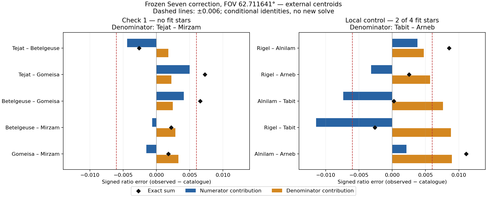

# Итерация 51: ошибки числителя и общего ребра усиливают отказ

На development **`wm_r_154807046`** локализованы оставшиеся отказы двух
четвёрок после сохранённой коррекции Seven из
[итерации 50](robustness-iteration-50.md). В **Check 1** увеличенные рёбра
к Gomeisa и укороченный общий знаменатель Tejat–Mirzam вместе выводят два
отношения за допуск. В **локальной четвёрке** укорочение Tabit–Arneb
сильно увеличивает все отношения; часть ошибок при этом компенсируется.

Это описание несогласованной геометрии при условных идентичностях.
Физическая причина и ошибочность конкретной звезды не установлены.
Нового улучшения алгоритма нет: fit, коррекция координат, поиск и пороги
не менялись и повторно не запускались.

## Протокол и исходные данные

Использованы все прежние **17 входов**, пять четвёрок, четыре варианта
координат и фиксированный FOV Seven **62.711641°**. Приоритет диагностики
Check 1 и локальной четвёрки определён отрицательным результатом итерации 50.
Остальные случаи сохранены для контроля; новых источников или исключений нет.

До измерения закреплены код, входы и критерии. Все необходимые данные уже
публичны: исправленные координаты и каталоговые лучи из `50-curves`,
сохранённая камера и проекции из итерации 45, измеренные центры из итерации 40.
Нового обращения к базе паттернов или внешнему WCS нет.

Для каждого паттерна рассчитаны шесть углов с идентичностями концов,
порядок их сортировки и пять отношений. Этот **f64-диагностический расчёт**
проверяется против сохранённых f32-значений tetra3; он не используется как
замена геометрии или проверки принятия в рабочем решателе.

Пусть `c` — каталоговое ребро, `C` — самое длинное каталоговое ребро,
`a`, `A` — их измеренные углы после коррекции. Точное разложение ошибки:

```text
a/A − c/C = (a−c)/A − c·(A−C)/(A·C)
              числитель    знаменатель
```

Оно сохраняет физические пары звёзд. Отдельно проверяется совпадение
каталогового и измеренного порядка: одинаковый номер в отсортированном
массиве не гарантирует одинаковое ребро.

## Check 1: два слагаемых в превышении порога

Состав прежний: **Tejat, Betelgeuse, Gomeisa, Mirzam**; все четыре вне fit16.
При external-центрах и коррекции Seven:

| Ребро | Изменение угла | Относительное изменение |
|---|---:|---:|
| Tejat–Gomeisa | +725.14″ | +0.960% |
| Betelgeuse–Gomeisa | +598.91″ | +0.730% |
| Tejat–Mirzam, общий знаменатель | −634.36″ | −0.435% |

Знаменатель имеет каталоговую длину **40.46955°**. Его укорочение увеличивает
отношения, дополнительно к увеличению двух числителей:

| Отношение к Tejat–Mirzam | Вклад числителя | Вклад знаменателя | Точная сумма |
|---|---:|---:|---:|
| Tejat–Gomeisa | +0.004999 | +0.002267 | **+0.007266** |
| Betelgeuse–Gomeisa | +0.004129 | +0.002463 | **+0.006592** |

Оба превышают **0.006**. В каждом случае ни один из двух вкладов по
отдельности не превышает порога, но их сумма превышает. Это арифметическое
разложение, а не результат исправления одного ребра в реальном изображении:
рёбра имеют общие вершины и не могут произвольно изменяться независимо.

С r8/r12 первое отношение равно **0.007237 / 0.007226**, второе —
**0.006554 / 0.006585**: причина отсева по этим двум компонентам сохраняется.
Перестановок рёбер нет во всех трёх центроидах и четырёх вариантах координат.

## Локальная четвёрка: знаменатель и компенсация ошибок

Состав: **Rigel, Alnilam, Tabit, Arneb**; Rigel и Arneb входят в fit16.
Знаменатель **Tabit–Arneb** имеет каталоговую длину **26.95056°**, но после
коррекции короче на **1386.28″**, или **1.429%**.

| Отношение к Tabit–Arneb | Вклад числителя | Вклад знаменателя | Точная сумма |
|---|---:|---:|---:|
| Rigel–Alnilam | +0.003792 | +0.004754 | **+0.008546** |
| Rigel–Arneb | −0.003174 | +0.005696 | +0.002522 |
| Alnilam–Tabit | −0.007376 | +0.007615 | +0.000240 |
| Rigel–Tabit | −0.011425 | +0.008802 | −0.002623 |
| Alnilam–Arneb | +0.002151 | +0.008951 | **+0.011102** |

У наихудшего отношения вклад знаменателя составляет около 81% подписанной
суммы. Но малые ошибки других отношений не означают точные рёбра: у
Alnilam–Tabit два больших вклада почти компенсируются. Поэтому нельзя
объявить три прошедших отношения подтверждением хорошей локальной геометрии.
Исправление только знаменателя также не гарантирует прохождения остальных
компонент, где сейчас есть компенсация.

Оба превышения сохраняются с r8/r12 и с координатами детектора. Для
Alnilam–Arneb значения **0.011080 / 0.011039 / 0.011093**. Порядок рёбер
также не меняется. Как установлено в итерации 50, на других FOV часть
отношений проходит; потери реального solver-решения этот опыт не измеряет.



Чёрный ромб — сумма двух вкладов; пунктир — ±0.006. Синие и оранжевые
полосы по отдельности не являются проверками принятия.
[PDF](images/robustness-iteration-51-edges.pdf).

## Векторы источников и проверка линейного объяснения

Прежние остатки прямой проекции Seven, **predicted − measured**, исходные px,
x вправо и y вниз, external-центры:

| Группа | Звезда | dx | dy | Норма |
|---|---|---:|---:|---:|
| Check 1 | Tejat | −3.71 | +5.81 | 6.89 |
| Check 1 | Betelgeuse | +4.72 | +13.61 | 14.41 |
| Check 1 | Gomeisa | +9.37 | −5.27 | 10.75 |
| Check 1 | Mirzam | +0.72 | +16.88 | 16.90 |
| Локальная | Rigel | +1.62 | +1.88 | 2.48 |
| Локальная | Alnilam | +4.78 | +10.60 | 11.63 |
| Локальная | Tabit | −19.77 | −16.50 | 25.76 |
| Локальная | Arneb | +3.33 | +7.67 | 8.36 |

Для объяснения отношений используется другой явно сохранённый вектор:
**measured_corrected − ideal**, в рабочих пикселях идеальной плоскости
камеры. Идеальные точки — проекция условных каталоговых идентичностей
сохранённой камерой без дисторсии. Это не новые измерения и не ground truth.

В этой плоскости вычислены производные пяти отношений по x/y всех четырёх
точек; умножение на сохранённые смещения даёт подписанные вклады звёзд.
Радиальная ось направлена от центра камеры, поперечная ортогональна ей.
Данные не изменяются: смещения не применяются как предлагаемая коррекция.

Для Check 1 линейное объяснение прошло заранее заданный предел **1e−4**:
максимальная ошибка **5.70e−5**, для r8/r12 — 5.67e−5/5.63e−5.
Для отношения Tejat–Gomeisa приближённые вклады:

| Источник | Полный вклад | Радиальная часть | Поперечная часть |
|---|---:|---:|---:|
| Tejat | +0.001757 | +0.000047 | +0.001710 |
| Gomeisa | +0.002662 | +0.001149 | +0.001513 |
| Mirzam, через знаменатель | +0.002806 | +0.002928 | −0.000123 |
| Betelgeuse | 0 | 0 | 0 |

Сумма около **0.007225**, фактический остаток 0.007266. Вклад распределён
между числителем и знаменателем, радиальной и поперечной составляющими.
Это не подтверждает, что любая из перечисленных звёзд неверно идентифицирована.

Для локальной четвёрки линейный прогноз **не прошёл**: ошибка
**3.05–3.08e−4**, выше предела. Изменение шага производной с 0.001 до
0.0005 px меняет прогноз не более 2.32e−12 во всех случаях: проблема здесь
в точности линейного приближения для конечных смещений. Порог не ослаблен;
локальные вклады звёзд сохранены с `usable: false` и не используются для
количественного вывода. Точное разложение рёбер выше от этого не зависит.

Из 17 случаев линейная проверка пройдена в 13. В контрольных Check 2/3
обнаружены и перестановки рёбер: у Check 2 они исчезают после Seven, у
Check 3 остаются. Поэтому их отношения с фиксированными идентичностями
не подменяют отсортированные компоненты решателя. Оба набора сохранены.

## Проверки, ограничения и следующий шаг

**331 Python-тест** прошёл. Шесть новых тестов проверяют известные сферические
углы, перестановку идентичностей при одинаковой сортированной сигнатуре,
компенсацию общего масштаба, знаки и сумму вкладов, сохранение всех случаев
и запрет holdout. Rust и Cargo не запускались: производственный код и
Rust-стенд не изменены.

Все 68 исходных сигнатур (17 × 4) воспроизведены с максимальным отклонением
**1.40e−7** от f32; все pass-флаги совпали. Для идеальных проекций разница
с каталогом не более **3.31e−7**, ниже заранее закреплённых 1e−6. Точное
разложение сумм проверено до 1e−12. Расчёт занял **0.241 s**, новых fit,
solver/WCS-вызовов нет. Проверены защищённые хеши и происхождение артефактов;
baseline, manifest, фотография, WCS-review, negative и holdout не менялись.

Установлено, какие пары и сочетания ошибок определяют два отказа. Не
установлены физическая причина, независимые истинные положения звёзд
или автоматический способ исправления. Исключать Tabit/Gomeisa по большому
остатку или увеличивать допуск эти данные не обосновывают.

Следующий ограниченный шаг — проверить **локальное звёздное окружение
Tabit и Gomeisa** на имеющемся снимке и каталоге, с выбором соответствий,
не зависящим от остатка текущей камеры. Это проверит альтернативу ошибки
идентичности/позиции до нового усложнения модели. Новые фотографии не нужны.

## Воспроизведение

Из `prototype/`, в свежий каталог:

```sh
export PYTHONPATH=artifacts/robustness-wcs-python:eval
python3 eval/robustness_orion_pattern_edges.py prepare --out-dir artifacts/robustness-iteration-51-repeat
python3 eval/robustness_orion_pattern_edges.py measure --out-dir artifacts/robustness-iteration-51-repeat
python3 eval/robustness_orion_pattern_edges.py validate --out-dir artifacts/robustness-iteration-51-repeat
python3 -m unittest discover -s eval -p 'test_*.py'
```

График: `robustness_orion_pattern_edges_plot.py --out-dir ...`; нужен
Matplotlib (использована существующая временная установка итерации 29).
[Протокол](experiments/robustness-iteration-51-protocol.json),
[все входы](experiments/robustness-iteration-51-input.json),
[результаты по рёбрам и источникам](experiments/robustness-iteration-51-results.json),
[проверки](experiments/robustness-iteration-51-checks.json).
JSON опубликованы без округления; вместе с фигурами около 0.31 MB.
