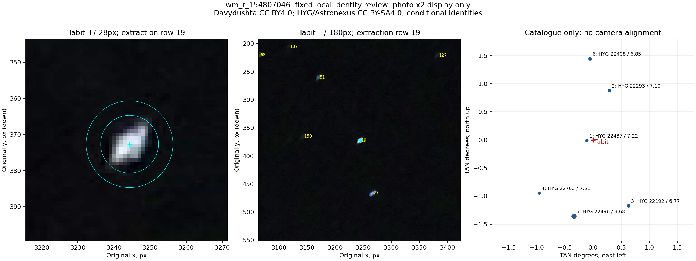
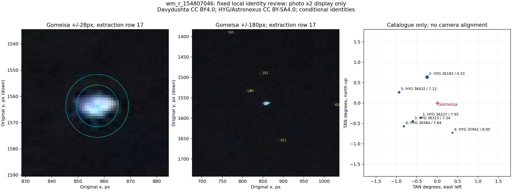

# Итерация 52: локальных соседей недостаточно для подтверждения идентичностей

Для development **`wm_r_154807046`** проверены окружения **Tabit** и
**Gomeisa**, выделенные в [итерации 51](robustness-iteration-51.md).
В каждом фиксированном наборе удалось уверенно сопоставить только
**одного яркого соседа**. Поэтому независимая от целевой точки локальная
привязка не выполнена, идентичности и абсолютные положения **не подтверждены**.

Восемь способов центроидирования дают максимальные смещения **0.186 px**
у Tabit и **0.498 px** у Gomeisa относительно прежнего центра. Они не
устраняют остатки сохранённой камеры **25.755 / 10.750 px**. Это ограничивает
объяснение через проверенные способы измерения центра, но не исключает
общую систематическую ошибку, смешение или неверную идентичность.

Автоматического улучшения нет. Старые источники и их метки не заменены,
производственный pipeline и пороги сохранены.

## Выбор и процедура до измерения

Цели неизменны: source **15 / HYG 22396 / Tabit** и source
**13 / HYG 36087 / Gomeisa**, строки старой `.axy` **19 / 17**.
Выбор целей обусловлен прежней диагностикой; это не случайная выборка.

Переиспользованы `neighbours` и `image_metrics` из итерации 33, HYG v4.2,
прежняя `.axy` и исходное нормализованное фото. Для каждой цели взяты:

- шесть ближайших записей полного локального HYG без ограничения яркости;
- отдельно шесть ближайших до **8 mag в радиусе 3°** для проверки рисунка;
- неизменный фрагмент **±180 исходных px**, все старые извлечения в нём;
- увеличение **±28 px** для формы источника и апертур 8/12 px.

Карта каталога строится в локальной TAN-плоскости: север вверх, восток
влево, начало на каталожной цели. Она **не совмещается** с фото проекцией
Starglyph или external WCS. На фото показаны только исходные пиксели,
прежний центр и номера старых извлечений. Выбор соответствий визуальный;
остатки камеры не используются для выбора соседа или строки `.axy`.

До просмотра закреплены правило выбора и критерий локальной регистрации:
не менее **пяти** различимых соседей, первые четыре в каталожном порядке
служат опорами, цель и минимум один дополнительный сосед остаются вне fit.
Предусмотрен существующий `registration_check`; его точный fit четырёх опор
сам по себе не считался бы проверкой качества. Набор не расширялся после
просмотра. Визуальная разметка зафиксирована отдельным хешем до измерения
центров и решения о допустимости регистрации.

## Что видно и что осталось неопределённым

| Цель | Надёжно сопоставленный яркий сосед | Строка `.axy` | Остальные выбранные соседи |
|---|---|---:|---|
| Tabit | HYG 22496, Pi⁴ Orionis | 27 | Пять неоднозначных |
| Gomeisa | HYG 36182, Gamma Canis Minoris | 63 | Пять неоднозначных |

Pi⁴ Orionis видна ниже и немного правее Tabit; Gamma Canis Minoris — выше
и левее Gomeisa. Это условные визуальные ассоциации по взаимному положению
и яркости. Одной такой пары недостаточно для проверки локальной проекции
или подтверждения каталожной идентичности цели.

Все 12 выбранных соседей сохранены:

| Цель | HYG, в порядке расстояния | Результат |
|---|---|---|
| Tabit | 22437, 22293, 22192, 22703, **22496**, 22408 | Только 22496 — `visible_source`, остальные `ambiguous` |
| Gomeisa | 36237, **36182**, 36315, 35942, 36432, 36384 | Только 36182 — `visible_source`, остальные `ambiguous` |

`ambiguous` здесь означает отсутствие уверенного соответствия по этому
просмотру, **не отсутствие звезды на фото**. Слабая звезда может находиться
ниже доступного контраста, быть смешанной или не иметь отдельного извлечения.
Порог яркости, область просмотра и число соседей для получения удобного
результата не менялись.

У Tabit ближайший HYG-сосед **22437**, 7.22 mag, находится в **0.111804°**.
Видно вытянутое световое пятно сверху справа вниз влево на отображении;
слабый сосед не имеет уверенно выделенного отдельного ядра.
Новая диагностическая морфологическая метка — `ambiguous`, без изменения
старой разметки. Само наличие каталожного соседа не доказывает, что именно
он создаёт наблюдаемую вытянутость или остаток камеры.

У Gomeisa ближайшая запись полного HYG — **36104**, 8.53 mag, на
**0.468005°**. Она сохранена в полном списке, но не входит в набор до 8 mag.
У цели одно доминирующее компактное асимметричное ядро с синей протяжённостью
слева. Метка `single_core` описывает видимую форму, а не физическую одиночность.





Яркость для отображения умножена на два; численные измерения используют
исходные пиксели. Каталоговые панели имеют собственную ориентацию; их нельзя
читать как наложение предсказанных координат на фотографию.

Для обеих целей сохранён результат **`insufficient_visible_neighbours`**,
число доступных соответствий — **1 вместо необходимых 5**. Ни одна
гомография не подгонялась. Малый локальный RMS не заявляется, поскольку
такой проверяемой привязки здесь нет.

## Чувствительность центров

Повторно применён прежний алгоритм: положительный поток сверх медианы
фонового кольца 16–22 px, круг радиуса 8 либо 12 px вокруг неизменного
внешнего центра, без повторного центрирования. Измерены Rec.709 luma и
каждый канал RGB. Все четыре прежних luma-центроида воспроизведены до 1e−8 px.

| Метрика, исходные px | Tabit | Gomeisa |
|---|---:|---:|
| Смещение luma r8 | 0.0805 | 0.1468 |
| Смещение luma r12 | 0.0251 | 0.0792 |
| Максимум RGB/luma × r8/r12 | **0.1859** | **0.4979** |
| Пикселей с исходным каналом 255 в r12 | 0 / 453 | 0 / 454 |
| Остаток прежней камеры Seven | **25.7552** | **10.7495** |
| Остаток той же камеры с восемью центрами | **25.6629–25.7581** | **10.4514–11.1883** |

Камера во всех строках одна и та же; новых fit нет. Отсутствие 255 относится
к нормализованной фотографии и не доказывает отсутствие насыщения в raw
или при прежней обработке. Согласие апертур не исключает общего смещения
всех методов. В частности, неразрешённый сосед Tabit остаётся ограничением.

## Вывод и следующий шаг

Подтверждено только, что проверенные цветовые и апертурные центры не
устраняют большие остатки. **Локальная проверка идентичностей не завершена**:
по одному яркому соседу недостаточно. Нет основания удалить эти источники,
заменить их координаты или повысить статус external WCS до ground truth.

Этот результат показывает предел полезности выбранного узкого окружения.
Следующий ограниченный опыт — заранее выбрать **более широкий рисунок из
ярких звёзд**, сохранив обе цели вне подгонки и отдельные контрольные звёзды.
Границы и опоры должны определяться по каталогу до оценки ошибок, с учётом
пространственного охвата; при недостатке независимых соответствий
неопределённость сохраняется. Это отдельный опыт, не продолжение подбора
радиуса в текущем протоколе. Новые снимки пока не нужны.

## Проверки и воспроизведение

**335 Python-тестов** прошли. Четыре новых теста проверяют неизменность
гомографии при изменении целевой и контрольной точек, выбор только первых
четырёх допустимых опор, отказ при недостатке/дублировании соответствий,
ориентацию TAN и запрет holdout. Синтетический тест регистрации не подменяет
отсутствующую регистрацию реального кадра.

Измерение заняло **1.147 s**. Проверены хеши каталога, старой `.axy`, фото,
manifest, baseline, WCS-review, протокола и замороженного просмотра.
Production и Rust не менялись; Cargo, solver, WCS, negative и holdout
не запускались. Новых фотографий и новых автоматических детекций нет.

Из `prototype/`, в свежий каталог:

```sh
export PYTHONPATH=artifacts/robustness-wcs-python:eval
export ITERATION_OUT=artifacts/robustness-iteration-52-repeat
python3 eval/robustness_orion_neighbour_audit.py prepare --out-dir "$ITERATION_OUT"
# Для точного повторения скопировать опубликованный 52-review.json в "$ITERATION_OUT/review.json".
python3 eval/robustness_orion_neighbour_audit.py freeze --out-dir "$ITERATION_OUT"
python3 eval/robustness_orion_neighbour_audit.py measure --out-dir "$ITERATION_OUT"
python3 eval/robustness_orion_neighbour_audit.py validate --out-dir "$ITERATION_OUT"
python3 -m unittest discover -s eval -p 'test_*.py'
```

`render` создаёт фигуры при доступном Matplotlib; использована прежняя
временная установка итерации 29. Если старой `.axy` нет, повторение этого
опыта требует её восстановления; нового WCS-прогона в этой работе не было.
Публичные входы содержат все использованные локальные извлечения.

[Протокол](experiments/robustness-iteration-52-protocol.json),
[каталоговые соседи и входы](experiments/robustness-iteration-52-input.json),
[визуальный просмотр](experiments/robustness-iteration-52-review.json),
[заморозка просмотра](experiments/robustness-iteration-52-review-protocol.json),
[результаты](experiments/robustness-iteration-52-results.json),
[проверки](experiments/robustness-iteration-52-checks.json).
Новые JSON опубликованы отдельно от baseline, без округления чисел.
Фото Davydushta — CC BY 4.0; HYG/Astronexus и производные аннотированные
фигуры — CC BY-SA 4.0; [атрибуция](../ATTRIBUTION.md).
