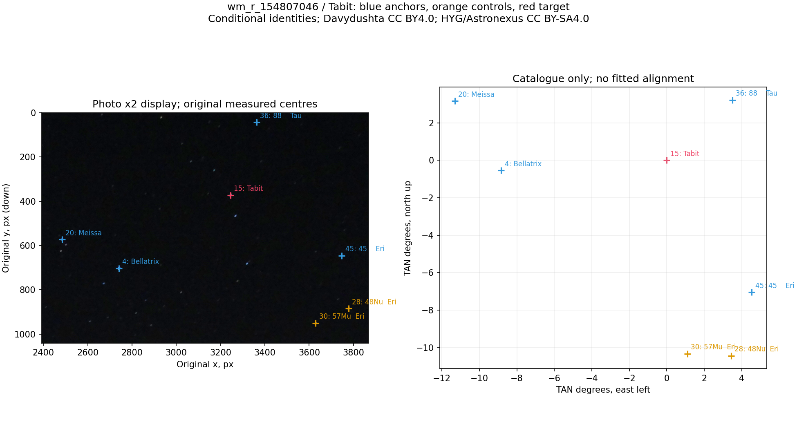
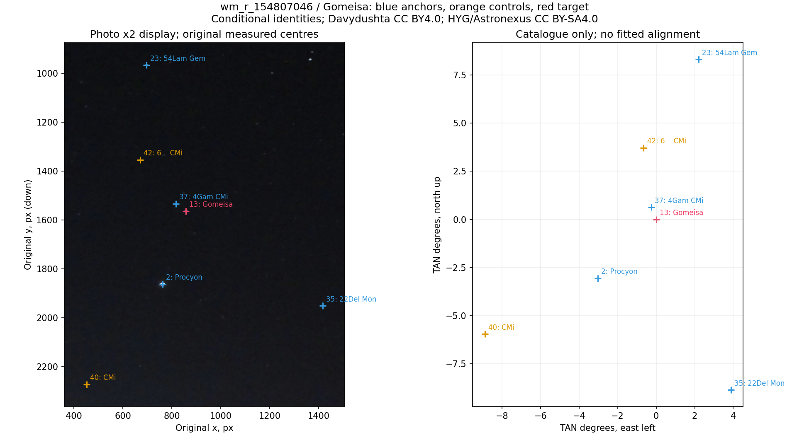

# Итерация 53: широкий рисунок поддерживает локальные соответствия Tabit и Gomeisa

Для development **`wm_r_154807046`** обе цели прошли заранее заданную
проверку более широким рисунком ярких звёзд. Гомография по четырём другим
звёздам предсказывает Tabit с ошибкой **4.50–4.96 исходных px**, Gomeisa —
**0.34–0.69 px**. По две дополнительные контрольные звезды также укладываются
в фиксированный предел 12 px при всех трёх способах центроидирования.

Это поддерживает **условные локальные соответствия**, но не устанавливает
причину остатка общей камеры. Каталожные идентичности не стали ground truth;
автоматического улучшения распознавания нет. Производственный код не менялся.

## Гипотеза и зафиксированный опыт

В [итерации 52](robustness-iteration-52.md) у каждой цели удалось различить
только одного соседа из узкого набора. Проверяем следующую гипотезу:
**более широкий рисунок позволяет проверить перенос на цель без её участия
в подгонке**. Это новый ограниченный опыт с заранее заданной областью.

Вселенная выбора — прежние **47 визуально просмотренных источников**
[итерации 40](robustness-iteration-40.md). Их исходные кандидаты были предложены
внешним WCS, до 5.5 mag, с выбором трёх ярких звёзд на ячейку сетки 4×4.
Поэтому это не новая независимая слепая идентификация и не полный каталог
звёзд вокруг целей. Старые координаты и метки не пересматривались.

До вычисления ошибок зафиксированы код, входы и правила:

- Цели неизменны: **15 / HYG 22396 / Tabit**, **13 / HYG 36087 / Gomeisa**.
  Обе исключены из опор и контролей обоих наборов.
- В TAN-плоскости с началом на цели выбирается ближайшая каталожная звезда
  в каждом из четырёх квадрантов, в пределах **15°**, до **5.5 mag**.
  Порядок — угловое расстояние, затем HYG ID. Из оставшихся выбираются две
  ближайшие контрольные звезды. Измеренные пиксели на выбор не влияют.
- При недостающем квадранте или числе контролей сохраняется отказ;
  расширение радиуса и замена звёзд по полученным ошибкам запрещены.
- Переиспользован существующий `registration_check`: нормализованная DLT
  гомография по четырём опорам. Цель и оба контроля остаются вне подгонки.
- Критерий: цель строго внутри выпуклого контура опор и в каталоге, и на
  фото; все три контрольные ошибки **≤12 исходных px** для каждого из методов
  `external_centroid`, `native_r8`, `native_r12`. Это диагностический предел,
  связанный с прежним радиусом ассоциации, не новый порог принятия solver.
- Положение контролей относительно контура сохраняется отдельно. Успешный
  локальный опыт не повышает статус WCS и не подтверждает точность всего поля.

В обоих наборах все четыре квадранта представлены. Получены следующие
неизменные опоры и контроли; номера — source ID из итерации 40:

| Цель | Четыре опоры | Два контроля |
|---|---|---|
| Tabit | 4 Bellatrix, 45 45 Eri, 20 Meissa, 36 88 Tau | 30 μ Eri, 28 ν Eri |
| Gomeisa | 2 Procyon, 35 δ Mon, 37 γ CMi, 23 λ Gem | 42 6 CMi, 40 CMi |

Расстояния до опор: **4.75–11.59°** у Tabit и **0.68–9.57°** у Gomeisa.
Названия, HYG ID, координаты всех доступных кандидатов, роли выбранных звёзд
и три набора центроидов сохранены в машиночитаемом входе.

## Визуальная проверка перед измерением

На фото отмечены только прежние измеренные центры; рядом построена отдельная
каталожная карта, без совмещения камерой или WCS. Яркость изображения ×2 —
только отображение. Старые пиксели и координаты не изменены.

У Tabit выбранный рисунок охватывает заметные источники, 88 Tau находится
рядом с верхним краем кадра. Неоднозначность формы самой Tabit из итерации 52
сохраняется. У Gomeisa хорошо видны Procyon и пара Gomeisa/γ CMi; слабые
звёзды сохраняют прежние условные метки. На обеих каталожных панелях контрольные
звёзды лежат за контуром опор. Эти наблюдения записаны до численного измерения.





Слово «независимая» здесь относится к построению карты без подгонки к фото.
Оно не означает независимое происхождение прежних идентичностей.

## Результаты всех шести регистраций

Все значения — исходные пиксели, расстояние между предсказанием и измеренным
центром. Входные опоры одинаковы между методами; меняется только ранее
сохранённый способ определения центра.

| Цель | Центроиды | Ошибка цели | Контроль 1 | Контроль 2 | Критерий |
|---|---|---:|---:|---:|---|
| Tabit | external | 4.858 | 8.756 | 7.407 | Пройден |
| Tabit | r8 | 4.962 | 8.435 | 7.002 | Пройден |
| Tabit | r12 | 4.500 | 8.373 | 7.120 | Пройден |
| Gomeisa | external | 0.374 | 0.768 | 0.263 | Пройден |
| Gomeisa | r8 | 0.690 | 0.938 | 1.147 | Пройден |
| Gomeisa | r12 | 0.338 | 0.782 | 0.675 | Пройден |

Обе цели внутри обоих контуров во всех методах. **Все четыре контроля вне
обоих контуров**: их результаты проверяют экстраполяцию, а не внутреннюю
точность всей области. Четыре опоры интерполируются практически точно
(максимальная ошибка 1.02e−12 px), что ожидаемо для такой гомографии и
само по себе не служит свидетельством качества.

До этого опыта регистрация узкого рисунка была невозможна. Теперь получены
шесть регистраций и 18 оценок точек вне fit, без отказов или таймаутов.
Сохранённая общая камера Seven из итераций 51–52 имела остатки
**25.755 / 10.750 px** на внешних центрах Tabit/Gomeisa. Новые локальные
остатки **4.858 / 0.374 px** существенно меньше, но это **не сравнение
алгоритмов при одинаковом fit**: изменены модель, область и опоры.
Перенос этого результата в solve rate не измерялся.

## Вывод, ограничения и следующий шаг

Гипотеза о возможности проверяемого переноса более широким рисунком
поддержана. Не появилось основания удалять Tabit/Gomeisa как неверные
соответствия или заменять их центры. Для Gomeisa дополнительный рисунок
согласован особенно точно; у Tabit и её контролей сохраняются ошибки
нескольких пикселей.

Гомография между двумя TAN-плоскостями описывает идеальную перспективную
геометрию, но не произвольную дисторсию фотографии. Она может локально
поглощать часть систематической ошибки общей модели. Условные опоры, их
ошибки, дисторсия и неоднозначность источников здесь не разделены. Проверка
двух целей на одном уже исследованном development-кадре также не измеряет
обобщение или частоту ложных принятий. Внешний WCS остаётся pending.

Следующий шаг — вернуться к формированию **распределённых автоматических
соответствий**, ограниченному в итерациях 46–50. Проверить возможность
расширить исходный локальный набор через существующий rematch и проверить
новые пары по сохранённым условным источникам вне fit. Правила расширения,
контрольные источники и бюджет нужно закрепить до запуска; нынешнюю ручную
гомографию нельзя подставлять как автоматический seed или ослаблять пороги
принятия. Повторять подбор радиуса вокруг этих двух целей сейчас не нужно.

## Проверки и воспроизведение

**341 Python-тест прошёл**. Шесть новых тестов защищают выбор только по
каталогу с исключением обеих целей, неизменность гомографии при изменении
контрольных точек, отказ при недостатке покрытия и вырожденных опорах,
выпуклый контур с дубликатами/границей и запрет holdout.

Численное измерение заняло **0.013 s**, выполнено **6 локальных fit**.
Новых автоматических детекций/inliers, запусков solver/WCS, глобальных
camera fit, negative или holdout нет. Production и Rust не менялись,
поэтому Cargo и тяжёлые регрессионные прогоны не повторялись. Хеши manifest,
baseline, WCS-review и исходного фото совпали с прежними. Новых снимков нет.

Из `prototype/`, в свежий каталог:

```sh
export PYTHONPATH=artifacts/robustness-wcs-python:eval
export ITERATION_OUT=artifacts/robustness-iteration-53-repeat
python3 eval/robustness_orion_bright_pattern.py prepare --out-dir "$ITERATION_OUT"
# Необязательно: render с доступным Matplotlib для просмотра тех же панелей.
python3 eval/robustness_orion_bright_pattern.py measure --out-dir "$ITERATION_OUT"
python3 eval/robustness_orion_bright_pattern.py validate --out-dir "$ITERATION_OUT"
python3 -m unittest discover -s eval -p 'test_*.py'
```

Для вычислений нужны прежние публичные JSON, локальное фото и Python-окружение
с NumPy/Astropy. Старый `.axy`, новый WCS и новый fit общей камеры не требуются.
Скрипт требует свежего выходного каталога и сверяет замороженные хеши перед
измерением; повторный `measure` в том же каталоге запрещён.

[Протокол](experiments/robustness-iteration-53-protocol.json),
[входы](experiments/robustness-iteration-53-input.json),
[визуальные наблюдения](experiments/robustness-iteration-53-visual-review.json),
[результаты](experiments/robustness-iteration-53-results.json),
[проверки](experiments/robustness-iteration-53-checks.json).
Компактные JSON занимают 37.2 kB, числа опубликованы без округления.
Внутренние ссылки SHA-256 протокола относятся к исходным локальным JSON;
хеши локальных и компактных публичных файлов отдельно записаны в `checks`.
Фото Davydushta — CC BY 4.0; HYG/Astronexus, производные таблицы и
аннотированные фигуры — CC BY-SA 4.0; [атрибуция](../ATTRIBUTION.md).
