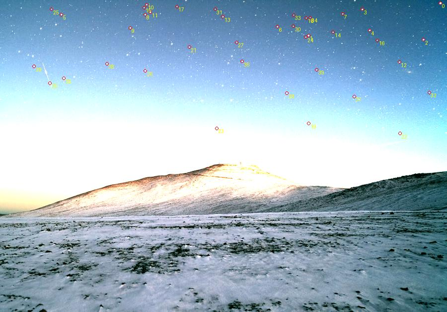
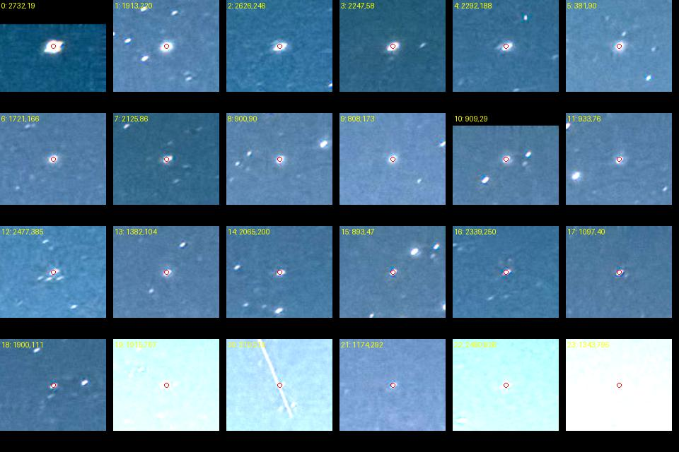

# Итерация 55: исключение снежного рельефа не дало кандидата

Исследован исходный development solver-отказ **`wm_r_16053617`**,
«Snow at Paranal Observatory». Единственное вмешательство — ручное
исключение детекций ниже консервативной границы неба **до top-K**.
На целевом кадре получено **0 кандидатов из 192 попыток** варианта.
В 24 попытках возник новый ранний отказ: после прореживания осталось три
источника. Нового автоматического улучшения нет.

**Строгий критерий воспроизведения control не пройден:** две из 192
исходных попыток завершились `Timeout` вместо прежнего `NoMatch`.
Поэтому `comparison_valid=false`; результаты сохраняются как диагностика,
а не как полностью воспроизведённое сравнение с прежним baseline.
Бюджет и критерий после запуска не изменены, повторных измерений не было.

## Выбор кадра и наблюдения

После [итерации 54](robustness-iteration-54.md) сверены прежние исследования
исходных отказов. `wm_r_134291495` уже прошёл разбор прореживания, ручных
источников и локальных областей в итерациях 36–39; независимые идентичности
там остались неизвестны. Повторять этот перебор оснований нет.

Повторно просмотрены прежние обзоры и детекции `wm_r_16053617` и
`wm_r_176481855`. Выбран первый: у него отчётливо отделён снежный передний
план, что позволяет ограниченным вмешательством проверить его конкуренцию
со звёздами в коротком входном списке. В итерации 1 среди первых 24 детекций
отмечено 17 звёздоподобных источников; это наблюдение формы, не проверка
каталожных идентичностей или достаточности конкретных паттернов.

На исходных crops видны яркие детали снега среди высокоранговых детекций,
много звёзд с вытянутыми профилями, яркий градиент к горизонту и след в небе.
Граница верхних **45% высоты** находится выше снежного гребня. Она выбрана
по изображению до поиска, без подбора по его результату.

Сохранённая внешняя привязка имеет статус **`unresolved`**. WCS-кандидата,
который можно проверить по идентичностям и краям, нет. Старые `.axy` не
являются ground truth. Нового запуска Astrometry.net не было.

## Один замороженный диагностический вариант

Исходный кадр **2772×1935**, рабочая ветка **1600×1117**. Для каждого из
двух масштабов и default/deep используются полные сохранённые списки
детектора из итерации 1. Из них оставляются точки с исходной координатой
**y < 870.75 px**, затем применяются прежние top-40/top-50 и префиксы
8, 10, 12, 16, 20, 30.

Для рабочего масштаба y переносится формулой `(y+0.5)×1935/height−0.5`.
Размеры кадра, пиксели, координаты точек, их фотометрия, порядок по яркости,
порог детекции и статистика фона **не меняются**. Кроп как новый вход solver
не создаётся. Этот опыт проверяет отбор источников и заполнение top-K;
это не полный перезапуск детектора с маской неба.

| Ветка | Все прежние детекции | В ручной области | Исключено из первых 30 | Поднято из-за top-K в новый top-40/50 |
|---|---:|---:|---:|---:|
| 1600 default | 265 | 159 | 9 | 13 |
| 1600 deep | 451 | 271 | 7 | 17 |
| 2772 default | 755 | 484 | 12 | 18 |
| 2772 deep | 1165 | 622 | 8 | 24 |

Числа относятся к детекциям, включая ложные; они не измеряют количество
пригодных звёзд. Новые списки по-прежнему имеют 40/50 точек. Оригинальные
индексы всех выбранных источников сохранены без перенумерации детекторных данных.





Просмотр выполнен до запуска matcher. Среди показанных точек больше нет
снежного рельефа, но native default содержит след под новым номером 20
и неоднозначные позиции на ярком фоне под номерами 19, 22, 23.
Ручная область не гарантирует звёздность. Дополнительные исключения после
просмотра не делались. Обзоры усилены ×2 для отображения; crops построены
старым инструментом и не используются для численной оценки формы.

Использован сохранённый, проверенный по SHA-256 бинарник наблюдения
tetra3 из итерации 38. Его thinning/funnel hooks и алгоритм не переписывались.
Всего **432 попытки**: 192 control, 192 ручного варианта, 48 положительного
контроля `wm_r_112929230`. Во всех случаях одинаковая лестница баз/FOV,
лимит **2500 ms на попытку**, общий wall limit **180 s**. Поиск продолжает
диагностический перебор после кандидата, поэтому время не равно времени
production с ранним выходом.

Код, входы, область и критерии закреплены до запуска. Успех tetra3 означал
бы только повод проверять идентичности и независимые контрольные звёзды,
а не автоматически принимать решение или внешний WCS. Ручной вариант
не мог считаться автоматическим улучшением даже при появлении кандидата.

## Исходы и точность воспроизведения

| Ветка | Control: NoMatch / Timeout | Ручной вариант: NoMatch / TooFew | Время control / вариант, s |
|---|---:|---:|---:|
| 1600 default | 46 / 2 | 34 / 14 | 12.281 / 5.311 |
| 1600 deep | 48 / 0 | 48 / 0 | 6.207 / 5.863 |
| 2772 default | 48 / 0 | 43 / 5 | 6.585 / 4.834 |
| 2772 deep | 48 / 0 | 43 / 5 | 7.495 / 5.411 |

В прежнем control итерации 24 было 192 `NoMatch`. Теперь не воспроизведены
две попытки **1600 default, dense db=1, FOV 23°, k=20 и k=30**: достигнут
лимит времени. Python-тесты выполнялись параллельно с началом прогона;
нагрузка не была изолирована. Вклад этой нагрузки и наблюдательных hooks
отдельно не измерен, инструментированный запуск не является benchmark. Таймаут не приравнен к
завершённому отрицательному поиску. Остальные **190 статусов совпали**.

Положительный контроль точно воспроизвёл прежние результаты всех 48 попыток:
**45 NoMatch, два кандидата с 7/11 соответствиями, один Timeout**.
Каталожные ID и индексы двух кандидатов совпали. Это проверка работоспособности
стенда, не компенсация нарушения критерия control целевого кадра.

Процесс завершился успешно за **67.835 s**, без wall timeout.
На целевом кадре кандидатов нет ни в control, ни в ручном варианте.
Финальные Starglyph inliers и независимая геометрия **не определены**:
refinement и принятие решения не запускались. Нельзя записывать их как нулевой
измеренный RMS или как новый full-pipeline solve rate.

## Установленные этапы отказов

| Последний достигнутый этап | Control | Ручной вариант |
|---|---:|---:|
| Нет паттерна после thinning | 0 | **24** |
| Отсев по отношениям рёбер | 25 | 4 |
| Внутренняя проверка вероятности | 165 | 164 |
| Timeout | 2 | 0 |

Для всех 24 новых `TooFew` отдельно извлечены исходные thinning-события.
Во всех **776 FOV** остаётся **ровно три источника**, недостаточно для
четвёрки. Их индексы и FOV опубликованы. Соответствующие control-попытки
завершились `NoMatch`, а не таймаутом. Следовательно, фиксированное исключение
переднего плана действительно изменяет ранний состав и пространственное
прореживание; оно не просто убирает ненужную работу без последствий.

Остальные 168 попыток варианта дошли дальше: четыре не прошли сравнение
отношений рёбер, 164 дошли до проверки вероятности. Лучшие отвергнутые
гипотезы по четырём веткам превышают свой внутренний порог примерно в
**7227, 7021, 4022 и 7227 раз**. Это не подтверждённые идентичности.
Их пары сохранены как отвергнутые гипотезы; порог не ослаблялся.

## Ограничения и следующий шаг

Наблюдается реальная конкуренция рельефа за top-K, но её устранение данным
способом **не дало кандидата в измеренном бюджете**. Это не доказательство,
что передний план не влияет на распознавание или что виновата конкретная
модель проекции. Вмешательство меняет состав префиксов и их охват, сохраняя
неоднозначные небесные детекции. Каталожные идентичности неизвестны, а строгая
проверка воспроизведения целиком не пройдена из-за двух таймаутов.

Не подбирать новую границу маски и не увеличивать лимит по текущему исходу.
Следующая содержательная задача для этого кадра — заранее зафиксировать
неоднозначные источники в небе и проследить их через существующий detector
trace: фон, форму и ранжирование. Проверять конкретный механизм отбора,
а не считать все точки внутри маски звёздами. До проверки идентичностей
сохранять неопределённость геометрии и статуса external WCS.

## Проверки и воспроизведение

**354 Python-теста прошли**. Пять новых тестов защищают порядок фильтрации
до top-K, неизменность исходных точек, полупиксельный перенос границы,
полный бюджет префиксов, этапы отказов и split. Три дополнительных защищают
сохранение `NoMatch→Timeout` как нарушения воспроизведения и запрет
молчаливого усечения сравнения.

Первоначальный `summarize` правильно остановился на непройденном строгом
критерии. После измерения добавлен отдельный исполнитель публикации:
он сохраняет все результаты с **`comparison_valid=false`**, не меняя ни
замороженный код опыта, ни исходные входы, ни критерий. Его код и зависимость
от полученных raw/log закреплены отдельным `report-protocol`. Это исправление
отчётности после отказа проверки, не повтор измерения или новая эвристика.

Rust не менялся, новой сборки/Cargo-прогона не было. Production, baseline,
manifest, split/track, WCS-review и пиксели проверены по хешам и сохранены.
Negative и holdout не запускались; частота ложных принятий не оценивалась.

Из `prototype/`, в свежий каталог с сохранённым бинарником 38 и базами:

```sh
export PYTHONPATH=artifacts/robustness-wcs-python:eval
export ITERATION_OUT=artifacts/robustness-iteration-55-repeat
python3 eval/robustness_snow_foreground.py prepare --out-dir "$ITERATION_OUT"
python3 eval/robustness_snow_foreground.py render --out-dir "$ITERATION_OUT"
python3 eval/robustness_snow_foreground.py run --out-dir "$ITERATION_OUT"
python3 eval/robustness_snow_foreground.py summarize --out-dir "$ITERATION_OUT"
python3 eval/robustness_snow_foreground.py validate --out-dir "$ITERATION_OUT"
python3 -m unittest discover -s eval -p 'test_*.py'
```

При таком же нарушении строгого критерия, до создания `results.json`,
скопировать опубликованный `visual-review.json` в новый каталог и вызвать
`robustness_snow_foreground_report.py --out-dir "$ITERATION_OUT"`.
Это публикует фактический исход, не исправляет таймаут. Извлечение `too-few`
повторяется существующим `robustness_thinning_trace.read_thinning` из `run.log`:
для случаев `*-manual_sky` выбрать попытки, у которых во всех `sweeps`
длина `kept_input_indices` меньше четырёх. Тайминги повтора могут отличаться.

[Протокол](experiments/robustness-iteration-55-protocol.json),
[все входные списки](experiments/robustness-iteration-55-input.json),
[визуальные наблюдения](experiments/robustness-iteration-55-visual-review.json),
[raw всех попыток](experiments/robustness-iteration-55-raw.json),
[протокол публикации после отказа](experiments/robustness-iteration-55-report-protocol.json),
[результаты](experiments/robustness-iteration-55-results.json),
[24 случая thinning](experiments/robustness-iteration-55-too-few.json),
[проверки](experiments/robustness-iteration-55-checks.json).
Компактные JSON занимают около **534 kB**, без округления. Внутренние SHA-256
относятся к локальным исходным JSON; хеши публичных копий перечислены отдельно.
Фото ESO/Y. Beletsky — CC BY 4.0; каталоговые производные HYG/Astronexus —
CC BY-SA 4.0; [атрибуция](../ATTRIBUTION.md).
