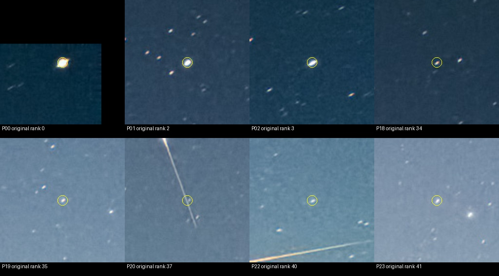

# Итерация 56: компактный фрагмент длинного следа проходит default

Для development solver-кадра **`wm_r_16053617`** установлено, почему один
источник на линейном следе попадает в native default top-40: высокий порог
выделяет маленькую компактную компоненту, которая проходит проверку формы
и не входит в диапазон проверки концентрации. В native deep та же область
объединяется в длинную компоненту и отбрасывается по вытянутости.

Это подтверждённый механизм отбора подозрительного источника, **не доказанная
причина отказа всего кадра**. Существующий `blob_concentration` не устраняет
механизм. Нового автоматического улучшения нет; production не изменён.

## Выбор и визуальная проверка

В [итерации 55](robustness-iteration-55.md) исключение снежного переднего
плана не дало кандидата. Для следующего шага взяты четыре заранее отмеченные
неоднозначные позиции из native default manual-sky: **19, 20, 22, 23**.
Контроли — позиции **0, 1, 2, 18** из того же сохранённого списка.
Это номера с нуля; исходные ранги детектора соответственно
**35, 37, 40, 41** и **0, 2, 3, 34**. Координаты взяты без повторного
центрирования, поиска локального максимума или ручного исключения точек.

Нейтральные квадратные crops уточняют наблюдение из итерации 55:
P19/P22/P23 имеют компактное звёздоподобное изображение на светлом фоне.
Считать их ложными источниками по прежнему усиленному обзору было бы
необоснованно. P20 находится на длинном следе; наложение настоящей звезды
на след не исключено. Контроли также выбраны по морфологии, без каталожных
идентичностей. P00 близок к верхнему краю: чёрная область на crop — padding
за границей фотографии, а не часть неба.



Внешний WCS по-прежнему `unresolved`, пригодного эталона нет. Изучение
детектора не меняет этот статус. Astrometry.net и matcher не запускались,
holdout не использовался.

## Замороженный протокол

До измерения сохранены код, восемь точек, радиус **12 исходных px**, критерии
и SHA-256 входов. Использован проверенный бинарник `replay-test` итерации 54
с существующим ignored test `solve::replay::source_traces`; механизм
трассировки не переписан. Проверены хеши всех текущих Rust-исходников core
против протокола его сборки.

Один запуск содержит **12 проходов**: control, существующие quantile и
blob_concentration × размеры **1600×1117 / 2772×1935** × default/deep.
Для каждого прохода Rust-harness отдельно запускает обычный детектор и
проверяет полное равенство результатов: всего 24 вызова детектора.
Лимит процесса 180 s, фактическое время **13.809 s**, exit code 0,
таймаутов нет. Тесты Python выполнены отдельно от этого измерения.
Время диагностического процесса не является временем production solve
или сравнением скорости отдельных режимов.

Трасса выбирает ближайший **пороговый пиксель компоненты**, а не доказывает
тождество источника. Поэтому для native default control дополнительно
проверены совпадения сохранённого ранга и центроида с допуском 1e−8 px.
Все **8/8** ассоциаций воспроизведены; **4/4** исходных top-40/50 списков
точно совпали с итерацией 1. Все 12 сравнений trace/обычного детектора
прошли. `comparison_valid=true` относится только к этой диагностике;
оно не исправляет невалидное сравнение matcher из итерации 55.

## Что происходит с точкой на следе

| Native ветка | Порог | Площадь компоненты / измеряемого ядра | Вытянутость | Исход P20 |
|---|---:|---:|---:|---|
| control default | 0.102497 | 15 / 15 | 1.419 | selected, ранг 37 |
| control deep | 0.081997 | 462 / 83 | 9.450 | elongation |
| quantile default/deep | 0.065526 | 564 / 83 | 9.450 | elongation |
| blob default | 0.102497 | 15 / 15 | 1.419 | top_k, ранг 62 |
| blob deep | 0.081997 | 462 / 83 | 9.450 | elongation |

В default bounding box компоненты **[308,512,312,518]** занимает лишь
5×7 px. В deep это **[264,392,313,523]**, участок следа 50×132 px;
после пересегментации по половине пика измеряется ядро из 83 пикселей.
Вытянутость ядра превышает действующий предел 2.5.
В default фрагмент имеет площадь меньше 25, поэтому концентрация
**не проверяется**. Это подтверждает зависимость оценки формы от
связности пороговой компоненты. Не доказано, что весь default-фрагмент
состоит только из следа или что его удаление обеспечит решение.

В уменьшенном control default ближайшая компонента имеет один пиксель
и отвергается по core area. В deep она проходит фильтры, но имеет ранг
165, вне top-50; в quantile — ранг 150. Одна проблемная точка native
default не объясняет отказ всех четырёх исходных веток.

## Концентрация и конкуренция за top-K

| Native default | Площадь | Контрольная концентрация | Проверяется? | Ранг control → blob |
|---|---:|---:|---|---:|
| P18, компактный контроль | 22 | 1.856 | нет | 34 → 59 |
| P19, светлый фон | 23 | 1.371 | нет | 35 → 60 |
| P20, след | 15 | 0.524 | нет | 37 → 62 |
| P22, светлый фон | 23 | 1.267 | нет | 40 → 65 |
| P23, светлый фон | 22 | 1.228 | нет | 41 → 66 |

Во всех этих случаях `blob_concentration` сохраняет измеренные координаты
и фотометрию. Из-за допуска других компонент число принятых до top-K
растёт **755 → 780**, а все пять точек опускаются на 25 позиций.
Выход P20 из top-40 здесь не означает, что фильтр научился отличать след:
вместе с ним выходит компактный контроль P18.

В native deep P19/P22/P23 достигают площади 29–30 px и уже проверяются
по концентрации. Control отвергает все три; blob допускает P19 с
концентрацией **2.635**, но только на ранг **68**, за top-50. P22/P23
остаются отвергнутыми (**2.414 / 2.448**, порог 2.5). P18 проходит
control с 2.514 на ранге 31; в blob его концентрация 3.119, но ранг 72.
Три ярких контроля P00/P01/P02 остаются выбранными в native ветках.
В рабочем масштабе P00 отвергается по border во всех режимах.

У P20 native default положительный поток внутри компоненты **2.662**,
фотометрический поток с кольцом **7.502** (отношение 2.82).
Это согласуется с уже описанным в [итерации 2](robustness-iteration-2.md)
различием фотометрических апертур и повторным учётом пикселей кольца.
Здесь оно не объявляется новой находкой и не исправляется повторно.
Поле `concentration` при `concentration_screened=false` — диагностическое
значение по исходной фотометрии, даже в режиме blob; оно не означает
применение альтернативного знаменателя.

## Проверки, ограничения и следующий шаг

**358 Python-тестов прошли**, включая четыре новых проверки сохранённых
источников, запрета holdout-происхождения, ассоциации по центроиду/рангу
и переноса центров пикселей между фактическими размерами изображения.
Rust-код и бинарник не изменены; выполнен существующий trace gate.
Хеши манифеста, baseline, WCS-review и фотографии сохранены.

Новые inliers, solve rate и независимая геометрия не измерялись.
Отрицательные и прежние успешные кадры заново не запускались: изменения
production нет, а эффект новой эвристики не заявляется. Восемь выбранных
точек не оценивают полноту звёзд или частоту ложных детекций по коллекции.

Результат ограниченного сравнения существующих механизмов отрицательный:
ни по quantile, ни по blob нельзя заключить, что отбор в целом улучшен.
Просто включить концентрацию для площадей меньше 25 нельзя обосновать
этими данными: действующий порог отверг бы и компактный контроль P18.

Следующая проверяемая гипотеза — отбраковывать компактный фрагмент по
длинной компоненте, в которую он входит при более низком пороге.
Перед экспериментом нужно проверить такое соответствие на звёздных
контролях и остальных development-полях с треками: слияние звёзд с
соседями может создать ложный отказ. Если разделения нет, гипотезу следует
закрыть. Ещё один полный blind-перебор этого кадра без новых оснований
не нужен. Независимые идентичности звёзд остаются отдельным условием
для утверждения об исправлении распознавания.

## Воспроизведение и артефакты

Из `prototype/`, с сохранённым бинарником итерации 54 и локальными исходными
диагностиками (каталог назначения должен быть новым):

```sh
export PYTHONPATH=artifacts/robustness-wcs-python:eval
ITERATION_OUT=artifacts/robustness-iteration-56-replay
python3 eval/robustness_snow_sources.py prepare --out-dir "$ITERATION_OUT"
python3 eval/robustness_snow_sources.py figure --out-dir "$ITERATION_OUT"
python3 eval/robustness_snow_sources.py run --out-dir "$ITERATION_OUT"
python3 eval/robustness_snow_sources.py summarize --out-dir "$ITERATION_OUT"
python3 eval/robustness_snow_sources.py validate --out-dir "$ITERATION_OUT"
python3 -m unittest discover -s eval -p 'test_*.py'
```

- [Протокол](experiments/robustness-iteration-56-protocol.json) и
  [восемь неизменных входов](experiments/robustness-iteration-56-input.json).
- [Все 96 исходов и измерений](experiments/robustness-iteration-56-results.json),
  включая отсутствующие измерения и расстояния ассоциации.
- [Процесс](experiments/robustness-iteration-56-run.json) и
  [проверки / хеши](experiments/robustness-iteration-56-checks.json).

Полные локальные трассы и логи: `prototype/artifacts/robustness-iteration-56/`.
Публичные JSON компактны; исходные baseline-артефакты не перезаписывались.
