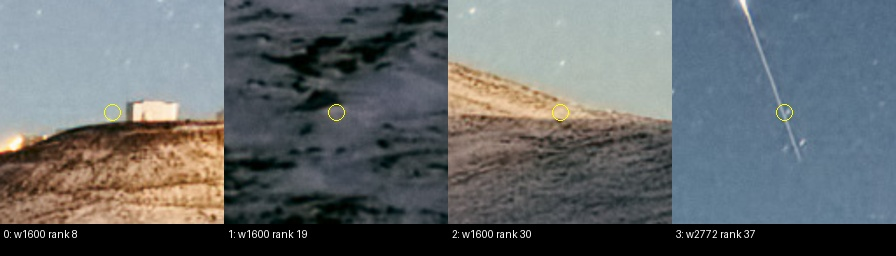
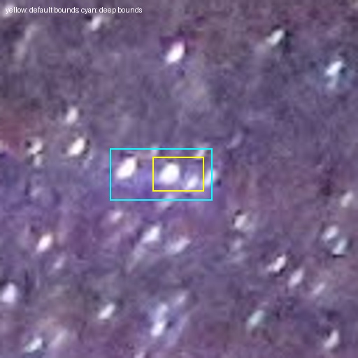

# Итерация 57: межпороговый veto удаляет и опорную звезду

Проверен один ограниченный вариант: исключать default-детекцию, если её
компонента при меньшем пороге входит в компоненту, отвергнутую по вытянутости.
Целевой фрагмент следа `wm_r_16053617` исключён, но вместе с ним теряется
**одна из 21 сохранённых опор** прежнего успешного `wm_r_112929230`.
Визуально это компактный звёздоподобный источник, объединённый с соседними
звёздами. Заранее установленный критерий сохранности опор не пройден.

**Вариант отклонён, production не изменён.** Это потеря контрольной детекции,
а не измеренный новый отказ полного solver: matcher после провала этого
критерия не запускался. Параметры не подбирались повторно.

## Гипотеза и фиксированная выборка

[Итерация 56](robustness-iteration-56.md) показала механизм: длинный след при
высоком пороге распадается на компактные компоненты, проходящие фильтр формы.
Снижение порога объединяет их и позволяет действующей проверке вытянутости
отвергнуть длинную компоненту. Проверяем перенос этого отказа на исходную
default-детекцию. Новых детекторов, масок или оценок фона не добавлено.

До измерений выбраны четыре development-кадра, просмотрены исходные фото:

| ID | Роль |
|---|---|
| `wm_r_16053617` | solver-отказ, целевой компактный фрагмент на следе, снежный передний план |
| `wm_r_112929230` | прежний solver-успех, 21 сохранённая inlier-опора и густое звёздное поле |
| `wm_r_152165509` | stress, длинные звёздные и спутниковые следы; проверка другого изображения линий |
| `wm_r_124355480` | negative/stress, Луна на чёрном фоне, звёздного поля нет |

Stress не включается в знаменатель solver-успехов. Новый материал не собран,
разметка и пиксели не менялись. Holdout не открывался. Внешние WCS не
пересчитывались и не принимались за эталон. У целевого снежного кадра
привязка остаётся unresolved; inlier-флаги положительного контроля — опоры
прежнего решения, а не новый независимо подтверждённый ground truth.

## Один вариант и проверка принадлежности компоненты

В каждом кадре взяты **все default top-40** обоих масштабов, либо весь список,
если он короче 40. Всего 313 входных детекций. Нет ручной области неба,
пополнения списка после исключений или повторной сортировки.

Veto разрешён только при всех условиях:

1. Воспроизведены исходные default-центроид и ранг.
2. Найден конкретный целочисленный пороговый пиксель исходной компоненты.
3. Фактический deep-порог строго меньше default-порога; статистика фона
   и шума совпадает.
4. Повторная трассировка того же пикселя подтверждает принадлежность обеим
   компонентам; deep-компонента имеет исход `elongation`.

При неопределённой ассоциации или непониженном пороге источник сохраняется.
Другие причины отказа deep — area, concentration, border и т. п. — veto
не вызывают. Используются действующие default/deep и предел вытянутости
**2.5**, без новых подобранных порогов.

Пиксель восстанавливается из точного расстояния existing trace до ближайшего
порогового пикселя: перебираются целочисленные позиции внутри bounding box,
находящиеся на этом расстоянии. Только единственное решение с численным
допуском 1e−10 принимается как опора; ничья остаётся неопределённой.
Затем detector trace вызывается в самой найденной точке. Расстояние меньше
1e−8 и повторное совпадение default-центроида/ранга подтверждают ассоциацию.
Bounding box сам по себе не считается доказательством принадлежности.
Координаты масштабируются по центрам пикселей с фактической высотой кадра.

Это Python-обвязка существующего `solve::replay::source_traces`, а не
повторная реализация компонент или Rust-детектора. Проверенный бинарник
итерации 54 и все текущие исходники core сверены по SHA-256.

## Результаты по каждому ID

Числа до/после обозначают входные детекции, не число подтверждённых звёзд.
Ранги с нуля. Глубокие списки сами по себе не меняются.

| ID | Ширина | До → после | Исключённые ранги |
|---|---:|---:|---|
| `wm_r_16053617` | 1600 | 40 → 37 | 8, 19, 30 |
| `wm_r_16053617` | 2772 | 40 → 39 | 37 — целевой фрагмент следа |
| `wm_r_112929230` | 1600 | 40 → 36 | 8, 15, **24**, 32 |
| `wm_r_112929230` | 4898 | 40 → 40 | нет |
| `wm_r_152165509` | 1600 | 33 → 12 | 21 позиция; полный список в JSON |
| `wm_r_152165509` | 6000 | 40 → 33 | 5, 6, 14, 22, 24, 28, 30 |
| `wm_r_124355480` | 1600 | 40 → 40 | veto неприменим: deep-порог выше |
| `wm_r_124355480` | 1920 | 40 → 40 | veto неприменим: deep-порог выше |

Итого **36 исключений / 313 входов**, четыре заранее выбранных native
звёздоподобных контроля снежного кадра сохранены. Просмотрены crops всех
36 исключений, включая stress; не только целевая точка.

На снежном кадре три рабочих исключения относятся к поверхности или границе
переднего плана. На stress-кадре большинство исключённых точек расположены
на длинных следах; два — на светящейся детали переднего плана. Приписывать
всем линиям спутниковое происхождение нельзя: звёзды здесь тоже дают следы.



### Потеря опоры на прежнем успешном кадре

Рабочая default-детекция ранга **24**, исходные координаты
**(2310.560, 860.571)**, отмечена inlier в сохранённом отчёте.
Фотометрический порядок всех 40 точек точно сверяется перед переносом
inlier-флагов. Сохраняются 20 из 21 прежних опор; это не новый n_inliers solver.

| Измерение этой компоненты | Default | Deep |
|---|---:|---:|
| Порог | 0.179498 | 0.143599 |
| Площадь, px | 19 | 44 |
| Bounding box в рабочем кадре | [752,279,757,282] | [747,278,758,283] |
| Вытянутость | 1.998 | 3.363 |
| Исход | selected, ранг 24 | elongation |

Общий пороговый пиксель **[754,281]** найден в обеих компонентах с расстоянием
0. На нейтральном crop видно расширение области к соседней звезде.
Жёлтый и голубой прямоугольники — границы компонент, не их пиксельные маски.
Каталожная идентичность здесь повторно не устанавливается.



Остальные три исключения положительного кадра лежат у растительности;
возможное наложение звёзд на её границы оставлено неопределённым. Отсутствие
inlier-флага не превращает их автоматически в ложные источники.

### Negative и реальное значение deep-порога

У изображения Луны default/deep пороги равны **0.051673 / 0.082676** для
1600 px и **0.042970 / 0.068752** для 1920 px. Адаптивное удвоение повышает
конечный deep-порог, несмотря на меньший исходный коэффициент sigma.
Поэтому все 80 детекций оставлены по правилу `retain_threshold_not_lower`.

Это проверка корректного неприменения veto, **не новый тест ложного принятия
полного решателя**. Число ложных solver-решений и их частота не измерялись.
Один negative в holdout по-прежнему не позволяет оценить такую частоту.

## Воспроизводимость, время и проверки

Протокол закрепляет четыре ID, правило выбора всех top-40, параметры,
критерии, исходные файлы и код до итогового измерения. На кадр выполнены
три стадии: получение исходных списков, trace центроидов, trace опорных
пикселей. Существующий harness на каждой стадии также вычисляет quantile/blob;
правило veto использует **только control default/deep**.

| ID | Время трёх диагностических процессов, s |
|---|---:|
| `wm_r_16053617` | 35.858 |
| `wm_r_112929230` | 81.633 |
| `wm_r_152165509` | 107.768 |
| `wm_r_124355480` | 19.386 |
| Всего | 244.645 |

Все **12 процессов** завершились с кодом 0, лимит каждого 240 s не достигнут.
Все **144 trace-прохода** равны обычному детектору по встроенному Rust-assert;
из-за этих проверок реально выполнены 288 вызовов детектора. Списки всех
режимов неизменны между тремя стадиями. **8/8** прежних control-списков
снежного и положительного кадров точно воспроизведены.

Вариант вычислен на тех же входах и общих default/deep-измерениях, без
дополнительного matcher-бюджета. Это время диагностического процесса, а не
скорость production или доказательство бесплатного улучшения: для раннего
успеха production дополнительный deep-проход мог бы быть новым расходом.
Тесты и построение картинок выполнены после завершения измерения.

Первый запуск был намеренно прерван с кодом **130**: служебный журнал
`anchors.json` перезаписывал одноимённую таблицу опор. Итоговые результаты
того запуска не использованы. Имя таблицы исправлено на
`anchor-mapping.json`, добавлен тест, код и протокол закреплены заново;
все четыре кадра затем пройдены полностью в новом каталоге.
Первичные артефакты и код сохранены в
`prototype/artifacts/robustness-iteration-57-interrupted/`.
Это ошибка измерительной обвязки, не timeout алгоритма или подбор параметров.

**364 Python-теста прошли**, включая шесть новых: уникальность пикселя,
неоднозначность/отсутствие ассоциации, совпадение ранга и центроида,
реальное понижение порога и общий пиксель, запрет других причин veto,
сохранность таблицы при записи журнала процесса. Rust-код не менялся;
existing trace equality gate выполнен. Hash-проверки защищённых данных прошли.

## Вывод и следующий шаг

Межпороговое объединение воспроизводимо обнаруживает целевой след, но тем же
правилом отвергает соседние звёзды. Это достаточный отрицательный результат
для замороженного требования сохранить все контрольные опоры. Усиливать
или ослаблять порог после этого наблюдения не стали.

Результат не доказывает падение solve rate: один потерянный inlier может не
сломать решение. Он также не доказывает улучшение отказавшего кадра:
независимого WCS и нового решения нет. Полная development-коллекция,
остальные прежние успехи и holdout с вариантом не запускались после провала
предварительного критерия. Production-эвристика не добавлена.

Следующий шаг — закрыть универсальный veto по одной вытянутости связанной
компоненты и вернуться к идентичностям и пространственному покрытию опор
исходного solver-отказа. Межпороговую связь сохранить как диагностическое
свидетельство; для новой фильтрации потребуется признак, различающий длинный
след и объединение соседних звёзд, с отдельной заранее фиксированной проверкой.

## Воспроизведение

Из `prototype/`, с локальным бинарником итерации 54 и сохранёнными
диагностиками итерации 1, в свежий каталог:

```sh
export PYTHONPATH=artifacts/robustness-wcs-python:eval
ITERATION_OUT=artifacts/robustness-iteration-57-replay
python3 eval/robustness_component_growth.py prepare --out-dir "$ITERATION_OUT"
python3 eval/robustness_component_growth.py run --out-dir "$ITERATION_OUT"
python3 eval/robustness_component_growth.py summarize --out-dir "$ITERATION_OUT"
python3 eval/robustness_component_growth_review.py --out-dir "$ITERATION_OUT"
python3 eval/robustness_component_growth.py validate --out-dir "$ITERATION_OUT"
python3 -m unittest discover -s eval -p 'test_*.py'
```

- [Протокол](experiments/robustness-iteration-57-protocol.json).
- [Все детекции, компоненты и решения](experiments/robustness-iteration-57-results.json).
- [Сводка и индекс всех crops](experiments/robustness-iteration-57-review-index.json).
- [Визуальная проверка и отклонение варианта](experiments/robustness-iteration-57-visual-review.json).
- [Проверки, процессы и хеши](experiments/robustness-iteration-57-checks.json).

Полные trace, входы каждого процесса и журналы сохранены отдельно в
`prototype/artifacts/robustness-iteration-57/`. Baseline не перезаписан.
