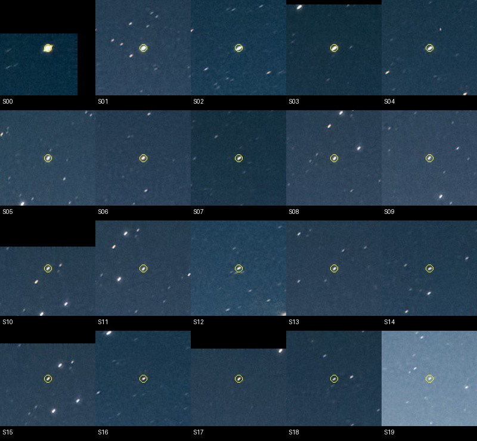
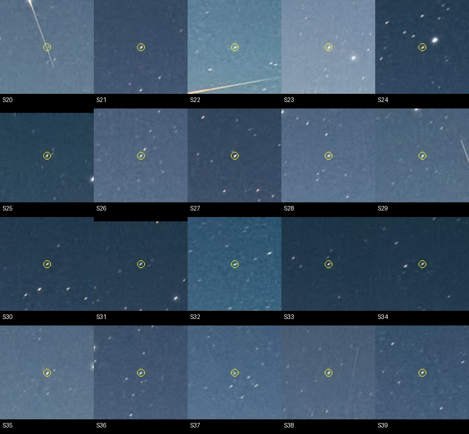

# Итерация 58: проверка свидетельств и завершение снежного направления

Завершена ограниченная проверка **`wm_r_16053617`**, development solver-отказа.
Звёздоподобные детекции распределены по значительной части неба, но их
**независимые каталожные идентичности не установлены**. Сохранённого WCS или
подтверждённого решения, на котором можно проверить края поля, нет.

**Направление итераций 55–58 закрыто без нового изменения production.**
Оснований для следующего подбора эвристики на этом кадре не получено.
Это не утверждение, что изображение невозможно распознать; это предел
проверенных свидетельств данного ограниченного цикла.

## Что проверено

До вычисления сводки закреплены SHA-256 входов, инвентарь внешних файлов,
правило описания охвата и критерий остановки. Использованы сохранённые
списки и результаты итераций 55–57, исходная фотография и внешние артефакты
baseline. Прочитана страница издателя; новые фотографии не скачивались.

На [странице ESO](https://www.eso.org/public/images/potw1132a/) указаны
автор ESO/Y. Beletsky, размер 2772×1935 и публикация 8 августа 2011 года.
Описание относит левый след к спутнику, правый — к метеору; снимок сделан
перед рассветом у Cerro Paranal. Страница не содержит именованных звёздных
соответствий или небесной WCS. Дата публикации не заменяет точное время
экспозиции. Удалённые файлы оригинала и их встроенные метаданные не изучались.

Источник подтверждает природу видимой помехи, но не задаёт привязку звёзд.
Подставлять предположительные время, направление камеры или имена ярких
звёзд в качестве независимого эталона оснований нет.

### Внешние привязки

| Сохранённый запуск Astrometry.net | Строк в `field.axy` | Итог журнала |
|---|---:|---|
| downsample-4 | 93 | достигнут общий лимит CPU |
| downsample-2 | 915 | достигнут общий лимит CPU |

Обе таблицы содержат только **X, Y, FLUX, BACKGROUND**. Проверены заголовки:
небесной калибровки в них нет. В сохранённом каталоге отсутствуют `.wcs`,
`.corr`, `.match`, `.rdls`; `reference.json` имеет статус `unresolved`.
Код завершения прежних команд 0 не означает успешную привязку.
Количество внешних детекций также не является числом подтверждённых звёзд.
Нового WCS-прогона не было.

### Внутренние гипотезы

У восьми сохранённых веток итерации 55 лучшие отвергнутые гипотезы содержат
5–7 пар, но ни одна не прошла порог вероятности: отношение вычисленной
вероятности к допустимому порогу составляет **921–16749**. Для четырёх
ручных sky-веток — **4022–7227**. Все эти отношения больше единицы.

Каталожные номера этих пар сохранены как **непроверенные**, без назначения
идентичностей реальным источникам. Ни число пар, ни лучшее место среди
отвергнутых вариантов не делают гипотезу эталоном. Исходный
`comparison_valid=false` итерации 55 сохранён: два control-таймаута
не переинтерпретируются как точное воспроизведение сравнения.

## Пространственный охват: что можно измерить без привязки

Повторно использована прежняя консервативная область
**y < 0.45 × 1935 = 870.75 px**, без новой маски или подбора границы.
Координаты перенесены по центрам пикселей с фактическими размерами каждого
масштаба. Охват — ширина и высота bounding box **детекций**, нормированные
на ширину кадра и высоту этой области. Дополнительно посчитаны занятые ячейки
фиксированной сетки 4×2. Это описательная статистика, не метрика качества WCS.

| Сохранённый список | Детекций в области | Охват ширины / высоты области | Ячеек из 8 |
|---|---:|---:|---:|
| 1600 default control | 27 из 40 | 87.9% / 89.6% | 7 |
| 1600 deep control | 33 из 50 | 88.4% / 94.6% | 7 |
| 2772 default control | 22 из 40 | 87.4% / 85.8% | 6 |
| 2772 deep control | 26 из 50 | 96.1% / 43.6% | 4 |
| 1600 default manual-sky | 40 из 40 | 91.8% / 94.6% | 8 |
| 1600 deep manual-sky | 50 из 50 | 93.4% / 94.6% | 7 |
| 2772 default manual-sky | 40 из 40 | 90.9% / 92.9% | 8 |
| 2772 deep manual-sky | 50 из 50 | 96.1% / 88.3% | 7 |

Исходный native deep сконцентрирован в верхней половине консервативной
области. Ручной отбор расширяет этот охват, но в итерации 55 кандидата не
даёт. Поэтому недостаточно объяснить все отказы только отсутствием детекций
в нижней части неба. Это также не доказательство достаточности пригодных
каталожных паттернов: охват подтверждённых звёзд остаётся **неизвестным**.
В JSON это `null`, а не нулевой охват или приравнивание всех точек к звёздам.

Просмотрены **все 40** сохранённых native default manual-sky позиций,
без повторного центрирования и изменения яркости. У 39 виден звёздоподобный
пик, часто с общей вытянутостью; одна точка S20 находится на левом следе.
Это морфологическая оценка, не 39 проверенных идентичностей. Возможное
наложение звезды на след не исключено. Чёрные поля у крайних crops — padding
за границами фотографии.





## Что установлено за завершённый цикл

| Итерация | Проверенный результат |
|---|---|
| [55](robustness-iteration-55.md) | Ручное исключение переднего плана перед top-K не дало кандидата; строгое воспроизведение control нарушено двумя таймаутами. |
| [56](robustness-iteration-56.md) | Высокий порог выделяет на следе компактную компоненту; существующий blob-режим только вытесняет её из top-K другими источниками. |
| [57](robustness-iteration-57.md) | Перенос отказа по вытянутости из deep исключает след, но также одну из 21 опор прежнего успешного кадра; вариант отклонён. |
| 58 | Детекции имеют широкий наблюдаемый охват, но независимых звёздных идентичностей и проверки геометрии по краям нет; дальнейший подбор остановлен. |

Прямая причина полного solver-отказа остаётся неустановленной. Подтверждены
конкретные механизмы отбора и ограниченность проверенных вмешательств.
Автоматическое улучшение в этом цикле не подтверждено; неудачный вариант
не включён по умолчанию, проверка принятия решений не ослаблена.

Новых detector/matcher/WCS запусков, inliers, времён решения и независимых
геометрических ошибок в итерации 58 нет. Отрицательные примеры, прежние
успехи и holdout заново не запускались: менялась только проверка уже
сохранённых свидетельств. Манифест, split, track, фотографии, WCS-review
и опубликованный baseline защищены хешами и не изменены.

**367 Python-тестов прошли**, включая три новых проверки описания охвата:
разделение детекций и подтверждённых звёзд, строгая граница области,
пустой список и неверные координаты. Rust/production не менялись;
повторные тяжёлые regression gates не требуются для этой обвязки.

Продолжение этого направления имеет смысл при появлении независимой
разметки звёзд/проверенной привязки либо отдельной новой гипотезы с новым
свидетельством. Автоматически назначать следующую итерацию по оставшимся
неопределённостям не следует. В рамках согласованного завершающего этапа
дополнительная алгоритмическая итерация не обоснована.

## Артефакты и воспроизведение

- [Протокол](experiments/robustness-iteration-58-protocol.json).
- [Сводка охвата и свидетельств](experiments/robustness-iteration-58-results.json).
- [Просмотр всех 40 источников](experiments/robustness-iteration-58-visual-review.json).
- [Проверка страницы издателя](experiments/robustness-iteration-58-publisher-review.json).
- [Проверки и хеши](experiments/robustness-iteration-58-checks.json).

Из `prototype/`, при наличии локальных baseline-артефактов, в новый каталог:

```sh
export PYTHONPATH=artifacts/robustness-wcs-python:eval
ITERATION_OUT=artifacts/robustness-iteration-58-replay
mkdir "$ITERATION_OUT"
cp ../docs/experiments/robustness-iteration-58-publisher-review.json "$ITERATION_OUT/publisher-review.json"
python3 eval/robustness_snow_closure.py prepare --out-dir "$ITERATION_OUT"
python3 eval/robustness_snow_closure.py audit --out-dir "$ITERATION_OUT"
python3 eval/robustness_snow_closure.py render --out-dir "$ITERATION_OUT"
python3 eval/robustness_snow_closure.py validate --out-dir "$ITERATION_OUT"
python3 -m unittest discover -s eval -p 'test_*.py'
```

Повторный audit использует сохранённую датированную запись проверки
страницы издателя, не выдаёт её за новое сетевое наблюдение.
