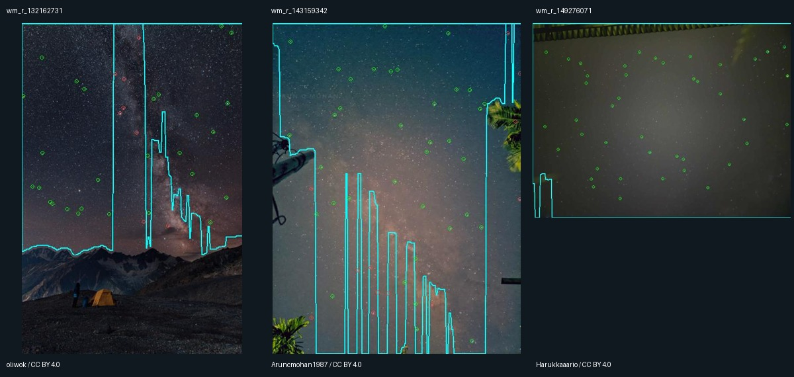

# Итерация устойчивости 9: сохранность звёзд при существующей gradient-маске

2026-10-03, продолжение [итерации 8](robustness-iteration-8.md).

**Существующая `rgb_gradient_v2` исключает подтверждённый лист, но одновременно
отсекает 18 из 117 ранее проверенных звёздных опор.** Предварительный критерий
не пройден. Полный solve A/B не запускался, параметры не подбирались,
автоматическое улучшение не подтверждено. Производственный код не изменён.

## Гипотеза и протокол

В итерациях 7–8 установлено влияние ложной опоры на пальмовом листе
`wm_r_143159342`. Проверяем существующий автоматический механизм исключения
переднего плана: способен ли он убрать лист, сохранив проверенное звёздное поле?
Алгоритм [gradient-sky](gradient-sky-experiment.md) переиспользуется без изменений.

До генерации зафиксированы все **45 development-входов** коллекции:
34 solver, 10 stress, один scene. Выбор выполняется до чтения изображений;
holdout запрещён исполнителем. Генератор получает только изображение и
прежний `GradientConfig`, без каталога, позы, разметки или результатов solve.

Сохранены параметры: длинная сторона 320, медианный фильтр 5×5, начальная
полоса 1/8 высоты, нижняя граница RGB-шума 3, допуск 4 sigma, три последовательных
отклонения, отступ два пикселя, минимум площади 15%, максимум sigma начальной
полосы 20, история 12 строк, три итерации начальной плоскости.

Заранее задан критерий для перехода к полному A/B: исключить лист и сохранить
**все 117** опор итерации 5. Это консервативная проверка пригодности маски,
не критерий принятия астрометрического решения. Опоры и краевые группы не
пересматривались после получения результатов. Все 11 размеченных исходных
fit-пар итерации 7 проверяются отдельно, без прибавления к 117.

Измеряется только принадлежность координат маске. Переиспользована существующая
`in_sky` с нормированием `(x+0.5)/width` и исключением точек на границе.
Сохранённые детекции также проверяются по этой маске, но **повторной детекции
нет**: sky-statistics/sky-fill могли бы изменить фон, центроиды и ранги.
Эти измерения нельзя выдавать за результаты маскированного pipeline.

## Сохранность проверочных опор

| Development ID | Сохранённая площадь | Все опоры | Вне прежних входов | Левый край | Правый край | Верхний край | Нижний край |
|---|---:|---:|---:|---:|---:|---:|---:|
| `wm_r_132162731` | 53.1% | **27/35** | 14/18 | 5/5 | 4/4 | 2/3 | — |
| `wm_r_143159342` | 67.9% | **30/40** | 9/14 | 2/2 | **0/3** | 3/4 | 2/2 |
| `wm_r_149276071` | 98.9% | 42/42 | 23/23 | 3/3 | 4/4 | — | 1/1 |

Края — прежние полосы 10% ширины/высоты исходного фото; группы перекрываются.
«Вне входов» — неизменные группы итерации 5, а не новая выборка, выбранная
после маскирования. Каталожные идентичности остаются условными на прежней
визуальной проверке; абсолютного ground truth нет.



Голубая линия — граница выбранной области; зелёные точки сохранены, красные
исключены. Фото слева направо: oliwok, Aruncmohan1987, Harukkaaario, CC BY 4.0.
Превью уменьшены и снабжены оверлеями; исходные пиксели не менялись.

На `wm_r_143159342` исключены лист и ещё одна из девяти визуально звёздных
исходных fit-пар — Alnasl. Возможный blend HYG 83221 остаётся. Среди 40 опор
сохраняются Albireo, Shaula и Kaus Australis, но исключаются Nunki, Ascella,
Albaldah, 13 Zet Oph, Kornephoros, 27 Phi Sgr, 37 Xi2 Sgr, 41 Iot Aql,
59 Sgr и Cujam. Удаление листа здесь нельзя отделить от потери настоящих
звёзд, как это было сделано ручным вмешательством в итерации 8.

На `wm_r_132162731` потеряны Altair, Tarazed, Albireo, Ascella, Kaus Media,
30 Del Aql, 12 Gam Sge и 7 Del Sge. На превью маска вырезает протяжённые
вертикальные участки вдоль структуры Млечного Пути, включая видимые звёзды.
Это наблюдение согласуется с ограничением алгоритма: после остановки столбца
всё ниже считается передним планом. Различение конкретного вклада начальной
RGB-плоскости и последующего трекинга в данном опыте не выполнялось.

На третьем фото сохраняются все 42 опоры, но остаётся и видимая конструкция
у верхней границы. Сохранность звёзд сама по себе не удостоверяет качество
удаления переднего плана.

## Все development-входы и отрицательные примеры

Маска выдана для 41/45 кадров. На `wm_r_152165509`, `wm_r_49541180`
и scene `wm_r_64398618` генератор отказался из-за неоднородной начальной полосы;
на negative `wm_r_153414920` — из-за слишком маленькой области (13.2%).
Отказ генератора означает прежний **путь без маски**, эффективная выбранная
область равна всему кадру. Это не распознавание отсутствия неба.

Для остальных семи development negatives генератор выдал маски с выбранной
площадью от 21.2% до 95.1%. Всего проверены восемь development negatives;
отрицательный holdout не открывался. Получение маски не является ложным
принятием решателя, а отсутствие solve не позволяет оценить частоту ложных
принятий. Все per-ID решения генератора и площади сохранены в JSON.

Доступны 44 исходных solve-report; их SHA-256 совпали с опубликованным baseline.
Для scene отчёта нет намеренно: single-pose solve ранее не запускался.
Все 24 прежних development-успеха включены в проверку координат детекций:
на десяти из них маска исключает хотя бы один прежний inlier. Это сигнал риска,
**не измеренная потеря десяти решений**. Каталожная метка inlier также не
доказывает, что источник является звездой.

Для трёх размеченных кадров исходные детекции/inliers сохраняются так:

| ID | Детекции | Прежние inliers |
|---|---:|---:|
| `wm_r_132162731` | 31/40 | 6/7 |
| `wm_r_143159342` | 36/50 | 22/27 |
| `wm_r_149276071` | 40/40 | 31/31 |

Это отчёты опубликованного исходного baseline. Они отличаются от поздней
footprint-трассы с 40 детекциями и 11 исходными парами на `wm_r_143159342`;
эти два набора в результатах сохранены раздельно.

## Проверки, ограничения и следующий шаг

Все 45 масок, диагностик и метрик повторены отдельным запуском с точным
совпадением, кроме времени. Сумма времени чтения/декодирования и генерации
масок — 30.11 s, медиана 0.64 s, максимум 1.35 s на кадр; построение превью
не входит. Ошибок генерации и наблюдаемых таймаутов нет. Это одиночное
измерение, не performance-бенчмарк полного решателя.

Прошли **122 Python-теста**, включая существующие automatic-sky, gradient-sky
и matching-search gates. Новые пять тестов проверяют запрет holdout,
неизменный путь при отказе от маски, краевые потери, принадлежность прежних
inliers и защиту от подмены исходного отчёта. Производственный Rust и
алгоритм маски не менялись; повторная Cargo-сборка не требовалась.

Не менялись фото, manifest, split/track, baseline и WCS-review. Новых WCS,
поисков tetra3, фото или ground truth нет. Геометрия новых решений не
измерялась, поскольку новые решения не получались. Полная семантическая
разметка неба отсутствует; precision/recall сегментации не заявляются.

Фиксированная v2 не прошла предварительную проверку. Подбор её порогов по
этим потерям или повторная реализация skyline не обоснованы данным опытом.
Следующий ограниченный шаг — вернуться к трассе итерации 8 и проверить
идентичность **34 пар широкого rematch без листа**. Большинство этих пар ещё
не проходили визуальную проверку; нужно отделить оставшиеся ложные опоры от
ограничений модели камеры, прежде чем менять refinement или радиусы.

## Артефакты и воспроизведение

- [Результаты по каждому ID](experiments/robustness-iteration-9-results.json):
  маски/отказы, все 117 опор, 11 исходных пар, исключённые детекции и inliers.
- [Полигоны](experiments/robustness-iteration-9-masks.json),
  [протокол](experiments/robustness-iteration-9-protocol.json) и
  [проверки](experiments/robustness-iteration-9-checks.json).
- [Исполнитель](../prototype/eval/robustness_mask_screen.py): подготовка,
  измерение и повторная проверка; существующий генератор не изменён.

Из корня, с NumPy и Pillow, при наличии нормализованных фото и прежних
baseline-отчётов:

```bash
python3 prototype/eval/robustness_mask_screen.py prepare prototype/artifacts/mask-screen-new
python3 prototype/eval/robustness_mask_screen.py measure prototype/artifacts/mask-screen-new
python3 prototype/eval/robustness_mask_screen.py repeat prototype/artifacts/mask-screen-new
python3 -m unittest discover -s prototype/eval -p 'test_*.py'
```

Полный набор тестов дополнительно требует Astropy. Выходной каталог должен
быть новым. Превью всех 45 входов и их пофайловые credits сохраняются локально;
для производных действуют исходные лицензии из [атрибуции](../ATTRIBUTION.md).
