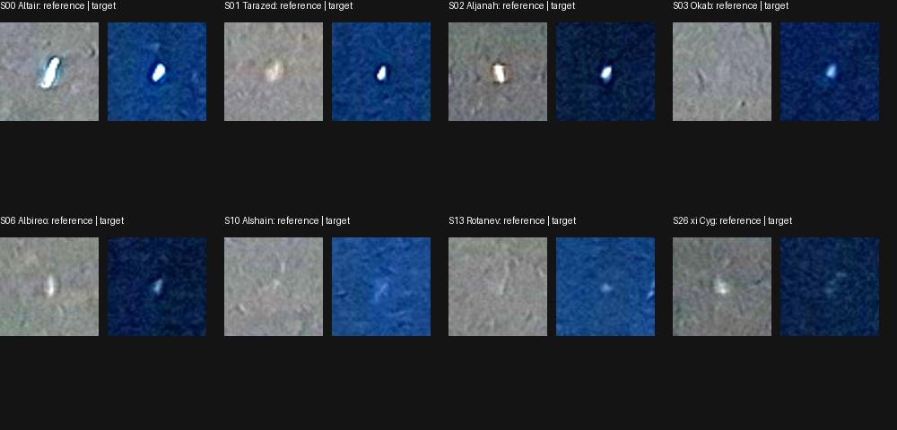

# Проверка `215934`, краёв кадра и спорной звезды S10

Дата: 2026-10-02. Продолжение [проверки sky-fill решений](sky-fill-review.md).

Для `215934` проверены **восемь соответствий с ранее независимо решённым кадром**:
RMS камеры движка **2.95 px**. Это проверка гипотезы с известными подсказками,
не слепое подтверждение. Дополнительные слепые запуски этот кадр не решили.
Для трёх других кадров выполнена проверка другим алгоритмом с общим каталогом
HYG, в том числе на нескольких звёздах у верхнего края. Ни один WCS не принят
как эталон всего поля; оснований менять модель оптики по этим данным нет.

## `215934`: сопоставление двух фотографий

В архиве имеется слепое решение Astrometry.net для `20260831_214709` на Tycho-2
index 19. Оно покрывает общий участок неба с `20260829_215934`. Его WCS остаётся
кандидатом, поэтому используются **измеренные центроиды и каталоговые
соответствия `.corr`**, а не экстраполированная проекция на всё изображение.

Идентичности восьми видимых источников сначала были подсказаны проекцией HYG
камерой движка. После этого просмотрены фрагменты обеих фотографий и сопоставлен
общий рисунок звёзд. Этот порядок явно ограничивает независимость проверки:
отбор не был слепым, и ошибки движка уже были известны. Пиксели и каталоговые
позиции внешнего кадра получены отдельным решателем; камера движка не используется
в последующем совмещении изображений.



Фото © Igor Lazarev, CC BY 4.0. Фрагменты 50 × 50 исходных пикселей, яркость ×3,
подписи добавлены Codex. Отобранные источники видны на обеих фотографиях.

Четыре фиксированные опоры — S00 (Altair), S02 (Aljanah), S06 (Albireo), S26
(ξ Cyg). По их **пиксельным** координатам рассчитана гомография. Остальные четыре
звезды — S01 (Tarazed), S03 (Okab), S10 (Alshain), S13 (Rotanev) — в эту подгонку
не входили. Метки Sxx локальны кадру: S10 здесь не является спорной S10 на `220101`.

| Измерение | Число точек | Median, px | RMS, px | Max, px |
|---|---:|---:|---:|---:|
| Проверка переноса изображения, без четырёх опор | 4 | 7.10 | **8.14** | 11.40 |
| Камера Starglyph против восьми внешних каталоговых позиций | 8 | 1.72 | **2.95** | 6.74 |

Охват восьми точек — 72.2% ширины и 37.1% высоты. Ненулевая ошибка гомографии
ожидаема при различающихся искажениях, центроидах и качестве двух снимков; из
этого опыта нельзя отдельно определить вклад каждой причины. Опоры не менялись
после измерения ошибок, точки не исключались. Четыре контрольные точки отложены
**только для гомографии**, не для распознавателя Starglyph.

Соответствия, четыре опоры, четыре контрольные точки, хеши фотографий и внешних
артефактов сохранены в
[`external-star-correspondences-215934.json`](../data/input/smartphone/external-star-correspondences-215934.json).
Это диагностическая проверка согласованности, не точный эталон дисторсии.

## Слепые контрольные запуски и их ограничения

Проверены две области `215934`, выбранные по изображению, без подсказок положения:
`[0, 0, 2252, 2600)` и `[500, 200, 2100, 2500)` в исходных ориентированных пикселях.
Отбор источников остался прежним. Обрезка списка меняет только начало координат и
размеры поля внешнего решателя. Для полученных WCS предусмотрен обратный перенос
CRPIX и координат `.corr`; корректность TAN-SIP переноса проверена тестом.
Сетка всего исходного кадра, если она строится после обрезки, включает экстраполяцию.

Для проверки влияния каталога локально построены индексы HYG v4.2: все звёзды
`mag ≤ 6.5`, без Солнца, позиции RA переведены из часов в градусы. Сначала шкалы
14–19, затем для `215934` добавлены 10–13. **HYG используется и движком**, поэтому
результат такого Astrometry.net — независимый поиск и отдельные центроиды,
но не независимая оценка каталоговой точности. Позы, FOV и детекции Starglyph
внешнему решателю не передавались. Новые индексы не входят в Git.

| Каталог / область | Внешние параметры | Результат |
|---|---|---|
| Tycho-2 / две области `215934` | pixel-error 4, code-tolerance 0.01, SIP 2 | Оба отказа |
| HYG 14–19 / все четыре кадра | 4, 0.01, 2 | Только `220101` |
| HYG 14–19 / все четыре кадра | 8, 0.03, 3 | `215839`, `220020`, `220101` |
| HYG 14–19 / верхнее небо `215934` | 4, 0.01, 2 | Отказ |
| HYG 14–19 / центральная область `215934` | 8, 0.03, 3 | Отказ |
| HYG 10–19 / полный `215934`, два режима | 4, 0.01, 2 и 8, 0.03, 3 | Оба отказа |

Во всех попытках — 30 секунд CPU, штатный odds-to-solve. Всего в этом продолжении
восемь новых неудачных слепых попыток на `215934`; они сохранены, не скрыты за
последующей ручной проверкой. Причина отказа внешнего решателя пока не установлена.

## Краевые точки и S10 на `220101`

Краевая полоса здесь заранее определена как внешние 10% по любой оси. Она не
совпадает с краем полигона неба. Учитываются соответствия с внешним весом ≥0.95;
в JSON остаются и остальные строки с явным признаком включения в метрику.

| Кадр | Источник соответствий | Краевых точек | RMS, px | Какие точки |
|---|---|---:|---:|---|
| `215839` | Слепой Astrometry.net + HYG, расширенный режим | 2 | **0.95** | S00, S03; у верхнего края |
| `215934` | Перенос с внешнего Tycho-2 кадра, с известными подсказками | 1 | **2.84** | S02; у верхнего края |
| `220020` | Слепой Astrometry.net + HYG, расширенный режим | 1 | **3.34** | S01; у верхнего края |
| `220101` | Слепой Astrometry.net + HYG, основной режим | 1 | **0.89** | S10; у верхнего края |

Это пять разреженных точек, а не сертификация периметра: нижний и боковые края
по-прежнему не покрыты достаточным набором контрольных звёзд. Для HYG-вариантов
также действует ограничение общего каталога. Менять параметры оптики или
принимать эталонный WCS по этому счётчику нельзя.

У S10 на `220101` найдено существенное различие идентичностей:

- Tycho-2 кандидат: RA 188.68338°, Dec 70.02177°, ошибка движка 13.83 px;
- HYG кандидат: RA 188.37087°, Dec 69.78824° (κ Dra), ошибка 0.89 px.

Запрос в каждый установленный индекс Tycho-2 10–19 в радиусе 0.02° от κ Dra
вернул ноль звёзд. Это наблюдение о конкретных индексах, не утверждение о полном
исходном каталоге. Координаты κ Dra также согласуются с
[SIMBAD](https://simbad.u-strasbg.fr/simbad/sim-basic?Ident=Kap+Dra&submit=SIMBAD+search).
В [описании Tycho-2](https://archive.eso.org/ASTROM/TYC-2/docs/guide.pdf) предусмотрены
дополнительные списки для пропущенных ярких звёзд; сам факт такого ограничения
не доказывает идентичность отдельного пикселя.

Таким образом, **13.83 px нельзя трактовать как доказанную ошибку оптики**:
внешний решатель, вероятно, назначил соседнюю звезду при отсутствии нужной в
индексе. Высокий `match_weight` сам по себе не гарантирует правильную идентичность.
Старый опыт и его 13.83 px сохранены без переписывания; новый результат показывает
альтернативное соответствие и его происхождение.

## Воспроизведение и проверки

Окружение Astrometry.net и исходные извлечения — [local-wcs](local-wcs.md).
Из `prototype/`, с новыми выходными каталогами:

```bash
python3 eval/build_hyg_review_indices.py \
  --out-dir artifacts/sky-edge-reproduction/hyg --scales 14 15 16 17 18 19

python3 eval/verify_masked_wcs.py \
  --raw-dir artifacts/sky-fill-experiment/wcs \
  --masks ../data/input/smartphone/sky-masks.json \
  --source-review ../data/input/smartphone/external-source-review.json \
  --config /path/to/original-tycho.cfg \
  --solver-config artifacts/sky-edge-reproduction/hyg/backend.cfg \
  --solver-index-dir artifacts/sky-edge-reproduction/hyg \
  --pixel-error 8 --code-tolerance 0.03 --tweak-order 3 \
  --out-dir artifacts/sky-edge-reproduction/hyg-wide

python3 eval/audit_sky_edges.py \
  --references artifacts/sky-edge-reproduction/hyg-wide/summary.json \
  --source-review ../data/input/smartphone/external-source-review.json \
  --reports-dir artifacts/sky-fill-experiment/run-1/sky-fill/solve-reports \
  --output artifacts/sky-edge-reproduction/edges.json

python3 eval/review_external_stars.py \
  --source-review ../data/input/smartphone/external-source-review.json \
  --correspondences ../data/input/smartphone/external-star-correspondences-215934.json \
  --reports-dir artifacts/sky-fill-experiment/run-1/sky-fill/solve-reports \
  --input-dir ../data/input/smartphone \
  --out-dir artifacts/sky-edge-reproduction/215934-transfer
```

Для полного диапазона индексов опустить `--scales`; для основного режима внешнего
решателя опустить три изменённых параметра. Область задаётся
`--ids 20260829_215934 --roi X0 Y0 X1 Y1`. Контроль с Tycho-2 не использует
`--solver-config` и `--solver-index-dir`. Для регистрации по сохранённым
соответствиям нужны только Python, NumPy, Astropy, Pillow и опубликованные фото.

Полный [снимок продолжения](experiments/sky-edge-review-2026-10-02.json) содержит
все варианты, хеши каталогов и файлов, покоординатные ошибки и запросы S10.
Позиции, производные от HYG, в этом JSON — CC BY-SA 4.0 (Astronexus);
атрибуция Tycho-2 и авторских фото сохраняется.

Прошли **29 Python-тестов**: в том числе неизменность гомографии при изменении
отложенных точек, отказ на вырожденных опорах, обратный перенос TAN-SIP,
раздельная нормировка краёв по двум осям и проверки происхождения данных.
Сборщик индексов дополнительно проверен реальным построением шкалы 19.
Rust-код и критерии принятия Starglyph в этом продолжении не менялись.

Следующий полезный шаг — автоматизировать регрессионный контроль экспериментального
режима отдельно от основного baseline, сохранив различие между успехом решателя,
проверкой соответствий и точностью всего поля. Точные эталоны требуют большего
числа независимых контрольных звёзд по краям, а не новых подгонок к этим пяти точкам.
