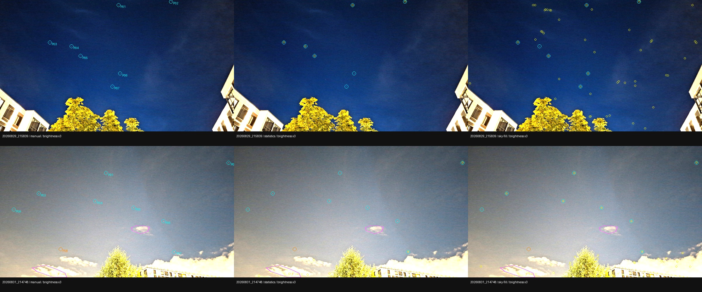

# Адаптивный порог: заполнение только внутри неба

Дата: 2026-10-02. Продолжение [исследования статистики неба](sky-statistics-experiment.md).

**По неизменённым критериям решателя: 8 → 12 из 17.** Все прежние успехи сохранены.
Четыре новых результата получены в эксперименте с ручными масками; это не показатель
автоматической сегментации и не утверждение абсолютной астрометрической точности.

## Гипотеза и одно изменение

В предыдущем опыте исключённый из фоновой статистики передний план продолжал
повышать адаптивный порог: заполнение бинарной маски считалось по всему кадру.
Проверяется, достаточно ли ограничить **эту долю** областью неба, чтобы восстановить
точечные источники без изменения критериев принятия решения.

Контроль A (`statistics`) — статистика фона/шума только по небу, заполнение по
всему изображению. Вариант B (`sky-fill`) — та же статистика, но заполнение равно
`число пикселей неба выше порога / число пикселей неба`.

Меняются **и числитель, и знаменатель**. Передний план не закрашивается и не
вырезается из связных компонент; фильтр центроидов по прежнему полигону остаётся.
Не меняются предел заполнения 2%, максимум четырёх удвоений, конфигурации
default/deep, top-K, геометрия, каталог, EXIF и пороги принятия решения.
При пустой дискретной области доля равна нулю; центроиды всё равно проходят
проверку исходным полигоном. Режим требует `--sky-statistics` и `--sky-masks`.

## Методика

Один release-бинарник последовательно обрабатывает все 17 смартфонных кадров
в обоих режимах. Те же шесть полигонов, те же 15 компактных проверочных источников,
один спорный источник и два облачных участка, что в предыдущем опыте. Разметка
не меняется и не подгоняется под результат.

Проверяются статусы всех кадров, сохранность каждого прежнего успеха, камеры и
качество на 11 кадрах без маски. Диагностика до top-K выполняется на двух масштабах
и в двух режимах вне времени solve. Координаты проб сопоставляются однозначно
с полупиксельной поправкой и радиусом 12 исходных пикселей.

Новые поля диагностики: `threshold_region_pixels` и `threshold_region_fill` —
площадь и заполнение именно той области, которая управляет адаптацией.
`threshold_fill` по-прежнему описывает всё изображение, чтобы значения прежних
отчётов не изменили смысл. Полная маска должна давать прежний результат детектора.

Этот опыт не гарантирует монотонность default/deep: дискретное удвоение порога,
разные составы компонент и последующие фильтры по-прежнему могут её нарушать.
Это проверяемый результат, а не заранее объявленное свойство новой реализации.

## Результаты A/B

[Измерения, камеры новых решений и происхождение](experiments/sky-fill-2026-10-02.json).
Контрольные отчёты всех 17 кадров совпали с предыдущим опытом, исключая время и
порядок равноярких детекций. В этой паре камеры и качество 11 кадров без маски
также совпали. Маски и проверочные пробы не менялись.

| Кадр с маской | A → B | Детекции A → B | Inliers B | RMS B, px | Log-odds B | Время A → B, с |
|---|---|---:|---:|---:|---:|---:|
| `20260829_215839` | failed → solved | 8 → 40 | 11 | 2.9 | 21.87 | 7.59 → 0.68 |
| `20260829_215934` | failed → solved | 4 → 40 | 21 | 3.05 | 110.72 | 6.46 → 1.64 |
| `20260829_215950` | failed → failed | 3 → 50 | — | — | — | 7.02 → 11.30 |
| `20260829_220020` | failed → solved | 4 → 50 | 16 | 2.97 | 43.77 | 5.22 → 0.85 |
| `20260829_220101` | failed → solved | 6 → 40 | 19 | 2.24 | 92.95 | 6.03 → 0.61 |
| `20260831_214748` | failed → failed | 15 → 50 | — | — | — | 8.48 → 13.89 |

Время — `report.timing_ms.total`, без отдельных диагностических проходов;
одна пара на прогретых базах, без статистического утверждения об ускорении.
Числа inliers/RMS/log-odds относятся к внутренней проверке движка.
Поле `confidence` не является калиброванной вероятностью правильного решения.

### Источники и облака

В таблице — проверочные источники, оставшиеся после top-K. Во всех этих строках
число совпадает с найденным до top-K: отмеченные пропуски возникают раньше
ограничения списка. «Кандидаты» — список до top-K; облачные счётчики — после.

| Кадр | Ширина | Режим | Пробы A → B | Кандидаты A → B | В двух участках облаков A → B |
|---|---:|---|---:|---:|---:|
| `215839` | 1600 | default | 4/7 → 6/7 | 4 → 138 | — |
| `215839` | 1600 | deep | 5/7 → 6/7 | 5 → 47 | — |
| `215839` | 4000 | default | 7/7 → 7/7 | 8 → 769 | — |
| `215839` | 4000 | deep | 7/7 → 7/7 | 8 → 502 | — |
| `214748` | 1600 | default | 1/8 → 7/8 | 9 → 16 | 0 → 0 |
| `214748` | 1600 | deep | 2/8 → 7/8 | 8 → 26 | 1 → 1 |
| `214748` | 4000 | default | 7/8 → 6/8 | 10 → 351 | 0 → 4 |
| `214748` | 4000 | deep | 6/8 → 4/8 | 15 → 219 | 1 → 3 |



Столбцы: исходная разметка, A, B; оверлеи детектора — deep на ширине 1600.
Производное превью фотографий Igor Lazarev, CC BY 4.0, яркость ×3 и аннотации.

На `215839`, ширина 1600, default: порог **0.12245 → 0.00765**, удвоения **4 → 0**.
Заполнение внутри неба — **1.01%**. Для deep удвоения **4 → 1**, пробы **5/7 → 6/7**.
На полном разрешении все семь проб и раньше находились, но новый список также
содержит больше слабых кандидатов; полный список до top-K увеличивается до 769.

На облачном `214748`, ширина 1600: default **1/8 → 7/8**, deep **2/8 → 7/8**.
Однако на полном разрешении восстановление проб ухудшается, а облачных кандидатов
становится больше. Кадр остаётся нерешённым: этот фактор не исчерпывает проблему
облаков, компонент и фильтров формы.

**Монотонность default/deep не исправлена в общем случае.** Например, на `215839`
в B default не удваивает порог, а deep удваивает один раз и получает порог
в 1.6 раза выше. Пространство, управляющее адаптацией, исправлено для этого опыта;
дискретность самой адаптации остаётся отдельной задачей.

## Воспроизведение

Из `prototype/`, с новым выходным каталогом:

```bash
cargo build --release -p starglyph-cli
python3 eval/sky_statistics_experiment.py --sky-fill-pair \
  --out-dir artifacts/sky-fill-experiment/reproduction
```

Повторный анализ существующих результатов: та же команда с `--compare-only`.
Прямой вызов CLI: `eval --sky-masks FILE --sky-statistics --sky-fill`.
Экспериментальные флаги отключены по умолчанию; обычный baseline не принимает
помеченные ими результаты.

Визуализация (Pillow):

```bash
python3 eval/preview_point_probes.py \
  --run-dir artifacts/sky-fill-experiment/reproduction \
  --modes statistics sky-fill \
  --out-dir artifacts/sky-fill-experiment/previews
```

Обозначения: голубые окружности — компактные пробы, оранжевая — спорная,
жёлтые маленькие окружности — детекции, розовые полигоны — облачные участки.
Это диагностическая выборка, не полная астрономическая истина.

## Повторяемость и независимая проверка

Четыре новых решения повторно рассчитаны: камеры и отчёты совпали после
исключения времени выполнения и порядка детекций с одинаковым потоком.
Контроль A также воспроизвёл камеры и отчёты предыдущего опыта на всех 17 кадрах.
Повторяемость сама по себе не подтверждает правильность привязки.

[Локальная Astrometry.net](local-wcs.md) не решила ни один из четырёх исходных
кадров в заданных лимитах (масштабы извлечения 4 и 2, по 30 секунд CPU).
Второй проход использовал собственные точки Astrometry.net, отфильтрованные
теми же ручными полигонами неба. Точки движка, его камера, FOV и соответствия
каталогу внешнему решателю не передавались. Скрипт `verify_masked_wcs.py`
проверяет хеши исходника и нормализованного FITS, размеры и конфигурацию;
при фильтрации учитывает переход из координат FITS с единицы в координаты с нуля.

| Кадр | Исходное изображение | Собственные точки Astrometry.net внутри неба |
|---|---|---|
| `20260829_215839` | Не решён | Не решён |
| `20260829_215934` | Не решён | Не решён |
| `20260829_220020` | Не решён | Не решён |
| `20260829_220101` | Не решён | WCS-кандидат, эталоном не принят |

У кандидата `220101` — 40 соответствий, из них 13 с внешним `match_weight ≥ 0.95`.
По этим 13 точкам расхождение камеры движка с внешними соответствиями:
медиана **2.17 px**, RMS **47.28 px**, максимум **140.94 px**.
Собственная невязка внешнего WCS — RMS **6.97 px**. На сетке всего кадра
различие моделей — RMS **84.01 px**; это сравнение моделей, а не измеренная
ошибка относительно истинного неба.

Визуальный просмотр выявил семь компактных источников с расхождением до 2.2 px,
один вероятный слабый источник с расхождением 13.8 px и пять сомнительных
соответствий на текстуре неба. Последние **не исключены** из приведённых метрик.
Такой WCS нельзя считать надёжной независимой истиной для всего кадра.
Для остальных трёх кадров отсутствие внешнего решения также не доказывает
ошибочность решения движка. **Точность четырёх новых привязок остаётся открытой.**
Числа и статусы сохранены в [снимке эксперимента](experiments/sky-fill-2026-10-02.json).

После подготовки исходных результатов по инструкции local-wcs, из `prototype/`:

```bash
python3 eval/verify_masked_wcs.py \
  --raw-dir artifacts/sky-fill-experiment/wcs \
  --masks ../data/input/smartphone/sky-masks.json \
  --config /path/to/backend.cfg \
  --ids 20260829_215839,20260829_215934,20260829_220020,20260829_220101 \
  --out-dir artifacts/sky-fill-experiment/wcs-masked-reproduction
python3 eval/compare_local_wcs.py \
  --references artifacts/sky-fill-experiment/wcs-masked-reproduction/summary.json \
  --reports-dir artifacts/sky-fill-experiment/run-1/sky-fill/solve-reports \
  --output artifacts/sky-fill-experiment/wcs-masked-reproduction/comparison.json
```

Нужна та же конфигурация, что использована при исходном извлечении; зависимости
Python и индексы описаны в local-wcs. Большие FITS и локальные артефакты не входят
в репозиторий.

## Проверки и дальнейшие действия

Прошли 101 Rust-тест и 21 Python-тест, `cargo fmt`, scoped Clippy с запретом
предупреждений и `make eval-gate` на двух эталонных кадрах. Тесты покрывают
числитель и знаменатель заполнения, пустую область, эквивалентность полной маски,
защиту baseline от экспериментальных результатов и независимую фильтрацию
внешних точек с проверкой происхождения данных.

Следующий шаг — независимая проверка звёздных соответствий четырёх новых
решений и создание проверенного регрессионного набора. До этого режим остаётся
выключенным по умолчанию. Отдельно требуется исследовать облачные компоненты
на полном разрешении и дискретную адаптацию порога default/deep: увеличение
числа принятых решений не устраняет эти ограничения детектора.

## Продолжение проверки

[Независимый разбор новых решений](sky-fill-review.md) добавляет внешние звёздные
соответствия для `220101` и визуальный перенос идентичностей на `215839` и `220020`.
Это уточняет первоначальное состояние проверки выше; WCS всего поля по-прежнему
не принят, а `215934` остаётся без независимых соответствий.

## Регрессионная проверка

Результат защищён отдельным `make eval-smartphone-sky-fill-gate`: 12 обязательных
ID, закреплённые входы и маски, отдельная задача CI. [Протокол gate](sky-fill-gate.md).
Обычный baseline остаётся отдельным, на восемь успехов без ручных масок.
