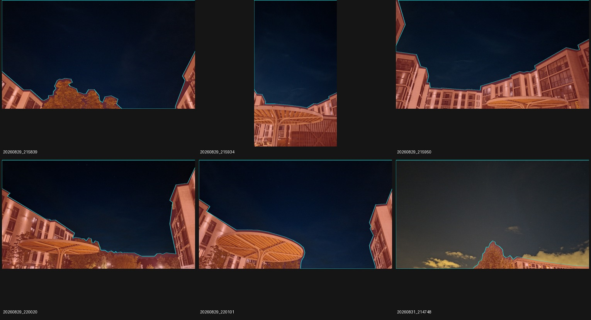

# Ручные маски неба: диагностический эксперимент

Дата: 2026-10-02. Продолжение [исследования устойчивости распознавания](recognition-robustness-research.md)
и [оценки смартфонного набора](smartphone-quality.md).

**Результат: 8/17 без масок и 8/17 с масками.** Все восемь прежних решений
сохранены, новых нет. Ручное исключение переднего плана очистило списки кандидатов,
но оказалось недостаточным для распознавания этих шести кадров.

## Вопрос и гипотеза

У шести неудачных смартфонных снимков в списках детекций преобладают здания,
навесы и деревья. Проверяем: достаточно ли исключить эти точки **до ограничения
списка по яркости**, чтобы существующий решатель нашёл звёздную конфигурацию?

Это локальный диагностический эксперимент на выбранных отказах, не оценка
обобщающей способности сегментатора. Решатель получает дополнительную ручную
информацию, которой нет в обычном режиме.

## Разметка

Файл: [`sky-masks.json`](../data/input/smartphone/sky-masks.json). Шесть простых
полигонов размечены Codex по визуальному осмотру снимков до A/B-прогона; границы
не подгонялись по результату решения. У крыш и растительности оставлен небольшой
консервативный запас. Просветы внутри крон и сложных конструкций не размечаются
отдельно. Облака остаются небом: видимость звёзд под ними — другой фактор.



Производная визуализация фотографий © 2026 Igor Lazarev, CC BY 4.0; добавлены
полигоны и окраска переднего плана. Подробности — [атрибуция](../ATTRIBUTION.md).

Каждая маска содержит SHA-256 исходного JPEG и размеры после EXIF-поворота.
В частности, `20260829_215934` размечен в геометрии **2252 × 4000**, остальные
пять — **4000 × 2252**. Нормированные координаты относятся к границам изображения;
центр пикселя `(x, y)` переводится в `((x + 0.5)/width, (y + 0.5)/height)`.
Это сохраняет смысл маски при уменьшении кадра. Точка на границе исключается.

Разметка диагностическая: она не является попиксельной истиной, не содержит
астрометрических координат и не утверждает, что каждая оставшаяся точка — звезда.

## Вмешательство

Эксперимент включается только аргументом `starglyph eval --sky-masks FILE`.
Обычный `solve`, HTTP и приложение используют прежний путь без маски.

1. Изображение загружается и ориентируется обычным способом.
2. Вычитание фона, оценка шума, фильтрация и выделение компонент не изменяются.
3. Центроиды вне полигона исключаются **перед дедупликацией, сортировкой и top-K**.
4. Этот фильтр действует на обоих масштабах и обоих режимах детектора.
5. Сопоставление с каталогом, геометрическая модель и все пороги принятия прежние.

Передний план не закрашивается чёрным. Его влияние на статистику фона, порог
выделения компонент и фильтрацию строк/столбцов сохраняется. Поэтому эксперимент
проверяет влияние **состава списка кандидатов**, а не все возможные преимущества
маски. Следующее вмешательство в статистику детектора нужно сравнивать отдельно.

CLI отклоняет неизвестные/повторные ID, некорректные полигоны, несовпадение
хеша или ориентированных размеров. Маска встраивается в JSON каждого обработанного
кадра; конфигурация итогового отчёта помечается как экспериментальная. Обычная
smartphone-gate не принимает отчёты с ручными масками как автоматический baseline.

## Протокол сравнения

Один release-бинарник, каталог HYG v4.2, одинаковые EXIF-подсказки и прогретый кеш
баз. Последовательно обрабатываются все 17 исходных JPEG без масок, затем с
масками только у шести выбранных кадров. Время — диагностическое измерение этой
машины, не SLA; отдельные поисковые попытки имеют тайм-ауты.

Скрипт проверяет хеши исходных данных, сохранность каждого из восьми прежних
успехов, идентичность геометрии и конфигурации. Для 11 кадров без аннотаций он
сравнивает полный solve-report и камеру, исключив время и порядок равноярких детекций (их состав и все поля должны совпасть). Помимо результата
сохраняются число детекций, число оставшихся в небе центроидов исходного прогона,
inliers, RMS, log-odds и время. Последние три метрики качества имеют смысл только
для принятых решений; при отказе нет подтверждённых соответствий.

## Результат и интерпретация

Все шесть выбранных кадров остаются нерешёнными. Числа ниже относятся к детекциям
**итогового solve-report**, а не к максимуму по всем масштабам/режимам детектора.
«В небе до» означает лишь попадание центроида в ручной полигон, не подтверждение
его звёздной природы.

| Кадр | До: все / в небе | После: все / в небе | Итог |
|---|---:|---:|---|
| `20260829_215839` | 50 / 6 | 8 / 8 | `no_confident_match` |
| `20260829_215934` | 50 / 3 | 3 / 3 | `no_confident_match` |
| `20260829_215950` | 50 / 3 | 3 / 3 | `too_few_stars` |
| `20260829_220020` | 50 / 0 | 4 / 4 | `no_confident_match` |
| `20260829_220101` | 50 / 0 | 6 / 6 | `no_confident_match` |
| `20260831_214748` | 50 / 1 | 50 / 50 | `no_confident_match` |

У `215934` итоговый список deep-режима содержит три точки, но другой режим имел
не менее четырёх кандидатов: этим объясняется `no_confident_match`, а не
`too_few_stars`. Разметка не меняет существующее правило выбора списка для отчёта.

На пяти кадрах оставшихся **детекций** мало. Это не доказывает отсутствие звёзд
в исходных пикселях: их мог пропустить детектор. На `214748` освободившийся top-K
заполняется точками неба, часть которых визуально лежит на облаках. Маска отделяет
небо от земли, но не отличает звёзды от облачной структуры и шумовых пиков.

Число подтверждённых inliers на этих шести кадрах — ноль; RMS и log-odds принятого
решения отсутствуют. У прежних восьми успехов камеры и показатели качества
сохранены. Новых решений для независимой WCS-проверки не появилось; прежние
WCS-кандидаты остаются в статусе pending, абсолютная точность не установлена.

При сравнении обнаружен безвредный для этой пары прогонов нюанс: две детекции
равной яркости в `220801` меняются местами. Проверка учитывает порядок одинаковой
яркости как несущественный, но требует одинакового состава, координат, признаков
inlier, всех остальных полей отчёта и камеры. Сам детектор ради сравнения не менялся.

### Время и сохранённые измерения

[Машиночитаемый результат](experiments/sky-mask-2026-10-02.json) содержит показатели
всех 17 кадров, контрольные суммы масок, каталога, бинарника и исходников реализации.
Прогоны выполнялись с четырьмя доступными CPU и заранее построенными базами.
Повторная пара на финальной сборке сохранила статусы, числа детекций/inliers,
RMS и log-odds первой пары; границы масок между прогонами не менялись.

| Кадр | Без маски, с | С маской, с |
|---|---:|---:|
| `20260829_215839` | 16.60 | 7.25 |
| `20260829_215934` | 31.95 | 5.54 |
| `20260829_215950` | 13.83 | 5.73 |
| `20260829_220020` | 7.84 | 9.49 |
| `20260829_220101` | 8.80 | 7.91 |
| `20260831_214748` | 5.76 | 10.84 |

Полное время процессов последней пары: **205.7 → 135.2 с**; первой пары —
191.5 → 137.9 с. На большинстве размеченных кадров короткий список сокращает
поиск, но `214748` замедляется после появления новых кандидатов. Это наблюдение
двух пар, не статистически надёжная оценка ускорения.

### Что проверять следующим

1. На `215839` и `214748` вручную отметить видимые точечные источники и сопоставить
   их с детекциями на двух масштабах: выяснить, где теряется полнота и откуда
   приходят ложные кандидаты. Не называть неидентифицированные точки звёздами.
2. Отдельным A/B проверить оценку фона/шума только по разрешённой области и влияние
   адаптивного порога. Не закрашивать исключённые пиксели и не менять одновременно
   пороги сопоставления. Сохранять этот вариант фильтрации как контроль.
3. Для `214748` отдельно проверять подавление облачных структур, измеряя одновременно
   сохранность слабых точечных источников. Маска облаков и маска земного переднего
   плана имеют разные задачи.

Внедрение обучаемого сегментатора пока не обосновано ростом числа решений:
даже ручная маска в проверенном месте конвейера не дала прироста. Это не отрицает
пользу сегментации для других кадров или для корректной оценки фона.

## Воспроизведение

Из `prototype/`:

```bash
cargo build --release -p starglyph-cli
python3 eval/sky_mask_experiment.py --out-dir artifacts/sky-mask-experiment/reproduction
```

Выходная папка должна быть новой. Скрипт сохраняет `unmasked/`, `masked/`, логи,
`provenance.json` и `comparison.json`; повторный анализ существующих результатов:

```bash
python3 eval/sky_mask_experiment.py \
  --out-dir artifacts/sky-mask-experiment/reproduction --compare-only
```

Для визуального пересмотра аннотаций нужен Pillow:

```bash
python3 eval/preview_sky_masks.py \
  --manifest ../data/input/smartphone/manifest.json \
  --masks ../data/input/smartphone/sky-masks.json \
  --out-dir artifacts/sky-mask-experiment/previews
```

Отдельный выбранный кадр можно обработать через `eval --ids ID --sky-masks FILE`.
Кадры без записи в файле масок обрабатываются без фильтра.

## Проверки реализации

- 97 Rust-тестов пройдены (9 CLI, 88 core), один performance-тест и три doc-test
  штатно пропущены. Проверены отбор до top-K, эквивалентность полной маски,
  неизменность оценки фона/шума, полупиксельное масштабирование, границы полигона,
  некорректная геометрия, SHA-256 и размеры после EXIF.
- 14 Python-тестов пройдены: защита smartphone baseline от ручных масок,
  проверка происхождения A/B, регрессия неизменённых кадров, порядок равноярких
  детекций и координаты центров пикселей.
- `cargo fmt --all --check`, `cargo clippy -p starglyph-core -p starglyph-cli
  --all-targets --no-deps -- -D warnings` и release-сборка проходят.
  Проверка clippy с зависимостями обнаруживает прежний `too_many_arguments`
  в `simulator-core/src/dataset.rs:289`, вне изменений этого эксперимента.
- `make eval-gate`: PASS на `tetra3_alt40` и `tetra3_alt60`. Обычная smartphone-gate
  также проходит на контрольном прогоне всех 17 кадров внутри A/B-скрипта.

Продолжение: [проверочные источники и статистика фона только по небу](sky-statistics-experiment.md).
