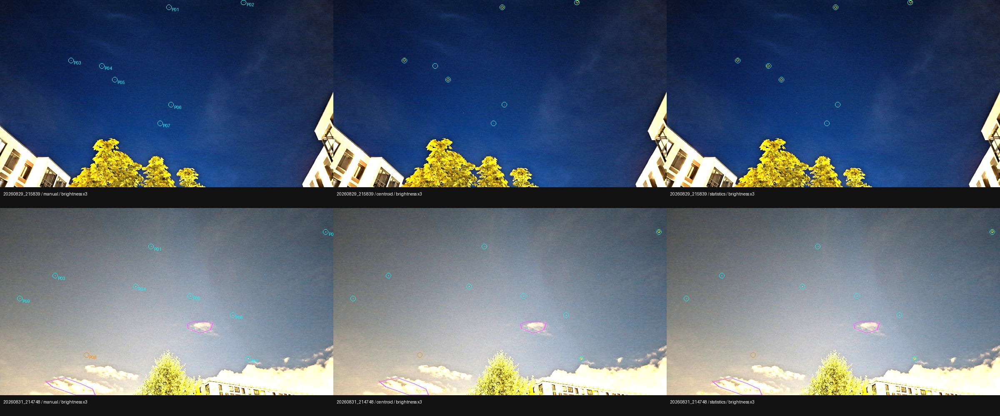
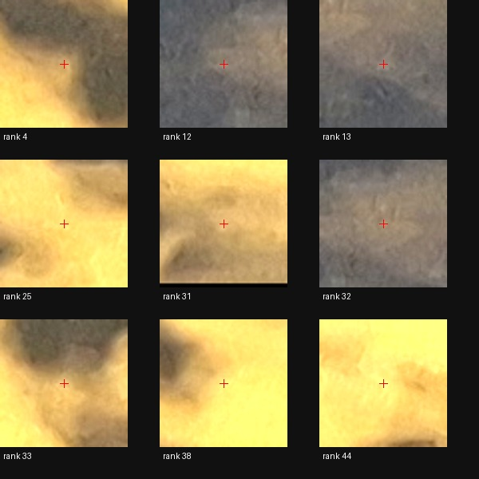

# Точечные источники и статистика фона внутри неба

Дата: 2026-10-02. Продолжение [эксперимента с масками переднего плана](sky-mask-experiment.md).

**Итог: 8/17 в обоих режимах, новых решений нет.** Статистика только по небу
улучшила некоторые списки кандидатов, но ухудшила выделение источников в другом
режиме. Обнаружена конкретная проблема для следующего эксперимента: регулятор
пороговой маски по всему кадру делает чувствительность default/deep немонотонной.

## Проверяемый вопрос

Ручное исключение наземных центроидов не увеличило число решений: осталось 8/17.
Здесь проверяются два более узких вопроса: где теряются визуально различимые
точечные источники и помогает ли вычислять статистику фона/шума только по небу.

Контроль A — прежняя маска только на этапе отбора центроидов. Вариант B — та же
маска плюс ограничение статистических выборок. Оба режима экспериментальные,
с ручной разметкой. Результат не заменяет автоматический smartphone baseline.

## Визуальная проверочная выборка

[`point-source-probes.json`](../data/input/smartphone/point-source-probes.json)
содержит 7 компактных источников на `20260829_215839` и 8 на `20260831_214748`.
Ещё один источник (`214748/P08`) размечен как спорный: на полном разрешении он
менее компактен и не входит в основной счётчик. Астрономические идентификаторы
не присваивались. Это **не исчерпывающая разметка и не ground truth звёзд**.

Точки выбраны до нового A/B по снимкам без оверлея детектора: превью 1600 × 901
с линейным усилением яркости ×3, затем проверка кропов 64 × 64 исходных пикселя.
Яркость менялась только для визуального осмотра; в решатель идут исходные JPEG.
В файле зафиксированы SHA-256, EXIF-ориентированные размеры и координаты центров
пикселей. Фото и производная разметка — CC BY 4.0, автор фото Igor Lazarev;
разметка Codex. См. [атрибуцию](../ATTRIBUTION.md).

На втором кадре отдельно отмечены два консервативных участка внутри видимых
облаков (`C01`, `C02`). Число детекций в этих областях показывает привязку к
облачной структуре, но само по себе не доказывает отсутствие звёзд за облаком.
Доли на всей площади неба и общая precision по этой выборке не оцениваются.

## Изменение конвейера

Вариант B включается через `eval --sky-masks FILE --sky-statistics`.
Аргумент `--sky-statistics` требует файл масок; кадры без записи в нём проходят
обычный путь. Меняется только выборка для следующих оценок:

1. Медианы столбцов и строк берутся по разрешённым центрам пикселей.
2. Медианы ячеек фоновой сетки вычисляются по разрешённым пикселям.
3. MAD и резервная квантильная оценка шума берутся по разрешённой области
   с прежним исключением рамки изображения, до и после согласованного фильтра.

Пустой столбец использует глобальную медиану разрешённых исходных пикселей;
пустая строка после вычитания столбцов — нулевую поправку; пустая ячейка сетки —
глобальную медиану разрешённых остатков. Если статистической выборки нет,
оценка шума возвращает прежний нижний предел. Полная маска кадра проверена на
эквивалентность обычному детектору.

Пиксели не закрашиваются. Свёртка остаётся обычной: около границы маски она
может захватывать соседний передний план; консервативные границы разметки уменьшают,
но не исключают этот эффект. Пространственная интерполяция сетки не меняется.
**Заполнение пороговой бинарной маски по-прежнему считается по всему кадру**,
и алгоритм повышения порога не меняется. Это намеренно оставленный отдельный
фактор: эксперимент не смешивает статистику фона с новым правилом адаптации порога.

Сохраняются прежние пределы числа детекций, проверки компактности, сопоставление
с каталогом, модель камеры и пороги принятия решения.

## Метод измерения

`--detection-diagnostics` выгружает оба масштаба и обе конфигурации детектора
(default/deep), независимо от того, на каком этапе решатель остановился.
Диагностический проход выполняется отдельно, **вне `report.timing_ms`**, и
возвращает все прошедшие фильтры детекции до top-K, их ранги и статистику.
Время всего процесса включает эти дополнительные проходы, поэтому его нельзя
напрямую сравнивать со временем предыдущего эксперимента без диагностики.

Координаты уменьшенного кадра переводятся обратно с полупиксельной поправкой:
`x_original = (x + 0.5) * width_original / width_working - 0.5` (аналогично y).
Отмеченные источники сопоставляются с детекциями однозначно, ближайшие пары
первыми, в радиусе **12 исходных пикселей**, выбранном до сравнения. Одна детекция
не может засчитаться дважды. Раздельно считаются найденные до top-K и оставшиеся
после ограничения. Это полнота на небольшой проверочной выборке, не на всех звёздах.

Для всех 17 кадров сохраняются статусы, число детекций, inliers, RMS, log-odds и
время solve. Проверяется каждый из восьми прежних успехов. Для 11 кадров без
маски сравниваются камера и весь solve-report без времени и порядка равноярких
детекций. Пороговые статистики включают raw/filtered sigma, итоговый порог,
число его удвоений, долю выбранных пикселей и счётчики причин отбраковки.

## Результаты

[Полные измерения и происхождение](experiments/sky-statistics-2026-10-02.json)
содержат статистику, списки сопоставленных проб, качество решений, время и хеши.
Все восемь прежних решений сохранены. Для 11 кадров без маски отчёты и камеры
совпали между A/B. Кроме того, все 17 контрольных отчётов совпали с предыдущим
экспериментом после исключения времени и порядка равноярких точек. Независимых
новых WCS-кандидатов не возникло; абсолютная астрометрическая точность не заявляется.

### Где пропадают источники

В таблице — число оставшихся в top-K проверочных источников. Во всех строках оно
равно числу найденных **до top-K**: здесь потери выбранных проб происходят раньше
ограничения списка. «Кандидаты» — все прошедшие фильтры до top-K.

| Кадр | Ширина | Режим | Пробы A → B | Кандидаты A → B | Облачные участки: в top-K A → B |
|---|---:|---|---:|---:|---:|
| `215839` | 1600 | default | 1/7 → 4/7 | 3 → 4 | — |
| `215839` | 1600 | deep | 4/7 → 5/7 | 5 → 5 | — |
| `215839` | 4000 | default | 7/7 → 7/7 | 8 → 8 | — |
| `215839` | 4000 | deep | 7/7 → 7/7 | 8 → 8 | — |
| `214748` | 1600 | default | 7/8 → 1/8 | 15 → 9 | 2 → 0 |
| `214748` | 1600 | deep | 2/8 → 2/8 | 8 → 8 | 1 → 1 |
| `214748` | 4000 | default | 5/8 → 7/8 | 80 → 10 | 4 → 0 |
| `214748` | 4000 | deep | 4/8 → 6/8 | 114 → 15 | 9 → 1 |



Столбцы: ручная разметка, A, B. Оверлеи детектора — **deep при ширине 1600**.
Голубые окружности — компактные пробы, оранжевая — спорная, жёлтые маленькие —
детекции, розовые полигоны — проверенные участки облаков. Яркость превью ×3.

### Адаптивный порог

На `214748`, ширина 1600, контроль A: default повышает порог три раза до
**0.08781**, а deep — четыре раза до **0.14050**. Поэтому режим с меньшим исходным
коэффициентом sigma фактически получает порог в **1.6 раза выше**; число найденных
проб падает с 7/8 до 2/8. Вариант B уменьшает raw sigma с 0.00899 до 0.00836,
но для default вызывает четвёртое удвоение: итоговый порог **0.16322**, лишь 1/8 проб.

На `215839` в B регулятор достигает лимита четырёх удвоений, а доля выбранных
пикселей всё равно остаётся **5.9–8.9%** при целевом максимуме 2%.
Исключённый из статистики передний план по-прежнему участвует в подсчёте этой
доли. Одна только более подходящая оценка шума не устраняет это взаимодействие.

На полном `214748` B, наоборот, сокращает число кандидатов: default **80 → 10**,
deep **114 → 15**; на пробах получается **5/8 → 7/8** и **4/8 → 6/8**.
Это локальная польза, но не улучшение всей системы: кадр так и не решён, а
уменьшенный default заметно хуже.

### Кандидаты на облаках

В контрольном full-resolution deep **9 из 50** возвращаемых центроидов лежат
в двух заранее выбранных облачных областях. Кропы всех девяти просмотрены:
вокруг центров видна широкая облачная структура без различимого компактного
источника. Это визуально подтверждённые примеры ложных кандидатов, но не оценка
полной precision: за пределами этих областей классификация не выполнена, а
каталожной истины для скрытых источников нет. В B в этих областях остаётся
**1 из 15** возвращаемых центроидов.



Кропы 64 × 64 исходных пикселя, показаны увеличенными; яркость ×1.5, красный крест
в центре детекции. Номер — нулевой ранг в контрольном full-resolution deep.
Подробные координаты и визуальные метки сохранены в JSON результатов.

### Решатель и время

Все шесть кадров с масками остаются нерешёнными; у них нет принятого набора
inliers и метрик RMS/log-odds принятого решения. Прежние восемь успехов сохраняют
камеры и качество. В таблице время `report.timing_ms.total`, без дополнительных
диагностических проходов; это одиночная пара измерений, не SLA или оценка ускорения.

| Кадр | Итоговые детекции A → B | Время A → B, с |
|---|---:|---:|
| `20260829_215839` | 8 → 8 | 6.88 → 7.52 |
| `20260829_215934` | 3 → 4 | 6.76 → 5.17 |
| `20260829_215950` | 3 → 3 | 5.88 → 6.36 |
| `20260829_220020` | 4 → 4 | 5.47 → 5.83 |
| `20260829_220101` | 6 → 6 | 4.55 → 6.80 |
| `20260831_214748` | 50 → 15 | 8.31 → 7.93 |

## Вывод и следующий проверяемый шаг

Режим статистики по небу оставлен **экспериментальным**, по умолчанию не включается.
По проверенным пробам основная потеря происходит до top-K; на `215839` полное
разрешение уже восстанавливает все семь выбранных источников, но этого недостаточно
для принятого решения. Эти данные не доказывают, что других звёзд на фото нет.

Следующий отдельный A/B: ограничить подсчёт заполнения адаптивной пороговой маски
областью неба, сохранив текущие A и B как контроль. Проверять монотонность
чувствительности default/deep, найденные пробы, облачные кандидаты и все 17 solve,
не снижая порогов принятия решения. Общий классификатор облаков имеет смысл
оценивать после отделения этого конкретного взаимодействия с передним планом.

## Воспроизведение

Из `prototype/`, с новым выходным каталогом:

```bash
cargo build --release -p starglyph-cli
python3 eval/sky_statistics_experiment.py \
  --out-dir artifacts/sky-statistics-experiment/reproduction
```

Для повторного анализа добавляется `--compare-only`. Результаты: `centroid/`,
`statistics/`, `comparison.json`, `provenance.json` и логи поисковых попыток.

Визуализация проверочной выборки и детекций (требуется Pillow):

```bash
python3 eval/preview_point_probes.py \
  --run-dir artifacts/sky-statistics-experiment/reproduction \
  --out-dir artifacts/sky-statistics-experiment/previews
```

Без `--run-dir` скрипт показывает только исходную разметку и кропы источников.

## Проверки реализации

- 100 Rust-тестов (10 CLI, 90 core) пройдены; один performance-тест и три doc-test
  штатно пропущены. Новые проверки покрывают растеризацию на границах и вогнутых
  полигонах, эквивалентность полной маски, отсутствие влияния переднего плана на
  выбранную статистику, пустые ячейки/выборки и обязательность маски для CLI-флага.
- 16 Python-тестов пройдены: масштабирование координат, однозначное сопоставление
  проб, top-K, исключение спорного источника из основного счётчика, облачные области,
  происхождение результатов и защита обычного baseline от экспериментальных режимов.
- `cargo fmt --all --check`, clippy выбранных пакетов с `--all-targets --no-deps
  -- -D warnings`, release-сборка и `make eval-gate` прошли.
- Все 17 кадров обработаны обоими вариантами; прежние успехи и неизменённые
  отчёты проверяются скриптом, а не только агрегированным числом решений.

Следующий опыт выполнен: [заполнение пороговой маски только внутри неба](sky-fill-experiment.md).
